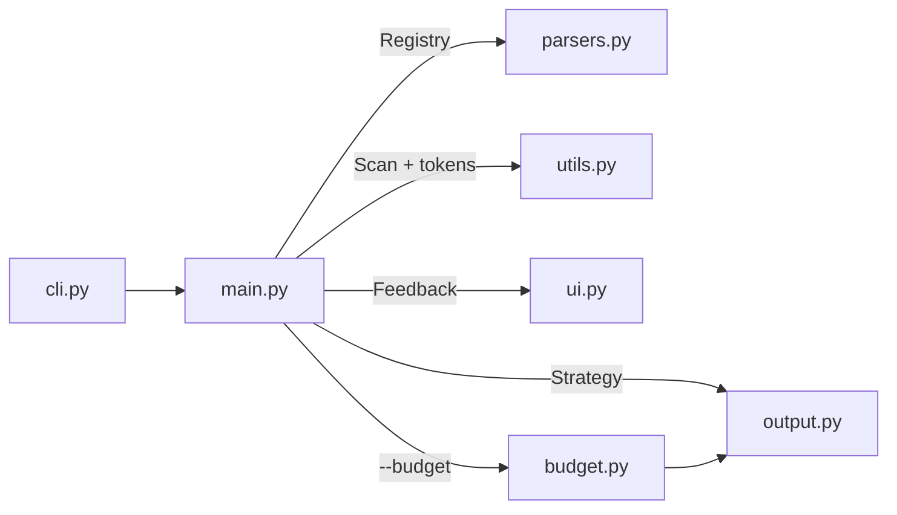

<p align="center">
  
</p>

<p align="center">
  <a href="https://pypi.org/project/data2prompt/"></a>
  <a href="https://github.com/arianmokhtariha/data2prompt/actions/workflows/tests.yml"></a>
  <a href="https://www.python.org/downloads/"></a>
  <a href="https://github.com/arianmokhtariha/data2prompt/blob/main/LICENSE"></a>
  <a href="https://github.com/arianmokhtariha/data2prompt/stargazers"></a>
</p>

<p align="center">
  
</p>

<p align="center">
  <b>Turn data-heavy projects into LLM context that actually fits — and actually informs.</b><br>
  One command turns a project full of CSVs, notebooks, Excel workbooks and SQLite
  databases into a single, structured, LLM-ready document — sampled, profiled,
  redacted, and fitted to your context window.
</p>

---

Generic repo-to-prompt tools break down on data projects — and not by a margin
you can optimize away. Point them at a directory with a few real datasets and
the output is tens of megabytes: no amount of trimming fits that into any
context window that exists. To a generic packer, a CSV is just a large text
file, so the only choices it offers are *dump it raw* or *skip it entirely* —
and both lose.

**data2prompt** treats data files as data. Every table is profiled — schema,
dtypes, per-column statistics, and missing-value counts computed on the
*complete* dataset — then represented by a seeded random sample of real rows.
The model doesn't get a shrunken view of your data; it gets a statistical
understanding of it that raw rows alone could never provide, plus enough real
rows to see formats, ranges, and quirks. Every intervention is disclosed in a
uniform notice grammar, so the LLM knows exactly what it is looking at and what
was left out.

<p align="center">
  
</p>

## 📉 Why

The same data-heavy project, packed by three tools with default settings:

<p align="center">
  
</p>

Read that chart as feasibility, not savings. A 22 MB dump is millions of
tokens — several times larger than the largest context window on the market,
at any price. On a real data project, a generic packer doesn't produce an
expensive prompt; it produces an impossible one. The 241 KB document is the
only output of the three that a model can actually be handed.

And the reduction is *representation*, not truncation. Every table still
contributes its full schema, per-column statistics computed on the complete
dataset, and a seeded random sample of real rows. The model often ends up
knowing *more* about your data than it would from pages of raw rows:
distributions, missingness, and dtypes are stated outright instead of left to
be inferred from whichever rows happened to fit. The model loses row noise,
not information.

## 🚀 Quick Start

```bash
# Recommended: install as a global CLI tool
pipx install data2prompt

# Or into an active virtual environment
pip install data2prompt
```

Run it from your project root:

```bash
data2prompt                    # → PROMPT.md (markdown, default settings)
data2prompt -b 100k -c        # fit the output into 100k tokens, copy to clipboard
data2prompt -f xml --schema-only   # XML format, schemas only, zero data rows
```

<details>
<summary><b>Parquet / Feather / Arrow support</b> (optional extra)</summary>

Columnar formats need [pyarrow](https://arrow.apache.org/docs/python/), which is
not bundled by default:

```bash
pipx install "data2prompt[parquet]"     # fresh install
pipx inject data2prompt pyarrow          # already installed via pipx
pip install "data2prompt[parquet]"      # pip equivalent
```

Without pyarrow these files still appear in the output with an inline note
explaining why they were skipped.
</details>

<details>
<summary><b>Install from source</b></summary>

```bash
git clone https://github.com/arianmokhtariha/data2prompt.git
cd data2prompt
pip install -e .
```
</details>

## 🔍 What Happens to Your Files

Every file type gets a strategy, not a dump:

| File type | Strategy | What the LLM sees |
| :--- | :--- | :--- |
| `.csv` | Seeded random sampling | Column schema, full-dataset stats, N sampled rows |
| `.parquet` `.feather` `.arrow` | Same, via pyarrow | Schema + stats + sample — identical treatment to CSV |
| `.xlsx` `.xls` `.xlsm` | Per-sheet extraction | Each sheet as its own schema + stats + sample section |
| `.db` `.sqlite` `.sqlite3` | Read-only stdlib `sqlite3` | Per-table `CREATE TABLE` DDL (keys, FKs, indexes) + stats + sampled rows |
| `.sql` | Statement-aware parsing | Schema statements kept intact, `INSERT` floods capped |
| `.ipynb` | Cell-level cleaning | Code, markdown and text outputs — base64 images and HTML dumps stripped |
| `.env` | Name-only redaction | `KEY=<redacted>` — variable names, never values |
| Binary files | Null-byte detection | Skipped, listed in the file index |
| Everything else | Size-aware reading | Full text, or first 10 KB past `--max-file-size` |

Two details make the samples trustworthy:

- **Statistics are computed on the full dataset, not the sample.** Dtypes,
  missing counts/percentages, and a `describe()` summary are extracted before
  sampling, so the model sees true data quality even from 15 rows.
- **Every intervention is disclosed.** Sampling, truncation, redaction, and
  skips all surface as uniform `-- [...] --` notices inside the document — the
  model is never left guessing why content looks incomplete.

## 🎛️ Fit Any Context Window: `--budget`

State the outcome you want instead of tuning knobs:

```bash
data2prompt --budget 100k
```

`--budget` runs a **de-escalation ladder** — halve CSV/SQL sample sizes, trim
notebook outputs, drop the stats blocks, switch to schema-only, and, as a last
resort, omit the heaviest remaining files — re-rendering and re-counting the
*actual* document after every step until it fits. No estimates: the number that
is checked is the number you ship.

- Accepts `50000`, `100k`, `1.5m` — commas and underscores welcome.
- A **budget report** is embedded in the document and shown in the terminal
  report: every parameter change and every omitted file, stated explicitly.
- If the budget is infeasible even at the ladder's floor, **nothing is written**
  and the process exits non-zero with the minimum achievable count — you will
  never silently receive an over-budget file.

## ✨ Features

What sets data2prompt apart from a generic repo-to-text dumper isn't any one
flag — it's that the whole pipeline is built around two rules: **never
silently lie about what the model is seeing**, and **never guess when the
real number can be measured**. Those two rules are why `--budget` re-renders
and re-counts instead of estimating, why every reduction gets a `-- [...] --`
notice instead of vanishing quietly, and why the same command on the same
project produces byte-identical output a year later.

### Statistical depth, not just sampling

- **A full statistical profile on every table** — before a single row is
  sampled, each CSV, Parquet file, Excel sheet, and SQLite table is profiled
  on the *complete* dataset: per-column dtype, missing count and percentage,
  and the full `describe()` battery (count, unique, top, freq, mean, std,
  min, quartiles, max) rendered as one unified schema table. Fifteen sampled
  rows plus this block tell the model more than a thousand raw rows would.
- **Samples that behave like the data** — sampling is seeded, and the drawn
  rows are re-sorted to original file order, so time series stay
  chronological and IDs stay ascending. Every sample notice cites the true
  size — `-- [Sample: random 15 of 1,234,567 rows] --` — captured *before*
  sampling, so the model can never mistake the sample for the dataset.
- **Exact dtypes from native schemas** — Parquet/Feather/Arrow columns carry
  pyarrow's native type strings (`int64`, `utf8`, `timestamp[us, tz=UTC]`)
  and SQLite columns their declared types from `PRAGMA table_info`,
  overriding pandas' lossier type inference.
- **Databases handled like databases** — SQLite files are verified by magic
  bytes, opened strictly read-only (`mode=ro` + `PRAGMA query_only`), and
  every table rendered with its full `CREATE` DDL — keys, foreign keys,
  indexes. Tables past 100k rows are `LIMIT`-read so a pathological database
  can never stall a run, and their stats block is honestly omitted rather
  than computed on a partial scan and passed off as truth.

### A document engineered for how LLMs read

- **The document teaches the model to read itself** — it opens with a reading
  contract: layout, structural conventions, the notice grammar, and explicit
  anti-hallucination accuracy rules. And the preamble is context-aware:
  conventions for notebooks, Excel, SQLite, or env files only appear when
  those file types were actually scanned this run.
- **An authoritative File Index** — one row per scanned file with its type
  and a controlled inclusion-status vocabulary (`Full`, `Sampled`,
  `Schema Only`, `Redacted`, `Omitted`, …). Every file the scan touched is
  accounted for; nothing silently vanishes from the document.
- **One notice grammar** — every tool intervention (sampling, truncation,
  redaction, skip, error) is a uniform `-- [Category: detail] --` line,
  taught once in the preamble, so the model can always separate what the tool
  says from what your files say.
- **Dynamic fence wrappers** — before any content is embedded, the longest
  backtick run inside it is measured and the enclosing fence is made one
  backtick longer. A file that itself contains ` ``` ` fences — a README, a
  notebook, generated docs — can never break the document's structure.
- **One canonical path per file** — project-relative, forward-slashed, and
  byte-identical across the File Index, the file headers, and every notice,
  so the model can cross-reference sections by literal string match.
- **Two output formats, one contract** — `markdown` (default) and `xml` for
  stronger structural anchoring in long contexts. Both are logically
  identical — same information, same order, same vocabulary — and governed by
  a written [output contract](docs/output-contract.md). In XML mode,
  attributes carrying user data are properly quoted while file content stays
  verbatim — no `&lt;` entity noise inflating tokens.
- **A closing recency anchor** — the document ends with an explicit
  end-of-codebase recap restating the accuracy rules, so the model knows the
  snapshot is complete and nothing follows.

### Measured, never estimated

- **Offline, exact token counting** — a bundled `o200k_base` BPE (tiktoken)
  counts the fully rendered document, scaffolding included. No network call,
  ever; a pure-regex fallback keeps counts flowing where the encoding cannot load.
- **Deterministic by default** — `--seed 42` means the exact same rows get
  sampled on every run. Regenerate a prompt for a diff, a reproducible eval,
  or a bug report and get the identical document back, not a new random draw.
- **Fails loud, never truncates silently** — if `--budget` is infeasible even
  at the ladder's floor, **nothing is written**. You get a non-zero exit and
  the minimum achievable token count — never a file that quietly blew past
  what you asked for.
- **Every budget decision is on the record** — a `--budget` run embeds a
  Budget Report in the document itself: every parameter it tightened and
  every file it omitted, so both you and the model know exactly what was
  traded away to fit.

### Robust by construction

- **Per-file error containment** — every parser degrades a corrupt file, a
  locked file, or a truncated database to an inline error note for that file
  alone. One bad file — or one bad Excel sheet, or one bad SQLite table —
  never crashes the run.
- **Secret-safe by design** — `.env` values never reach the output (variable
  names only, values redacted); long lines are truncated to neutralize
  prompt-injection padding; binary content is detected and excluded.
- **Scan hygiene** — respects `.gitignore` with real per-directory scoping
  (a `src/.gitignore` applies under `src/`, exactly like git), honors a
  project-level `.data2promptignore`, ships hardened core ignore lists
  (`.git`, `node_modules`, caches), and recognizes its own previously
  generated outputs by an embedded marker so it never packs itself.
- **Straight to clipboard** — `--clipboard` pipes the result to your OS
  clipboard via native tools (`clip`/`pbcopy`/`xclip`/`wl-copy`) with a file
  fallback — UTF-16 on Windows so non-ASCII content round-trips intact.
- **A terminal UI that earns its place** — an animated glitch-sweep banner, a
  transient progress bar, and a final report with a token gauge against a 200K
  context window, a per-type composition chart, attention badges, and the
  heaviest files each with a token-share bar. Animations disable themselves on
  non-interactive output, and every quantity in the report doubles as a
  proportional bar.

## ⌨️ CLI Reference

The flags you will actually reach for:

| Flag | Default | Purpose |
| :--- | :--- | :--- |
| `-o`, `--output` | `PROMPT` | Base name of the generated file |
| `-f`, `--format` | `markdown` | Output format: `markdown` or `xml` |
| `-b`, `--budget` | off | Target token budget (`50000`, `100k`, `1.5m`) |
| `-c`, `--clipboard` | off | Copy to clipboard instead of writing a file |
| `-s`, `--csv-sample-size` | `15` | Rows sampled per tabular file |
| `--seed` | `42` | Sampling seed — identical output across runs |
| `--schema-only` | off | Schemas and dtypes only, zero data rows |
| `--max-lines` | `40` | Output lines kept per notebook cell |
| `--max-sheets` | `10` | Sheets processed per Excel workbook |
| `--max-tables` | `25` | Tables processed per SQLite database |
| `--max-file-size` | `70` | KB threshold before plain files are head-truncated |
| `--no-stats-summary` | stats on | Drop the per-table stats block |
| `--no-env-keys` | redact | Skip `.env` files entirely instead of redacting |
| `--no-gitignore` | respect | Ignore `.gitignore` rules while scanning |
| `--ignore-folders` / `--ignore-files` / `--skip-exts` | — | Additional exclusions, merged with the core ignore sets |

Full reference with validation rules and edge cases: [docs/cli.md](docs/cli.md)

## 🏗️ Architecture

Small, single-responsibility modules under an orchestration layer — parsing,
output generation, scanning, token budgeting, and UI never bleed into each other:



- A **parser registry** maps extensions to specialized parsers; new file types
  plug in without touching the pipeline.
- An **output strategy** keeps markdown and XML generation interchangeable and
  contract-bound.
- Fully typed (PEP 484), stdlib-first, with per-file error containment — one
  corrupt file degrades to an inline error note, never a crashed run.

Every module has a matching deep-dive document:

| | |
| :--- | :--- |
| [Architecture](docs/architecture.md) | Module layout, data flow, design patterns |
| [Parsers](docs/parsers.md) | Per-format strategies and the tool-notice grammar |
| [Budget](docs/budget.md) | The `--budget` de-escalation ladder, end to end |
| [Output](docs/output.md) · [Output Contract](docs/output-contract.md) | Document structure and the markdown/XML parity rules |
| [CLI](docs/cli.md) · [UI](docs/ui.md) · [Installation](docs/installation.md) | Flags, the terminal interface, setup |

## 🛠️ Development

```bash
pip install -e .[dev]
pytest
```

Contributions are welcome — new file-type parsers are the highest-leverage place
to start (the registry makes them self-contained). Open an issue first for
anything that changes the generated document, and read
[docs/output-contract.md](docs/output-contract.md) before touching output code.

---

<p align="center"><i>If data2prompt saved you time and tokens, a ⭐ helps other data people find it.</i></p>
