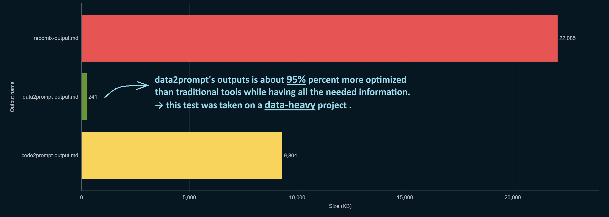

<p align="center">
  
</p>

<p align="center">
  <a href="https://pypi.org/project/data2prompt/"></a>
  <a href="https://github.com/arianmokhtariha/data2prompt/blob/main/LICENSE"></a>
  <a href="https://www.python.org/downloads/"></a>
  <a href="https://github.com/arianmokhtariha/data2prompt"></a>
</p>


> **High-performance codebase-to-prompt orchestration for Data Science workflows and data-heavy projects.**

data2prompt is a CLI tool designed to bridge the gap between local data-heavy projects and Large Language Model (LLM) context windows. Unlike generic code-packagers, it provides an intelligent,optimized output for LLM attention mechanism, token-aware representation of a project's structure and content.

## 📝 Important Note
**Data2prompt** is purpose-built for **data-heavy projects** (`.csv`, `.sql`, `.xlsx`, `.ipynb`, `.db`), not large pure-code repositories. It intelligently samples and truncates data files to prevent context window explosion while preserving semantic structure.


## 🎯 Why Data2Prompt?
Generic code-to-prompt tools choke on data files—they either skip them entirely or dump raw CSVs that waste 90% of your context window. Data2Prompt solves this with intelligent sampling, schema extraction, and LLM-optimized formatting specifically designed for data science workflows.

<p align="center">
  
</p>


## ✨ Core Features

*   **Smart Jupyter Parsing**: Intelligently extracts code, markdown, and text outputs from [`.ipynb`](docs/parsers.md) files while stripping heavy Base64 images and raw HTML to preserve context.
*   **Multi-Format Sampling**: Advanced sampling strategies for [CSV, SQL, and Excel](docs/parsers.md) files to preserve schema and data context which reduces the data size significantly while extracting the needed context for llm.
*   **SQLite Database Extraction**: Reads `.db`/`.sqlite`/`.sqlite3` databases with the standard library (zero extra dependencies) — one section per table/view with its `CREATE TABLE` DDL (keys, foreign keys, indexes), a schema/stats block, and a sampled preview. Huge tables degrade to a head sample automatically, and the whole thing respects `--budget` and `--schema-only`. Cap tables per database with `--max-tables`.
*   **Stats-Aware Metadata**: Each table is annotated with a metadata block — column dtypes, missing counts/percentages, and a `describe()` summary — all computed on the *full* dataset (not the sample), so the LLM sees true data quality. Toggle with `--no-stats-summary`.
*   **Secret-Safe `.env` Handling**: `.env` files are surfaced as variable *names* with redacted values (`KEY=<redacted>`) so the LLM understands the project's configuration without ever leaking secrets. Disable with `--no-env-keys`.
*   **Direct Clipboard Output**: `--clipboard` copies the generated prompt straight to your system clipboard (no file), using native OS tools with a graceful file fallback.
*   **Aggressive truncations**: To preserve context, long lines are truncated to neutralize line injections and avoid exploding the context windows, if a tabular data was still to large after sampling it will get truncated to a certain amount, also if a raw text file of unhandled type was too large it will get truncated to a certain amount. 
*   **Defensive Processing**: Automatic binary detection (Null-byte checks), Checks if a file is binary by looking for a Null byte in the first 1024 bytes.
*   **Optimized LLM attention**: The default output format is markdown with well structured schema and another option is xml output with xml style tags to enhance LLM anchoring for complex analysis and large context windows
*   **Token-Aware Output**: Real-time token estimation using `tiktoken` (`o200k_base`) to ensure prompts fit target LLMs (Claude 3.5, GPT-4o, Gemini 1.5) and advanced offline token counting via `regex`.
*   **Professional TUI**: A high-fidelity terminal interface built with `Rich` in a monochrome-and-crimson "BLACKSITE" theme — an animated banner reveal, a live progress bar with file counts and elapsed time, and a compact, stamped final report that reads at a glance: a token gauge against a 200K context window, a per-type composition bar chart, attention badges, and the heaviest/flagged files each with a token-share bar. Identical on every platform; animations auto-disable on non-interactive output.
*   **Dynamic Markdown Wrapping**: Uses intelligent backtick depth to ensure robust nesting of code blocks in the final output.
*   **Gitignore aware**: Respects the .gitignore rules by default and you can turn this feature off with cli argument(--no-gitignore) if needed.

## 🏗️ Architecture

The codebase is organized into small, single-responsibility modules — parsing, output
generation, scanning, and UI are kept separate so each can be tested and extended on
its own:

*   **Registry & Strategy Patterns**: A `ParserRegistry` handles extensible file
    parsing and an `OutputGenerator` strategy supports multiple output formats
    (Markdown, XML).
*   **Centralized Configuration**: Core logic, magic numbers, and default ignore
    lists live in one place: [`src/data2prompt/constants.py`](src/data2prompt/constants.py).
*   **Strict Type Hinting**: Fully typed function signatures (PEP 484) across all
    modules.
*   **UI Encapsulation**: Terminal feedback is handled by a dedicated `UIHandler`,
    keeping presentation separate from logic.

For a deep dive into the module layout and data flow, see the
[Architecture Documentation](docs/architecture.md).

## 🚀 Quick Start

### Installation

Ensure you have Python 3.10+ installed.

**Recommended — using pipx (installs as a global CLI tool):**

Don't have pipx? Install it first:
```bash
pip install pipx
pipx ensurepath
```

Then install data2prompt:
```bash
pipx install data2prompt
```

**Alternative — using pip (requires an active virtual environment):**
```bash
pip install data2prompt
```

**Update to the latest version:**
```bash
# with pipx
pipx upgrade data2prompt

# with pip
pip install --upgrade data2prompt
```

### Install from the source

```bash
# Clone the repository
git clone https://github.com/arianmokhtariha/data2prompt.git
cd data2prompt

# Install normally
pip install .

# Or Install in editable mode
pip install -e .
```

### Optional: Parquet, Feather, and Arrow support

Support for `.parquet`, `.feather`, and `.arrow` files requires [pyarrow](https://arrow.apache.org/docs/python/), which is not bundled by default. Choose the command that matches how you installed data2prompt:

| Scenario | Command |
| :--- | :--- |
| pip — fresh install | `pip install data2prompt[parquet]` |
| pip — already installed | `pip install pyarrow` |
| pipx — fresh install | `pipx install data2prompt[parquet]` |
| pipx — already installed | `pipx inject data2prompt pyarrow` |

If pyarrow is not installed, these files still appear in the output with a short inline note explaining why they were skipped.

### Usage

Run `data2prompt` in your project root to generate a structured prompt:

```bash
# Basic usage (defaults to markdown output)
data2prompt

# Custom output with xml format and specific sampling
data2prompt --output my_analysis --format xml --csv-sample-size 50 --ignore-folders venv .pytest_cache
```

### CLI Arguments

| Argument | Description | Default |
| :--- | :--- | :--- |
| `-o`, `--output` | Base name of the generated file | `PROMPT` |
| `-f`, `--format` | Output format (`xml` or `markdown`) | `markdown` |
| `-s`, `--csv-sample-size` | Number of random rows to sample from CSVs | `15` |
| `--max-lines` | Max lines of text output per notebook cell | `40` |
| `--max-tables` | Max tables/views to process per SQLite database | `25` |
| `--max-file-size` | Max file size in KB to read entirely | `70` |
| `-c`, `--clipboard` | Copy the output to the system clipboard instead of writing a file | `off` |
| `--schema-only` | Emit only the schema (columns + dtypes) of data files, no rows | `off` |
| `--no-stats-summary` | Disable the per-table stats block (dtypes, missing %, `describe()`) | `on` |
| `--no-env-keys` | Skip `.env` files entirely instead of listing redacted variable names | `on` |

See the [CLI Reference](docs/cli.md) for a full list of arguments.

## 📚 Documentation

Explore the detailed documentation for more information:

*   [**Architecture**](docs/architecture.md): MFO pattern and module flow.
*   [**CLI Reference**](docs/cli.md): Detailed argument descriptions and usage.
*   [**Parsers**](docs/parsers.md): How different file types are handled.
*   [**Output Formats**](docs/output.md): Details on Markdown and XML generation.
*   [**User Interface**](docs/ui.md): Features of the high-tech TUI.
*   [**Installation**](docs/installation.md): Comprehensive setup guide.

## 🛠️ Developer Setup

To contribute or run tests:

```bash
pip install -e .[dev]
pytest
```

## 🌟 Show Your Support

If Data2Prompt saves you token costs or speeds up your workflow, consider:
- ⭐ Starring the repo
- 🐛 Reporting issues or suggesting features
- 🔀 Contributing parsers for new file types

## Star History

<a href="https://www.star-history.com/?repos=arianmokhtariha%2Fdata2prompt&type=date&legend=top-left">
 <picture>
   <source media="(prefers-color-scheme: dark)" srcset="https://api.star-history.com/chart?repos=arianmokhtariha/data2prompt&type=date&theme=dark&legend=top-left" />
   <source media="(prefers-color-scheme: light)" srcset="https://api.star-history.com/chart?repos=arianmokhtariha/data2prompt&type=date&legend=top-left" />
   
 </picture>
</a>

---
*Built for the modern AI-assisted development workflow.*
