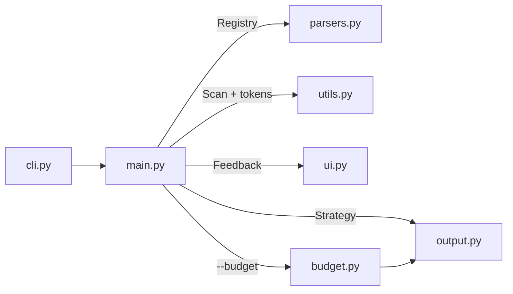

<p align="center">
  
</p>

<p align="center">
  <a href="https://pypi.org/project/data2prompt/"></a>
  <a href="https://github.com/arianmokhtariha/data2prompt/actions/workflows/tests.yml"></a>
  <a href="https://www.python.org/downloads/"></a>
  <a href="https://github.com/arianmokhtariha/data2prompt/blob/main/LICENSE"></a>
  <a href="https://github.com/arianmokhtariha/data2prompt/stargazers"></a>
  <a href="https://deepwiki.com/arianmokhtariha/data2prompt"></a>
</p>

<p align="center">
  
</p>

<p align="center">
  <b>Turn data-heavy projects into LLM context that actually fits.</b><br>
  One command packs a directory of CSVs, notebooks, Excel workbooks and SQLite
  databases into a single structured document: sampled, profiled, redacted, and
  sized to your context window.
</p>

---

Point a generic repo-to-prompt tool at a project with real datasets in it and
you get tens of megabytes of output. That is not a number you can trim your way
out of. To a generic packer a CSV is just a large text file, so it offers two
choices: dump the whole thing, or skip it.

data2prompt reads data files as data. Every table is profiled on the complete
dataset (schema, dtypes, per-column statistics, missing-value counts), then
represented by a seeded random sample of real rows. The model gets a statistical
picture of the data plus enough real rows to see formats, ranges and quirks.
Anything the tool changed or left out is stated inline, so the model always
knows what it is looking at.

<p align="center">
  
</p>

## Why

The same data-heavy project, packed by three tools on default settings:

<p align="center">
  
</p>

Read that as feasibility rather than savings. A 22 MB dump is millions of
tokens, several times larger than the biggest context window on the market at
any price. On a real data project a generic packer doesn't produce an expensive
prompt, it produces an impossible one. Of the three outputs, only the 241 KB one
can be handed to a model at all.

The reduction comes from representation, not truncation. Each table still
contributes its full schema, statistics computed over every row, and a seeded
sample of real rows. The model often ends up knowing more about your data than
it would from pages of raw rows, because distributions, missingness and dtypes
are stated outright instead of inferred from whichever rows happened to fit.

## Quick start

```bash
# No install: fetch and run in one step, via uv
uvx data2prompt

# Or install as a global CLI tool
uv tool install data2prompt   # via uv
pipx install data2prompt      # via pipx

# Or into an active virtual environment
pip install data2prompt
```

[`uvx`](https://docs.astral.sh/uv/) caches the tool after the first run, so
repeat runs start instantly and nothing is left on your system to clean up.

Run it from your project root:

```bash
data2prompt                        # → PROMPT.md (markdown, default settings)
data2prompt -b 100k -c             # fit into 100k tokens, copy to clipboard
data2prompt -f xml --schema-only   # XML format, schemas only, zero data rows
```

<details>
<summary><b>Parquet / Feather / Arrow support</b> (optional extra)</summary>

Columnar formats need [pyarrow](https://arrow.apache.org/docs/python/), which is
not bundled by default:

```bash
uvx --from "data2prompt[parquet]" data2prompt   # no install
uv tool install "data2prompt[parquet]"          # uv global install
pipx install "data2prompt[parquet]"             # fresh pipx install
pipx inject data2prompt pyarrow                 # already installed via pipx
pip install "data2prompt[parquet]"              # pip equivalent
```

Without pyarrow these files still appear in the output, with an inline note
explaining why they were skipped.
</details>

<details>
<summary><b>Install from source</b></summary>

```bash
git clone https://github.com/arianmokhtariha/data2prompt.git
cd data2prompt
pip install -e .
```
</details>

## What happens to your files

Every file type gets a strategy, not a dump:

| File type | Strategy | What the LLM sees |
| :--- | :--- | :--- |
| `.csv` | Seeded random sampling | Column schema, full-dataset stats, N sampled rows |
| `.parquet` `.feather` `.arrow` | Same, via pyarrow | Schema, stats and sample, identical treatment to CSV |
| `.xlsx` `.xls` `.xlsm` | Per-sheet extraction | Each sheet as its own schema, stats and sample section |
| `.db` `.sqlite` `.sqlite3` | Read-only stdlib `sqlite3` | Per-table `CREATE TABLE` DDL (keys, FKs, indexes), stats, sampled rows |
| `.sql` | Statement-aware parsing | Schema statements kept intact, `INSERT` floods capped |
| `.ipynb` | Cell-level cleaning | Code, markdown and text outputs, with base64 images and HTML dumps stripped |
| `.env` | Name-only redaction | `KEY=<redacted>`, so variable names but never values |
| Binary files | Null-byte detection | Skipped, listed in the file index |
| Everything else | Size-aware reading | Full text, or head-truncated at `--max-file-size` (default 70 KB) |

Two things make the samples trustworthy. Statistics are computed on the full
dataset before any sampling happens, so dtypes, missing counts and the
`describe()` summary reflect every row even when the model only sees 15 of them.
And every intervention the tool makes (sampling, truncation, redaction, skips)
appears as a uniform `-- [...] --` notice inside the document, so the model is
never left guessing why something looks incomplete.

## Fitting a context window

State the outcome you want instead of tuning knobs:

```bash
data2prompt --budget 100k
```

`--budget` runs a de-escalation ladder: halve CSV and SQL sample sizes, trim
notebook outputs, drop the stats blocks, switch to schema-only, and as a last
resort omit the heaviest remaining files. It re-renders and re-counts the actual
document after every step until it fits. The number that gets checked is the
number you ship.

- Accepts `50000`, `100k`, `1.5m`. Commas and underscores are fine.
- A budget report is embedded in the document and shown in the terminal report,
  listing every parameter change and every omitted file.
- If the budget is infeasible even at the ladder's floor, nothing is written.
  The process exits non-zero with the minimum achievable count, so you never
  silently receive an over-budget file.

## Under the hood

Two rules shape the whole pipeline: never misrepresent what the model is seeing,
and never estimate a number that can be measured. That's why `--budget`
re-renders and re-counts instead of guessing, why every reduction leaves a
notice behind, and why the same command on the same project produces
byte-identical output a year later.

### Profiling and sampling

- Every CSV, Parquet file, Excel sheet and SQLite table is profiled before a
  single row is sampled: per-column dtype, missing count and percentage, and the
  full `describe()` battery (count, unique, top, freq, mean, std, min, quartiles,
  max), rendered as one unified schema table.
- Sampling is seeded, and the drawn rows are re-sorted back into original file
  order, so time series stay chronological and IDs stay ascending. Every notice
  cites the true size captured before sampling, as in
  `-- [Sample: random 15 of 1,234,567 rows] --`, so the sample can never be
  mistaken for the dataset.
- Parquet, Feather and Arrow columns carry pyarrow's native type strings
  (`int64`, `utf8`, `timestamp[us, tz=UTC]`), and SQLite columns their declared
  types from `PRAGMA table_info`. Both override pandas' lossier inference.
- SQLite files are verified by magic bytes and opened strictly read-only
  (`mode=ro` plus `PRAGMA query_only`). Each table is rendered with its full
  `CREATE` DDL, including keys, foreign keys and indexes. Tables past 100k rows
  are `LIMIT`-read so a pathological database can't stall a run, and their stats
  block is honestly omitted rather than computed on a partial scan.

### The generated document

- It opens with a reading contract covering layout, structural conventions, the
  notice grammar, and explicit accuracy rules against hallucination. The preamble
  is context-aware: conventions for notebooks, Excel, SQLite or env files only
  appear when those types were actually scanned.
- A File Index lists every scanned file with its type and an inclusion status
  drawn from a controlled vocabulary (`Full`, `Sampled`, `Schema Only`,
  `Redacted`, `Omitted` and a few more). Nothing the scan touched goes
  unaccounted for.
- Every tool intervention uses the same `-- [Category: detail] --` form, taught
  once in the preamble, so the model can always separate what the tool says from
  what your files say.
- Fences are sized dynamically. Before content is embedded, the longest backtick
  run inside it is measured and the enclosing fence is made one backtick longer,
  so a README or notebook that contains its own fences can't break the structure.
- Each file has one canonical path (project-relative, forward-slashed) that is
  byte-identical across the File Index, the file headers and every notice, so the
  model can cross-reference sections by literal string match.
- Two formats, `markdown` (default) and `xml` for stronger structural anchoring
  in long contexts, are logically identical and governed by a written
  [output contract](docs/output-contract.md). XML mode quotes attributes carrying
  user data while leaving file content verbatim, so no `&lt;` entity noise
  inflates the token count.
- The document closes with an end-of-codebase recap that restates the accuracy
  rules, so the model knows the snapshot is complete and nothing follows.

### Reliability

- Token counts are exact and offline. A bundled `o200k_base` BPE (tiktoken)
  counts the fully rendered document, scaffolding included, with a pure-regex
  fallback if the encoding can't load. No network call, ever.
- `--seed 42` keeps runs reproducible. Regenerate a prompt for a diff, an eval or
  a bug report and you get the identical document back.
- Every parser contains its own failures. A corrupt file, a locked file, a
  truncated database, one bad Excel sheet or one bad SQLite table degrades to an
  inline error note for that file alone, never a crashed run.
- `.env` values never reach the output (names only, values redacted), long lines
  are truncated to neutralize prompt-injection padding, and binary content is
  detected and excluded.
- Scanning respects `.gitignore` with real per-directory scoping (a
  `src/.gitignore` applies under `src/`, exactly like git), honors a
  project-level `.data2promptignore`, ships hardened core ignore lists (`.git`,
  `node_modules`, caches), and recognizes its own previous outputs by an embedded
  marker so it never packs itself.
- `--clipboard` pipes the result to your OS clipboard through native tools
  (`clip`, `pbcopy`, `xclip`, `wl-copy`) with a file fallback, using UTF-16 on
  Windows so non-ASCII content round-trips intact.
- An animated banner and a transient progress bar run during the scan, and the
  final report shows a token gauge against a 200K context window, a per-type
  composition chart, attention badges, and the heaviest files each with a
  token-share bar. Animations disable themselves on non-interactive output.

## CLI reference

The flags you will actually reach for:

| Flag | Default | Purpose |
| :--- | :--- | :--- |
| `-o`, `--output` | `PROMPT` | Base name of the generated file |
| `-f`, `--format` | `markdown` | Output format: `markdown` or `xml` |
| `-b`, `--budget` | off | Target token budget (`50000`, `100k`, `1.5m`) |
| `-c`, `--clipboard` | off | Copy to clipboard instead of writing a file |
| `-s`, `--csv-sample-size` | `15` | Rows sampled per tabular file |
| `--seed` | `42` | Sampling seed, for identical output across runs |
| `--schema-only` | off | Schemas and dtypes only, zero data rows |
| `--max-lines` | `40` | Output lines kept per notebook cell |
| `--max-sheets` | `10` | Sheets processed per Excel workbook |
| `--max-tables` | `25` | Tables processed per SQLite database |
| `--max-file-size` | `70` | KB threshold before plain files are head-truncated |
| `--no-stats-summary` | stats on | Drop the per-table stats block |
| `--no-env-keys` | redact | Skip `.env` files entirely instead of redacting |
| `--no-gitignore` | respect | Ignore `.gitignore` rules while scanning |
| `--ignore-folders` / `--ignore-files` / `--skip-exts` | | Additional exclusions, merged with the core ignore sets |

Full reference with validation rules and edge cases: [docs/cli.md](docs/cli.md)

## Architecture

Small, single-responsibility modules under an orchestration layer. Parsing,
output generation, scanning, token budgeting and UI never bleed into each other:



A parser registry maps extensions to specialized parsers, so new file types plug
in without touching the pipeline. An output strategy keeps markdown and XML
generation interchangeable and contract-bound. The codebase is fully typed
(PEP 484) and stdlib-first.

Every module has a matching deep-dive document:

| | |
| :--- | :--- |
| [Architecture](docs/architecture.md) | Module layout, data flow, design patterns |
| [Parsers](docs/parsers.md) | Per-format strategies and the tool-notice grammar |
| [Budget](docs/budget.md) | The `--budget` de-escalation ladder, end to end |
| [Output](docs/output.md) · [Output Contract](docs/output-contract.md) | Document structure and the markdown/XML parity rules |
| [CLI](docs/cli.md) · [UI](docs/ui.md) · [Installation](docs/installation.md) | Flags, the terminal interface, setup |

## Development

```bash
pip install -e .[dev]
pytest
```

Contributions are welcome. New file-type parsers are the highest-leverage place
to start, since the registry makes them self-contained. Please open an issue
first for anything that changes the generated document, and read
[docs/output-contract.md](docs/output-contract.md) before touching output code.

---

<p align="center"><i>If data2prompt saved you time and tokens, a star helps other data people find it.</i></p>
