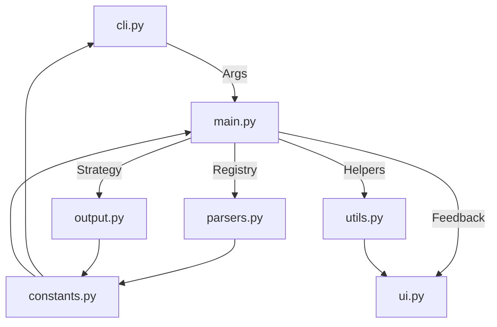

# Architecture: Modular Functional Orchestration (MFO)

The `data2prompt` project is built upon the **Modular Functional Orchestration (MFO)** pattern. This architectural approach ensures a clear separation of concerns, high maintainability, and senior-level engineering maturity.

## Core Principles

1.  **Centralized Configuration**: All default values, ignore lists, and static strings are managed in [`src/data2prompt/constants.py`](src/data2prompt/constants.py), providing a single source of truth.
2.  **Functional Specialization**: Logic is encapsulated into focused, pure-ish functions within specialized modules (`parsers.py`, `utils.py`).
3.  **Orchestration Layer**: The main execution path in [`src/data2prompt/main.py`](src/data2prompt/main.py) coordinates high-level logic, dispatching tasks to specialized modules.
4.  **UI Encapsulation**: All terminal output is handled exclusively by the `UIHandler` in [`src/data2prompt/ui.py`](src/data2prompt/ui.py).
5.  **Defensive Programming**: Robust error handling and resource management are implemented throughout the codebase.

## Module Flow

The high-level workflow is orchestrated by [`src/data2prompt/main.py`](src/data2prompt/main.py):

### Workflow Steps

1.  **Initialization**: [`src/data2prompt/cli.py`](src/data2prompt/cli.py) parses user input and merges it with defaults from [`src/data2prompt/constants.py`](src/data2prompt/constants.py).
2.  **Discovery**: [`src/data2prompt/main.py`](src/data2prompt/main.py) uses [`src/data2prompt/utils.py`](src/data2prompt/utils.py) to scan the project directory, respecting ignore rules.
3.  **Processing**: For each file, [`src/data2prompt/main.py`](src/data2prompt/main.py) uses the `ParserRegistry` in [`src/data2prompt/parsers.py`](src/data2prompt/parsers.py) to select the appropriate parser.
4.  **Generation**: Once all files are processed, [`src/data2prompt/main.py`](src/data2prompt/main.py) uses an `OutputGenerator` strategy from [`src/data2prompt/output.py`](src/data2prompt/output.py) to compile the final output.
5.  **Feedback**: Throughout the process, [`src/data2prompt/ui.py`](src/data2prompt/ui.py) provides real-time progress updates and final reporting.
