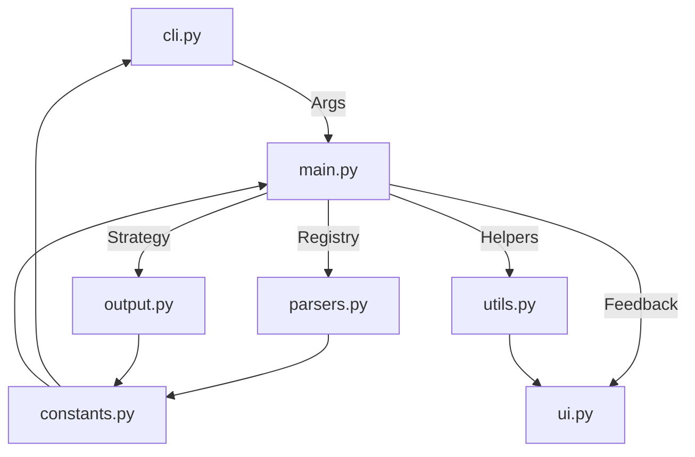
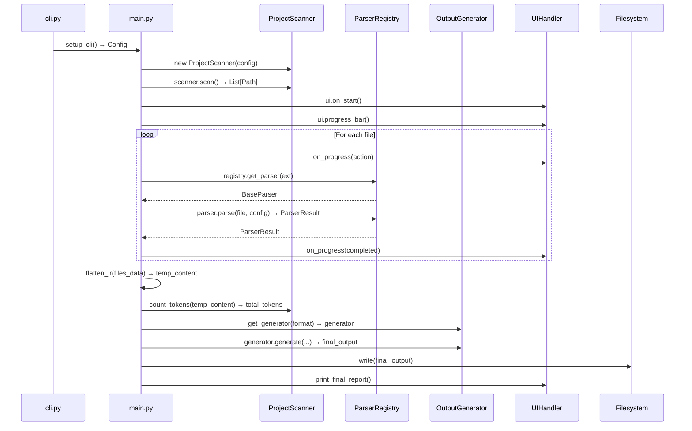

# Architecture: Modular Functional Orchestration (MFO)

The `data2prompt` project is built upon the **Modular Functional Orchestration (MFO)** pattern. This architectural approach ensures a clear separation of concerns, high maintainability, and senior-level engineering maturity.

## Core Principles

1.  **Centralized Configuration**: All default values, ignore lists, and static strings are managed in [`src/data2prompt/constants.py`](../src/data2prompt/constants.py), providing a single source of truth.
2.  **Functional Specialization**: Logic is encapsulated into focused, pure-ish functions within specialized modules (`parsers.py`, `utils.py`).
3.  **Orchestration Layer**: The main execution path in [`src/data2prompt/main.py`](../src/data2prompt/main.py) coordinates high-level logic, dispatching tasks to specialized modules.
4.  **UI Encapsulation**: All terminal output is handled exclusively by the `UIHandler` in [`src/data2prompt/ui.py`](../src/data2prompt/ui.py).
5.  **Defensive Programming**: Robust error handling and resource management are implemented throughout the codebase.

## Module Flow

The high-level workflow is orchestrated by [`src/data2prompt/main.py`](../src/data2prompt/main.py):



### Workflow Steps

1.  **Initialization**: [`src/data2prompt/cli.py`](../src/data2prompt/cli.py) parses user input and merges it with defaults from [`src/data2prompt/constants.py`](../src/data2prompt/constants.py).
2.  **Discovery**: [`src/data2prompt/main.py`](../src/data2prompt/main.py) uses [`src/data2prompt/utils.py`](../src/data2prompt/utils.py) to scan the project directory, respecting ignore rules.
3.  **Processing**: For each file, [`src/data2prompt/main.py`](../src/data2prompt/main.py) uses the `ParserRegistry` in [`src/data2prompt/parsers.py`](../src/data2prompt/parsers.py) to select the appropriate parser.
4.  **Generation**: Once all files are processed, [`src/data2prompt/main.py`](../src/data2prompt/main.py) uses an `OutputGenerator` strategy from [`src/data2prompt/output.py`](../src/data2prompt/output.py) to compile the final output.
5.  **Feedback**: Throughout the process, [`src/data2prompt/ui.py`](../src/data2prompt/ui.py) provides real-time progress updates and final reporting.

---

## The Orchestration Layer: main.py

[`src/data2prompt/main.py`](../src/data2prompt/main.py#L1) serves as the central orchestration hub for the entire application. It follows the MFO pattern by coordinating high-level workflows without implementing any specialized parsing, output generation, or UI logic.

### Module Responsibilities

| Module | Responsibility | Access in main.py |
|--------|---------------|-------------------|
| [`cli.py`](../src/data2prompt/cli.py#L1) | Argument parsing and Config construction | `config = setup_cli()` |
| [`parsers.py`](../src/data2prompt/parsers.py#L1) | Format-specific file parsing via Registry | `registry.get_parser(ext)` |
| [`output.py`](../src/data2prompt/output.py#L1) | Output generation via Strategy pattern | `get_generator(config.format)` |
| [`utils.py`](../src/data2prompt/utils.py#L1) | Project scanning, tokenization, connectivity | `ProjectScanner`, `count_tokens()`, `check_connectivity()` |
| [`ui.py`](../src/data2prompt/ui.py#L1) | Terminal feedback and reporting | `ui.on_start()`, `ui.progress_bar()` |

### Data Flow



### Processing Pipeline

The [`main()`](../src/data2prompt/main.py#L43) function implements a three-phase processing pipeline:

#### Phase 1: Initialization & Discovery

```python
config = setup_cli()
project_path = Path.cwd()
scanner = ProjectScanner(
    project_path=project_path,
    ignore_folders=config.ignore_folders,
    ignore_files=config.ignore_files,
    output_file=config.output,
    use_gitignore=config.use_gitignore
)
all_files = scanner.scan()
```

1. **Config Construction**: [`setup_cli()`](../src/data2prompt/cli.py#L48) merges CLI arguments with defaults from [`constants.py`](../src/data2prompt/constants.py#L1)
2. **Project Scanner**: [`ProjectScanner`](../src/data2prompt/utils.py#L105) discovers files while respecting ignore patterns (`.gitignore`, `.data2promptignore`, CLI exclusions)

#### Phase 2: File Processing

```python
for file_path in all_files:
    result = process_target_file(file_path, config)
    files_data.append({...})
```

The [`process_target_file()`](../src/data2prompt/main.py#L27) function:

1. **Routes env files by name**: if `is_env_file(name)`, delegates to the shared `env_parser` (redacts values) — this runs *before* the extension checks because a bare `.env` has no suffix
2. **Checks exclusions**: Returns early for files matching `skip_exts`
3. **Selects parser**: Uses `registry.get_parser(ext)` to obtain the appropriate [`BaseParser`](../src/data2prompt/parsers.py#L92)
4. **Delegates parsing**: Calls `parser.parse(file_path, config)` and returns [`ParserResult`](../src/data2prompt/parsers.py#L47)

The [`get_ui_action()`](../src/data2prompt/main.py#L18) helper determines the progress bar action based on file type:

| Extension | Action |
|-----------|--------|
| `.csv` | "Sampling" |
| `.ipynb` | "Cleaning" |
| `.sql` | "Parsing" |
| `.xlsx`, `.xls` | "Extracting" |
| Other | "Reading" |

#### Phase 3: Output Generation

```python
temp_content = flatten_ir(files_data) + tree_text
total_tokens, method = count_tokens(temp_content)

generator = get_generator(config.format)
final_output = generator.generate(
    project_name=project_path.name,
    tree_text=tree_text,
    files_data=files_data,
    stats=stats,
    total_tokens=total_tokens,
    token_method=method,
    config=config
)
```

1. **Token Estimation**: Uses [`flatten_ir()`](../src/data2prompt/parsers.py#L56) (with the `schema_only`/`stats_summary` flags) to convert structured IR back to string for accurate token counting
2. **Generator Selection**: [`get_generator()`](../src/data2prompt/output.py#L232) returns the appropriate [`OutputGenerator`](../src/data2prompt/output.py#L23) strategy based on `config.format`
3. **Output Destination**: when `config.clipboard` is set, the generated output is copied to the system clipboard via [`copy_to_clipboard()`](../src/data2prompt/utils.py) and no file is written; if no clipboard utility is available it falls back to writing `config.output` and warns. Otherwise the output is written to `config.output` as usual.
4. **Final Report**: [`ui.print_final_report()`](../src/data2prompt/ui.py#L129) displays the interactive summary

### Design Patterns

#### Parser Registry Pattern

The `ParserRegistry` in [`parsers.py`](../src/data2prompt/parsers.py#L1) maps file extensions to specialized parser classes:

```python
class ParserRegistry:
    _parsers: Dict[str, Type[BaseParser]]
    
    def get_parser(self, ext: str) -> BaseParser:
        """Returns the appropriate parser for the given extension."""
        
    def register(self, ext: str, parser_cls: Type[BaseParser]) -> None:
        """Registers a new parser for an extension."""
```

Registered parsers include:
- [`CsvParser`](../src/data2prompt/parsers.py#L1) → `.csv`
- [`SqlParser`](../src/data2prompt/parsers.py#L1) → `.sql`
- [`NotebookParser`](../src/data2prompt/parsers.py#L1) → `.ipynb`
- [`ExcelParser`](../src/data2prompt/parsers.py#L1) → `.xlsx`, `.xls`

In addition, `EnvParser` handles `.env` files. It is dispatched **by filename** (not via
the extension registry) because a bare `.env` has no suffix; it emits variable names with
redacted values so secrets never reach the output.

#### Output Strategy Pattern

The `OutputGenerator` in [`output.py`](../src/data2prompt/output.py#L1) uses the Strategy pattern:

```python
class OutputGenerator(ABC):
    @abstractmethod
    def generate(self, ...) -> str:
        pass

class MarkdownGenerator(OutputGenerator): ...
class XmlGenerator(OutputGenerator): ...

def get_generator(format: str) -> OutputGenerator:
    """Factory function returning the appropriate generator."""
```

#### Intermediate Representation (IR)

Parsers return structured data using IR dataclasses:

- [`NotebookCellIR`](../src/data2prompt/parsers.py#L27): Represents Jupyter notebook cells with code/markdown type, source, and outputs
- [`TableIR`](../src/data2prompt/parsers.py#L36): Represents tabular data (CSV/Excel) with DataFrame, metadata, and truncation notes
- `TableSchema` / `ColumnSchema`: Per-table and per-column metadata (dtype, missing counts/%, optional `describe()`) computed on the full DataFrame; powers the `--schema-only` mode and the stats-summary block

### Statistics Tracking

The [`main()`](../src/data2prompt/main.py#L43) function maintains comprehensive statistics:

| Stat Key | Purpose |
|----------|---------|
| `file_count` | Total files discovered |
| `csv_count` | CSV files processed |
| `notebook_count` | Jupyter notebooks processed |
| `sql_count` | SQL files processed |
| `excel_count` | Excel workbooks processed |
| `excel_sheets_count` | Total Excel sheets extracted |
| `truncated_count` | Files/content truncated due to size limits |
| `binary_count` | Binary files detected and skipped |
| `excluded_count` | Files excluded via ignore rules |
| `env_count` | `.env` files redacted (or skipped via `--no-env-keys`) |

### Defensive Measures

1. **Warning Suppression**: Global suppression of `openpyxl` and `pandas` warnings for cleaner TUI output
2. **Connectivity Check**: [`check_connectivity()`](../src/data2prompt/utils.py#L33) determines online/offline mode before tokenization
3. **File Size Warning**: Triggers a warning panel if output exceeds 2MB (potential context window issues)
4. **Graceful Skipping**: Files matching skip extensions receive a placeholder result rather than failing

### Entry Points

The module exposes two entry points:

- `main()`: Primary CLI entry point
- `run_packager`: Alias for backward compatibility with stale entry point scripts (line 172)
