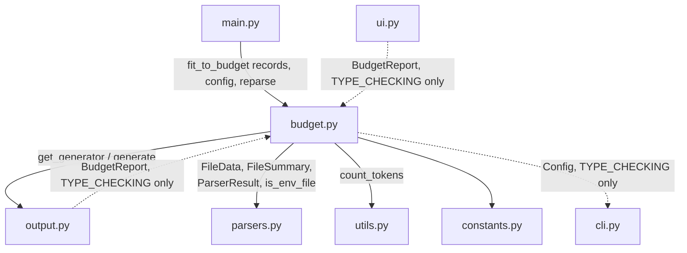

# Token Budget Targeting (`--budget`)

The `budget.py` module (`src/data2prompt/budget.py`) implements `--budget`: it
tunes the tool's own data-cap parameters so the generated `PROMPT.md` /
`PROMPT.xml` fits inside a requested token budget, instead of the user
hand-tweaking `--csv-sample-size`, `--max-lines`, and the rest by trial and
error.

Its entry point, `fit_to_budget()`, is given the first-pass parse of every
file (parsed exactly as a budget-less run would parse it) and a token budget.
It tightens data-cap parameters one **verified de-escalation ladder** step at
a time — each step re-parses only the files it affects, re-renders the whole
document (with its Budget Report block already included), and re-counts the
real rendered text with `utils.count_tokens()` — until the document fits, or
omits the token-heaviest remaining files as a last resort. No parser logic
lives in `budget.py`: every step calls back into the caller's `reparse`
function (`main.process_target_file`) with a `dataclasses.replace()`-modified
copy of the config, so `parsers.py` never needs to know a budget exists.

## Architecture Overview



### Import-cycle design

`main.py` is the only module that imports `budget.py` at runtime
(`from data2prompt.budget import fit_to_budget, FileRecord, BudgetOutcome`).
The reverse direction — `output.py` and `ui.py` needing `BudgetReport` for
type hints — would create a runtime cycle, since `budget.py` itself imports
`output.get_generator()` to render each attempt. Both modules break the cycle
the same way, importing `BudgetReport` only under `TYPE_CHECKING` and
referring to it via the string annotation `'BudgetReport'`:

```python
# output.py
if TYPE_CHECKING:
    from data2prompt.cli import Config
    # Imported only for type hints — a runtime import would cycle, since
    # budget.py imports this module for get_generator().
    from data2prompt.budget import BudgetReport
```

```python
# ui.py
if TYPE_CHECKING:
    # Imported only for type hints — a runtime import would create a
    # budget → parsers → utils → ui cycle.
    from data2prompt.budget import BudgetReport
```

`budget.py` mirrors the same discipline in the other direction: `Config` from
`data2prompt.cli` is imported only under `TYPE_CHECKING` (string-annotated as
`'Config'`), and `dataclasses.replace()` is used on the caller's instance
instead. `budget.py` never imports `data2prompt.main` or `data2prompt.ui` at
all — its runtime imports are limited to `dataclasses`, `pathlib.Path`,
`typing`, `data2prompt.constants` (the six `BUDGET_*` names),
`data2prompt.output.get_generator`, `data2prompt.parsers` (`FileData`,
`FileSummary`, `ParserResult`, `is_env_file`), and `data2prompt.utils.
count_tokens`.

## Public Data Structures

### `FileRecord`

```python
@dataclass
class FileRecord:
    """One scanned file's first-pass parse result, re-parseable in place."""
    absolute_path: Path
    relative_path: str          # str(relative) exactly as main.py builds it
    result: ParserResult
```

`main.py` builds one `FileRecord` per non-`skip_file` result, but **only when
`config.budget is not None`** — a budget-less run never allocates the list, so
it pays nothing for this feature. `records` is the mutable working set every
ladder step re-parses in place (`record.result = reparse(...)`); it is never
rebuilt, only mutated.

### `BudgetAdjustment`

```python
@dataclass(frozen=True)
class BudgetAdjustment:
    """One data-cap parameter change made to fit the budget."""
    parameter: str              # CLI-flag spelling, e.g. "csv-sample-size"
    requested: str               # value before the budget pass, rendered
    adjusted: str                 # final value after the pass, rendered
    scope: str                   # e.g. "6 tabular data file(s) re-sampled"
```

One instance per **parameter**, not per halving iteration — see
[Adjustment Bookkeeping](#adjustment-bookkeeping-one-row-per-parameter) below.

### `BudgetReport`

```python
@dataclass
class BudgetReport:
    """Everything the document and the TUI report about a budget run."""
    requested_tokens: int
    adjustments: List[BudgetAdjustment]
    omitted: List[Tuple[str, int]]   # (forward-slash path, est. tokens)
```

This is the object both `output.py` (the Budget Report document block, see
[output.md](output.md#budget-report)) and `ui.py` (the BUDGET TUI section, see
[ui.md](ui.md)) render — a fresh `BudgetReport` is built for **every**
attempt, so the report handed to `generate()` always matches exactly what that
attempt's render contains.

### `BudgetOutcome`

```python
@dataclass
class BudgetOutcome:
    """Final result of a budget-fitting pass, ready for main.py to consume."""
    fits: bool
    final_output: Optional[str]      # rendered text with placeholders; None
    total_tokens: int                # count of the last attempt
    method: str                      # token-count method of the last attempt
    report: BudgetReport
    files_data: List[FileData]       # final files_data (omitted files gone)
    stats: Dict[str, int]            # rebuilt stats for the final document
    summaries: List[FileSummary]     # final TUI rows (omitted files kept)
    config: 'Config'                 # the adjusted config used to render
```

`fit_to_budget()`'s sole return type. `final_output` still carries the
`{{TOTAL_TOKENS}}` / `{{TOKEN_METHOD}}` placeholders — `main.py` substitutes
them exactly as it does on the budget-less path (see
[output.md § Token Estimation](output.md#token-estimation)). `config` is the
fully de-escalated `Config` used for the winning (or final, if infeasible)
attempt; it is returned even when `fits` is `False`, so callers can inspect
exactly how far the ladder got.

### `_AttemptResult` (module-private)

```python
@dataclass
class _AttemptResult:
    """One rendered-and-counted attempt at fitting the budget."""
    text: str
    tokens: int
    method: str
    files_data: List[FileData]
    stats: Dict[str, int]
    summaries: List[FileSummary]
    report: BudgetReport
```

The bundle returned by the internal `_attempt()` closure (below) — one fully
rendered-and-counted candidate document. `fit_to_budget()` keeps only the
`result` of the most recent attempt in scope; nothing about a rejected
attempt is retained.

## Entry Point: `fit_to_budget()`

```python
def fit_to_budget(
    budget: int,
    config: 'Config',
    records: List[FileRecord],
    scanned_file_count: int,
    tree_text: str,
    project_name: str,
    reparse: Callable[[Path, 'Config'], ParserResult],
    on_progress: Optional[Callable[[str, str], None]] = None,
) -> BudgetOutcome:
```

`reparse` is `main.process_target_file`, injected by the caller — this
dependency-injection keeps `budget.py` free of a `main` import (see
[Import-cycle design](#import-cycle-design) above). `on_progress` receives the
same plain `(action, target)` strings as `UIHandler.on_progress`'s first two
parameters and is guarded with `if on_progress is not None` before every
call:

- `on_progress("Fitting", f"{parameter} -> {value}")` before each re-parse
  pass (every halving iteration and every discrete step; the omission phase
  emits no `"Fitting"` line of its own).
- `on_progress("Budgeting", f"{tokens:,} / {budget:,} tokens")` after **every**
  count, inside `_attempt()` — including the very first, unmodified-config
  attempt.

## The Fit Test

```python
threshold = budget - BUDGET_TOKEN_MARGIN
...
def _over_budget() -> bool:
    return result.tokens > threshold
```

An attempt fits when `tokens <= budget - BUDGET_TOKEN_MARGIN`
(`BUDGET_TOKEN_MARGIN = 16`). The margin exists because, after
`fit_to_budget()` returns a fitting `BudgetOutcome`, `main.py` still performs
the same placeholder substitution as the budget-less path —
`{{TOTAL_TOKENS}}` and `{{TOKEN_METHOD}}` are replaced with real digits/text
*after* the count was taken (see
[output.md § Token Estimation](output.md#token-estimation)) — and inserting
those digits can shift the true token count by a token or two. The 16-token
margin guarantees the final, placeholder-substituted document still lands at
or under the requested budget even after that shift, without requiring a
second count-and-substitute pass.

## Why Global Parameter Adjustment, Not Per-File Overrides

Every ladder step calls `dataclasses.replace(current, **{field_name: value})`
to produce a new, immutable `Config` and re-parses only the records a step
affects with that config — it never mutates the caller's original `config`,
and it never touches any parser:

```python
def _reparse_records(
    affected: List[FileRecord],
    config: 'Config',
    reparse: Callable[[Path, 'Config'], ParserResult],
) -> None:
    """Re-parse each affected record in place with the adjusted config."""
    for record in affected:
        record.result = reparse(record.absolute_path, config)
```

Parsers already accept the whole `Config`, so a globally-adjusted copy gives
per-step behavior change for free — `parsers.py` is untouched by this
feature, and the render / count loop stays honest: whatever `current` says
`csv_sample_size` is, that is what every tabular file in the document
actually shows, so the Budget Report line ("csv-sample-size 15 → 5 · 6
tabular data file(s) re-sampled") is never lying about what the LLM will
read. Re-parsing is scoped to the affected extension group only
(`_select_by_ext()` / `_select_text_group()`, below) — re-parsing a file that
comes back unchanged is harmless (idempotent), so per-group selection by
suffix is sufficient; no per-parser bookkeeping is needed.

## `_materialize()`: Rebuilding State Every Attempt

```python
def _materialize(
    records: List[FileRecord],
    omitted_paths: Set[str],
    scanned_file_count: int,
) -> Tuple[List[FileData], Dict[str, int], List[FileSummary]]:
    """Rebuild files_data/stats/summaries from records for one attempt.

    Rebuilding from scratch every attempt (instead of mutating running
    totals) is what prevents double-counting stats across re-parses.
    Omitted records are dropped from ``files_data`` but kept in
    ``summaries`` with 0 tokens and an ``"Omitted (Budget)"`` status, so the
    TUI composition chart never counts content that is not in the document.
    """
```

Every attempt calls `_materialize()` to build `files_data`, `stats`, and
`summaries` **from scratch** out of the current `records` list and the
current `omitted_paths` set — nothing is carried forward from the previous
attempt's totals. This is deliberate: if stats were instead incremented
in-place across attempts, a file re-parsed three times by three different
ladder steps would have its `stats_update` folded into the running totals
three times over (double, then triple, counting). Starting from
`{"file_count": scanned_file_count}` and folding each *currently included*
record's `result.stats_update` exactly once per attempt makes every attempt's
`stats` dict correct in isolation, regardless of how many times a record has
been re-parsed so far.

Included records populate both `files_data` (the dict shape `main.py` builds
on the budget-less path: `path`, `content`, `type`, `tokens`, `status`) and
`summaries` (the TUI row: `name`, `type`, `tokens`, `status`). Omitted records
are dropped from `files_data` entirely but kept in `summaries` with
`"tokens": 0` and `"status": "Omitted (Budget)"` — tokens **must** be 0 there
so the TUI composition chart (`ui._composition_chart()`) never counts content
that is not actually in the rendered document. When `omitted_paths` is
non-empty, `stats["budget_omitted_count"] = len(omitted_paths)` is set (see
[constants.md](constants.md) — this key feeds the document's `> Contents:` /
`<stats/>` summary line via `STATS_SUMMARY_LABELS`. It does **not** feed the
TUI's ATTENTION section — `ui._ATTENTION_SPECS` was not extended for this
feature; omitted files are instead visible per-file in the TUI's BUDGET
section, see [ui.md](ui.md)).

## Selection Helpers

```python
EXTS_TABULAR = frozenset({".csv", ".xlsx", ".xls", ".parquet", ".feather", ".arrow",
                          ".db", ".sqlite", ".sqlite3"})
EXTS_SQL = frozenset({".sql"})
EXTS_NOTEBOOK = frozenset({".ipynb"})
```

- `_select_by_ext(records, omitted, exts)` — included (not-yet-omitted)
  records whose `absolute_path.suffix.lower()` is in `exts`. Used for the
  tabular, SQL, and notebook ladder steps. SQLite databases (`.db`/`.sqlite`/
  `.sqlite3`) are in `EXTS_TABULAR`, so they ride the same tabular steps as
  CSV/Excel/Arrow: step 1 re-samples their tables (`csv_sample_size` halving),
  step 6 drops their DDL + schema block (`stats_summary → off`), and step 7
  demotes them to schema-only. Their presence in `EXTS_TABULAR` also keeps them
  **out** of the text group, so a rendered multi-table database is never
  byte-truncated as if it were a plain text file.
- `_select_text_group(records, omitted, config)` — the "text group" the
  `DefaultParser` would handle: included records whose suffix is **not** in
  `EXTS_TABULAR | EXTS_SQL | EXTS_NOTEBOOK`, **not** in `config.skip_exts`
  (their content is already dropped, so truncating them further gains
  nothing), and whose filename is **not** an env file per `is_env_file()`
  (env values are already redacted, not size-truncated, so the file-size cap
  is meaningless for them).

## The De-escalation Ladder

Nine fixed steps, applied in order. Each step is skipped outright if it has
no affected records or if its condition is already satisfied (e.g. step 6
only runs if `stats_summary` is currently `True`); each halving loop also
stops the instant an attempt fits, so a step that isn't needed to reach the
budget never runs at all.

| # | Step | Config field | Change | Floor / target | Affected group |
|---|---|---|---|---|---|
| 1 | csv-sample-size | `csv_sample_size` | halve | `BUDGET_MIN_CSV_SAMPLE` = 5 | tabular (`EXTS_TABULAR`) |
| 2 | max-lines | `max_lines` | halve | `BUDGET_MIN_NOTEBOOK_LINES` = 10 | notebook (`EXTS_NOTEBOOK`) |
| 3 | sql-sample-size | `sql_sample_size` | halve | `BUDGET_MIN_SQL_SAMPLE` = 5 | SQL (`EXTS_SQL`) |
| 4 | sql-max-lines | `sql_max_lines` | halve | `BUDGET_MIN_SQL_MAX_LINES` = 20 | SQL (`EXTS_SQL`) |
| 5 | max-lines → 0 | `max_lines` | drop to zero | `0` | notebook (`EXTS_NOTEBOOK`) |
| 6 | stats-summary → off | `stats_summary` | `True → False` | — | tabular (`EXTS_TABULAR`) |
| 7 | schema-only → on | `schema_only` | `False → True` | — | tabular + SQL (`EXTS_TABULAR \| EXTS_SQL`) |
| 8 | max-file-size → 10KB | `max_file_size` | cap | `BUDGET_TEXT_FILE_SIZE_KB` = 10 | text group (`_select_text_group`) |
| 9 | omission | *(no config change)* | remove files | — | all remaining included records |

### Steps 1–4: the halving loops

```python
def _halving_step(
    field_name: str,
    floor: int,
    affected: List[FileRecord],
    parameter: str,
    scope: Callable[[int], str],
) -> None:
    nonlocal current, result
    if not affected or not _over_budget():
        return
    requested_value = getattr(current, field_name)
    value = requested_value
    while _over_budget() and value > floor:
        value = max(floor, value // 2)
        current = replace(current, **{field_name: value})
        adjustments[parameter] = BudgetAdjustment(
            parameter=parameter, requested=str(requested_value),
            adjusted=str(value), scope=scope(len(affected)),
        )
        _reparse_records(affected, current, reparse)
        result = _attempt(current)
```

Each of csv-sample-size, max-lines, sql-sample-size, and sql-max-lines is
halved (`max(floor, value // 2)`) in a loop that re-parses, re-renders, and
re-counts after **every** halving, stopping the moment the attempt fits or
the floor is reached. Scope strings (exact wording, `n = len(affected)`):

- csv-sample-size: `"{n} tabular data file(s) re-sampled"`
- max-lines (halving): `"{n} notebook(s) output-trimmed"`
- sql-sample-size: `"{n} SQL file(s) re-sampled"`
- sql-max-lines: `"{n} SQL file(s) re-capped"`

### Step 5: drop notebook outputs entirely

Only runs if still over budget and `current.max_lines > 0`. Sets
`max_lines = 0` — every notebook output block collapses to its existing
truncation notice (no new tool notice is introduced; the parser already
produces one at `max_lines == 0`). If step 2 already created a `"max-lines"`
adjustment, this step **merges into it** rather than adding a second row: the
merged entry's `requested` stays the *original* pre-ladder value, `adjusted`
becomes `"0"`, and the scope is overwritten to
`"notebook outputs dropped from {n} notebook(s)"`.

### Step 6: drop the per-table stats block

Only runs if still over budget and `current.stats_summary` is `True`. Sets
`stats_summary = False`, dropping the describe/missing stats block — often
the largest single chunk of a wide table's rendering. Scope:
`"describe/missing stats dropped from {n} tabular data file(s)"`.

### Step 7: schema-only

Only runs if still over budget and `current.schema_only` is `False`. Sets
`schema_only = True` for the tabular **and** SQL groups combined — data rows
vanish, schema/columns stay, and the affected files' statuses become
`"Schema Only"` automatically via the existing parser logic (no new status is
introduced). Scope: `"{n} data file(s) reduced to schema only"`.

### Step 8: cap unhandled text files to 10KB

Only runs if still over budget and `current.max_file_size >
BUDGET_TEXT_FILE_SIZE_KB` (10). `DefaultParser`'s head read is fixed at 10KB
regardless of `max_file_size`, so a threshold below 10 would gain nothing —
this is the floor. Scope counts records whose `result.status == "Truncated"`
**after** the re-parse (not simply `len(text_group)`, since not every text
file in the group is necessarily large enough to actually get truncated at
the new cap): `"{truncated} text file(s) truncated to their first 10KB"`.

### Adjustment bookkeeping: one row per parameter

`adjustments` is a `Dict[str, BudgetAdjustment]` keyed by parameter name (not
a list appended to per halving iteration), so re-assigning the same key
during a halving loop simply updates that one row in place — the final
`BudgetReport.adjustments` has exactly one entry per parameter that was ever
touched, `requested` holding the value *before the budget pass began* and
`adjusted` holding the final value reached. An adjustment is only ever
recorded when the config actually changed and at least one record was
re-parsed for it.

## The Adjustment-Recorded-Before-Render Invariant

In every step, the code writes to `adjustments[...]` (and, for the omission
phase, to `omitted` / `omitted_list`) **before** calling `result =
_attempt(current)` for that step. The halving loop comments this explicitly:

```python
adjustments[parameter] = BudgetAdjustment(
    parameter=parameter,
    requested=str(requested_value),
    adjusted=str(value),
    scope=scope(len(affected)),
)
# Recorded before rendering: the attempt's Budget Report (and so
# the verified token count) must already carry this adjustment.
```

Because `_attempt()` builds its `BudgetReport` from the *current* contents of
`adjustments` / `omitted_list` and hands that report to `generator.generate()`
as `budget_report=report`, the rendered Budget Report block — and therefore
the token count `count_tokens()` measures — always already includes every
adjustment that produced it. There is no attempt whose verified count omits
the cost of rendering its own Budget Report; "verified" means the count is of
the literal document that would be written, adjustment table and all.

## The Omission Phase (Last Resort)

```python
while _over_budget():
    included = [r for r in records if r.relative_path not in omitted]
    if not included:
        break
    included.sort(key=lambda r: (-r.result.tokens, r.relative_path))
    overshoot = result.tokens - threshold
    taken = 0
    for record in included:
        omitted.add(record.relative_path)
        omitted_list.append(
            (Path(record.relative_path).as_posix(), record.result.tokens)
        )
        taken += record.result.tokens
        if taken >= overshoot:
            break
    result = _attempt(current)
```

Step 9 never re-parses anything — it only changes which records
`_materialize()` treats as omitted. Remaining included records are sorted
**heaviest-first** by `result.tokens`, with ties broken on `relative_path`
(plain string comparison) so the omission order is fully deterministic even
when several files tie on token count. The loop takes records off the front
of that sorted list — always **at least one** per pass — until the running
sum of their tokens covers the current overshoot (`result.tokens -
threshold`), then re-renders and re-counts; if the real reduction differs
from the estimated one, the outer `while` runs another pass with a freshly
sorted, freshly computed overshoot. Omitted files are recorded as
`(Path(record.relative_path).as_posix(), record.result.tokens)` — the
`.as_posix()` form is mandatory: it is the same canonical forward-slash path
key the File Index and `## File:` headers use (output-contract invariant 5),
so the Budget Report's omitted-file table and the File Index's `Omitted`
rows name the same file with the identical string. Omitted files are never
deleted from `records` or the tree — they stay scanned, so
`output.build_file_index()`'s existing "present in the tree but absent from
`files_data`" leftover rule picks them up automatically and lists them with
status `Omitted` (see [output.md](output.md#file-index)).

## Outcomes: Fits vs. Infeasible

```python
if result.tokens <= threshold:
    return BudgetOutcome(fits=True, final_output=result.text, ...)
return BudgetOutcome(fits=False, final_output=None, ...)
```

If the very first attempt (unmodified `config`) already fits, `fit_to_budget`
returns immediately with `fits=True` and empty `adjustments`/`omitted` — the
Budget Report still renders, stating the budget was met with no adjustments
needed.

**Infeasible**: the ladder runs to exhaustion — every halving loop hit its
floor, every discrete step fired, and the omission phase omitted every
remaining record (`included` became empty) — and the document is *still*
over budget. `fit_to_budget()` returns `fits=False`, `final_output=None`,
`total_tokens` set to the last attempt's real count (the best achievable),
and a `report` carrying every adjustment and omission that was tried.
`main.py` responds by calling `ui.print_budget_failure(...)` and raising
`SystemExit(1)` — **before** reaching the write/clipboard block, which is
gated by `if outcome is None or outcome.fits:`. No output file is written, no
clipboard copy happens, and the total_tokens/output_destination/file_size_kb
variables that the success path would populate are never referenced on the
infeasible path.

## Determinism Guarantees

- Sampling inside re-parsed files still uses `config.seed`, unchanged by the
  ladder — the same seed produces the same sampled rows on every re-parse.
- The ladder is a fixed, hard-coded sequence of nine steps, always attempted
  in the same order.
- Omission ties break on `relative_path` (a plain string), so two
  equal-weight files are always omitted in the same order.
- No other randomness is introduced anywhere in `budget.py`.

Same inputs (project contents, `Config`, `budget`) therefore always produce
the same `BudgetOutcome`.

## Integration Points

- **`main.py`**: builds `records` (only when `config.budget is not None`),
  calls `fit_to_budget(...)` with `reparse=process_target_file` and
  `on_progress=handler.on_progress`, and on `outcome.fits` swaps
  `final_output`/`total_tokens`/`method`/`files_data`/`stats`/
  `processed_files_info` for the outcome's versions before the normal
  placeholder-substitution and write/clipboard logic. On infeasibility it
  calls `ui.print_budget_failure()` and raises `SystemExit(1)`. It always
  passes `budget_report=outcome.report if outcome is not None else None` to
  `ui.print_final_report()`.
- **`output.py`**: `generator.generate(..., budget_report=report)` is called
  for every attempt; see [output.md § Budget Report](output.md#budget-report)
  for the rendered block's structure in both formats.
- **`ui.py`**: renders `BudgetReport` in the final report's BUDGET section
  and in `print_budget_failure()`'s panel; see [ui.md](ui.md).

## Edge Cases

- A run **without** `--budget` never calls into the ladder at all —
  `config.budget is None` skips `records` collection entirely in `main.py`
  (the module import itself is unconditional), so the feature costs nothing
  when unused.
- A step with zero affected records (e.g. no `.sql` files in the project) is
  a guaranteed no-op — `_halving_step` returns immediately when `affected` is
  empty, and the discrete steps' `if affected:` guards do the same.
- Re-parsing a file whose new config produces byte-identical output is
  harmless — it costs a parse call but changes nothing.
- If `budget` is set below what even the maximally reduced, fully-omitted
  document can reach, the run is infeasible per
  [Outcomes](#outcomes-fits-vs-infeasible) above — this is expected behavior,
  not an error condition, and is reported cleanly rather than raised as an
  exception.
