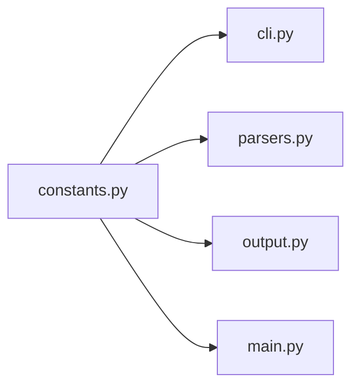

# `constants.py` — Core Constants Module

## Overview

The [`constants.py`](src/data2prompt/constants.py:1) module serves as the **Single Source of Truth** for all immutable application behavior in the data2prompt project. This module centralizes magic numbers, default values, ignore patterns, and static strings that define how the tool processes, filters, and outputs codebase representations.

## Architectural Role

Following the **Modular Functional Orchestration (MFO)** pattern, `constants.py` is the foundational configuration layer that feeds into all other modules:



## Module Categories

### 1. Exclusion Patterns

#### `CORE_IGNORES` — Folder Exclusion Set

```python
CORE_IGNORES = {
    '.git', '__pycache__', 'venv', '.vscode', '.ipynb_checkpoints',
    'node_modules', '.idea', 'dist', 'build', '.mypy_cache',
    '.pytest_cache', 'target', '.docker', '.aws', '.gcloud',
    '__MACOSX'
}
```

**Type:** `set[str]`

**Purpose:** Folder names excluded from both project tree generation and content processing. These are high-level directories that never contain relevant source code or data.

**Consumed by:**
- [`cli.py`](src/data2prompt/cli.py:141) — Merged with user-provided `--ignore-folders` via set union
- [`utils.py`](src/data2prompt/utils.py) — Used by `ProjectScanner` for directory traversal

#### `CORE_IGNORE_FILES` — File Exclusion Set

```python
CORE_IGNORE_FILES = set()
```

**Type:** `set[str]`

**Purpose:** Specific filenames to exclude from the entire process. Currently empty, but provides a hook for future expansion.

**Consumed by:**
- [`cli.py`](src/data2prompt/cli.py:142) — Merged with user-provided `--ignore-files`

#### `CORE_SKIP_EXTS` — Extension-Based Content Skip Set

```python
CORE_SKIP_EXTS = {
    # Data & Databases
    '.pbix', '.db', '.sqlite', '.sqlite3', '.parquet', '.pkl', '.pickle', '.feather', '.h5',
    # Compressed & Binary
    '.zip', '.tar', '.gz', '.7z', '.rar', '.exe', '.dll', '.so', '.bin',
    # Media
    '.png', '.jpg', '.jpeg', '.gif', '.svg', '.pdf', '.mp4', '.mp3', '.mov',
    # Environment & Secrets
    '.env', '.venv', '.pyc', '.ds_store'
}
```

**Type:** `set[str]`

**Purpose:** File extensions where file names appear in the project tree but content is skipped. This preserves tree visibility while avoiding binary bloat.

**Consumed by:**
- [`cli.py`](src/data2prompt/cli.py:144) — Merged with user-provided `--skip-exts`
- [`main.py`](src/data2prompt/main.py:31) — Checked via `config.skip_exts` in `process_target_file()`

---

### 2. Default Processing Values

All default values are imported by [`cli.py`](src/data2prompt/cli.py:7) and used as CLI argument defaults. They control sampling, truncation, and size limits throughout the processing pipeline.

| Constant | Default | Purpose |
|----------|---------|---------|
| `DEFAULT_CSV_SAMPLE_SIZE` | `15` | Rows sampled per CSV file |
| `DEFAULT_SQL_SAMPLE_SIZE` | `15` | INSERT/data rows kept per SQL table |
| `DEFAULT_SQL_MAX_LINES` | `50` | Non-data lines (comments, setup) cap in SQL files |
| `DEFAULT_MAX_LINES` | `40` | Max lines of text output per notebook cell |
| `DEFAULT_MAX_SHEETS` | `10` | Excel sheets processed per workbook |
| `DEFAULT_SEED` | `42` | Random seed for consistent sampling |
| `DEFAULT_LINE_LENGTH_THRESHOLD` | `4000` | Characters per line before truncation |
| `DEFAULT_TRUNCATED_LINE_LENGTH` | `1000` | Characters retained when line is truncated |
| `DEFAULT_TABLE_CHAR_LIMIT` | `50000` | Max characters for table/sheet after sampling |
| `DEFAULT_TABLE_TRUNCATED_SIZE` | `20000` | Characters retained when table is size-truncated |
| `DEFAULT_MAX_FILE_SIZE_KB` | `70` | Max file size (KB) for unhandled types to be read entirely |
| `DEFAULT_OUTPUT_FILE` | `'PROMPT'` | Default output base name |
| `DEFAULT_FORMAT` | `'markdown'` | Default output format |

**Consumed by:**
- [`cli.py`](src/data2prompt/cli.py:61) — All defaults used as CLI argument defaults
- [`parsers.py`](src/data2prompt/parsers.py:14) — Processing functions use these as parameter defaults

---

### 3. Output Format Configuration

#### `SUPPORTED_FORMATS` — Format-to-Extension Mapping

```python
SUPPORTED_FORMATS = {
    'xml': '.xml',
    'markdown': '.md'
}
```

**Type:** `dict[str, str]`

**Purpose:** Maps format type identifiers to their respective file extensions. Used to construct output filenames.

**Consumed by:**
- [`cli.py`](src/data2prompt/cli.py:125) — Determines file extension based on format

---

### 4. Recursive Scanning Prevention

#### `GENERATION_FLAG` — Self-Identification Marker

```python
GENERATION_FLAG = "DATA2PROMPT_GENERATED_CONTENT"
```

**Type:** `str`

**Purpose:** A unique identifier added to the top of every generated file. The [`DefaultParser`](src/data2prompt/parsers.py:507) checks for this flag to prevent re-processing previously generated output files.

**Consumed by:**
- [`parsers.py`](src/data2prompt/parsers.py:511) — Checked in `DefaultParser.parse()`
- [`output.py`](src/data2prompt/output.py:49) — Injected as HTML comment in Markdown output

---

### 5. LLM Structured Output Constants

#### System Instructions

```python
SYSTEM_INSTRUCTIONS_MARKDOWN = """## purpose: \nThis document is a structured representation of a codebase and data schema..."""
SYSTEM_INSTRUCTIONS_XML = """<purpose>\nThis document is a structured representation of a codebase and data schema..."""
```

**Type:** `str`

**Purpose:** Instructional headers embedded in generated output files to guide LLM consumption. These explain the document structure and section organization.

**Consumed by:**
- [`output.py`](src/data2prompt/output.py:53) — Injected into Markdown output
- [`output.py`](src/data2prompt/output.py:156) — Injected into XML output

#### XML Tag Constants

```python
TAG_DIRECTORY_STRUCTURE = "directory_structure"
TAG_FILES = "files"
TAG_FILE = "file"
TAG_CONTENT = "content"  # Used for notebook cells
```

**Type:** `str`

**Purpose:** Consistent XML tag names for structured output generation. Ensures uniform tagging across all XML-formatted output.

**Consumed by:**
- [`output.py`](src/data2prompt/output.py:163) — `<directory_structure>` wrapper
- [`output.py`](src/data2prompt/output.py:167) — `<files>` container
- [`output.py`](src/data2prompt/output.py:178) — `<file>` element with path attribute
- [`output.py`](src/data2prompt/output.py:184) — `<content>` for notebook cells

---

### 6. UI & Aesthetic Constants

#### Color Palette

```python
MATRIX_DARK_GREEN = (0, 150, 0)
MATRIX_NEON_GREEN = (0, 255, 0)
```

**Type:** `tuple[int, int, int]`

**Purpose:** RGB color values for the terminal UI theme, providing a consistent matrix-style aesthetic.

#### Animation Timing

```python
STARTUP_ANIMATION_DURATION = 0.9
ANIMATION_FRAME_DELAY = 0.03
```

**Type:** `float`

**Purpose:** Controls the startup banner animation and frame delay timing.

#### Scroll Bar Characters

```python
SCROLL_THUMB = "█"
SCROLL_TRACK = "│"
```

**Type:** `str`

**Purpose:** Unicode characters for custom scroll bar rendering in the TUI.

#### ASCII Art Banner

```python
ASCII_ART = [
    "  ██╗      ██████╗   █████╗  ████████╗  █████╗  ██████╗  ██████╗  ██████╗   ██████╗  ███╗   ███╗ ██████╗  ████████╗",
    "  ╚██╗     ██╔══██╗ ██╔══██╗ ╚══██╔══╝ ██╔══██╗ ╚════██╗ ██╔══██╗ ██╔══██╗ ██╔═══██╗ ████╗ ████║ ██╔══██╗ ╚══██╔══╝",
    ...
]
```

**Type:** `list[str]`

**Purpose:** Multi-line ASCII art banner displayed at application startup.

---

## Defensive Programming Benefits

The centralized constant configuration provides several defensive programming advantages:

1. **Single Source of Truth**: When limits or patterns need adjustment, only `constants.py` requires modification
2. **Consistent Defaults**: All modules reference the same default values, preventing drift
3. **User Override Safety**: [`cli.py`](src/data2prompt/cli.py:141) merges user input with core constants using set union, ensuring essential exclusions are never bypassed
4. **Magic Number Elimination**: All thresholds and limits are named constants with documented purposes
5. **Easy Tuning**: Users and developers can quickly identify adjustment points without code archaeology

## Configuration Flow

```
constants.py
    │
    ├──► cli.py ──────────────────────────► Config dataclass (user overrides merged)
    │                                            │
    │◄───────────────────────────────────────────┘
    │
    ├──► parsers.py ──────────────────────► Processing functions (sampling/truncation logic)
    │
    ├──► output.py ───────────────────────► Generator classes (formatting logic)
    │
    └──► utils.py (indirectly) ───────────► ProjectScanner (file discovery)
```

## Constants Not Directly Imported

Some modules use constants indirectly through the `Config` object created by `cli.py`:

- [`main.py`](src/data2prompt/main.py) — Accesses constants via `config.*` attributes
- [`utils.py`](src/data2prompt/utils.py) — Uses ignore sets passed from `Config`

This indirection allows runtime configuration to override defaults while maintaining the fallback values in `constants.py`.
