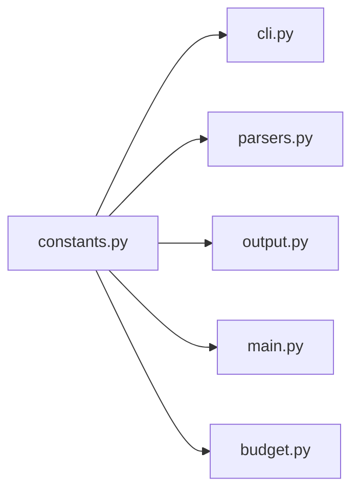

# `constants.py` — Core Constants Module

## Overview

The [`constants.py`](../src/data2prompt/constants.py#L1) module serves as the **Single Source of Truth** for all immutable application behavior in the data2prompt project. This module centralizes magic numbers, default values, ignore patterns, and static strings that define how the tool processes, filters, and outputs codebase representations.

## Architectural Role

Following the **Modular Functional Orchestration (MFO)** pattern, `constants.py` is the foundational configuration layer that feeds into all other modules:



## Module Categories

### 1. Exclusion Patterns

#### `CORE_IGNORES` — Folder Exclusion Set

```python
CORE_IGNORES = {
    '.git', '__pycache__', 'venv', '.vscode', '.ipynb_checkpoints',
    'node_modules', '.idea', 'dist', 'build', '.mypy_cache',
    '.pytest_cache', 'target', '.docker', '.aws', '.gcloud',
    '__MACOSX'
}
```

**Type:** `set[str]`

**Purpose:** Folder names excluded from both project tree generation and content processing. These are high-level directories that never contain relevant source code or data.

**Consumed by:**
- [`cli.py`](../src/data2prompt/cli.py#L141) — Merged with user-provided `--ignore-folders` via set union
- [`utils.py`](../src/data2prompt/utils.py) — Used by `ProjectScanner` for directory traversal

#### `CORE_IGNORE_FILES` — File Exclusion Set

```python
CORE_IGNORE_FILES = set()
```

**Type:** `set[str]`

**Purpose:** Specific filenames to exclude from the entire process. Currently empty, but provides a hook for future expansion.

**Consumed by:**
- [`cli.py`](../src/data2prompt/cli.py#L142) — Merged with user-provided `--ignore-files`

#### `CORE_SKIP_EXTS` — Extension-Based Content Skip Set

```python
CORE_SKIP_EXTS = {
    # Data & Databases
    '.pbix', '.db', '.sqlite', '.sqlite3', '.parquet', '.pkl', '.pickle', '.feather', '.h5',
    # Compressed & Binary
    '.zip', '.tar', '.gz', '.7z', '.rar', '.exe', '.dll', '.so', '.bin',
    # Media
    '.png', '.jpg', '.jpeg', '.gif', '.svg', '.pdf', '.mp4', '.mp3', '.mov',
    # Environment & Secrets
    # Note: '.env' is intentionally NOT here — env files are detected by name and
    # routed to EnvParser, which emits variable names with redacted values.
    '.venv', '.pyc', '.ds_store'
}
```

**Type:** `set[str]`

**Purpose:** File extensions where file names appear in the project tree but content is skipped. This preserves tree visibility while avoiding binary bloat.

> **Note:** `.env` was previously listed here, but a bare `.env` file has an empty
> suffix (`Path(".env").suffix == ""`), so extension-based skipping never matched it.
> Env files are now detected **by name** and handled by [`EnvParser`](../src/data2prompt/parsers.py)
> (variable names with redacted values). See [`docs/parsers.md`](parsers.md).

**Consumed by:**
- [`cli.py`](../src/data2prompt/cli.py#L144) — Merged with user-provided `--skip-exts`
- [`main.py`](../src/data2prompt/main.py#L31) — Checked via `config.skip_exts` in `process_target_file()`

---

### 2. Default Processing Values

All default values are imported by [`cli.py`](../src/data2prompt/cli.py#L7) and used as CLI argument defaults. They control sampling, truncation, and size limits throughout the processing pipeline.

| Constant | Default | Purpose |
|----------|---------|---------|
| `DEFAULT_CSV_SAMPLE_SIZE` | `15` | Rows sampled per CSV file |
| `DEFAULT_SQL_SAMPLE_SIZE` | `15` | INSERT/data rows kept per SQL table |
| `DEFAULT_SQL_MAX_LINES` | `50` | Non-data lines (comments, setup) cap in SQL files |
| `DEFAULT_MAX_LINES` | `40` | Max lines of text output per notebook cell |
| `DEFAULT_MAX_SHEETS` | `10` | Excel sheets processed per workbook |
| `DEFAULT_SEED` | `42` | Random seed for consistent sampling |
| `DEFAULT_LINE_LENGTH_THRESHOLD` | `4000` | Characters per line before truncation |
| `DEFAULT_TRUNCATED_LINE_LENGTH` | `1000` | Characters retained when line is truncated |
| `DEFAULT_TABLE_CHAR_LIMIT` | `50000` | Max characters for table/sheet after sampling |
| `DEFAULT_TABLE_TRUNCATED_SIZE` | `20000` | Characters retained when table is size-truncated |
| `DEFAULT_MAX_FILE_SIZE_KB` | `70` | Max file size (KB) for unhandled types to be read entirely |
| `DEFAULT_OUTPUT_FILE` | `'PROMPT'` | Default output base name |
| `DEFAULT_FORMAT` | `'markdown'` | Default output format |

#### Token Budget Targeting Constants (`--budget`)

```python
DEFAULT_BUDGET: Optional[int] = None   # no budget targeting unless --budget
BUDGET_TOKEN_MARGIN = 16       # safety margin: placeholder digits shift count
BUDGET_MIN_CSV_SAMPLE = 5      # csv_sample_size floor (CSV/Excel/Arrow rows)
BUDGET_MIN_NOTEBOOK_LINES = 10  # max_lines floor before outputs are dropped
BUDGET_MIN_SQL_SAMPLE = 5      # sql_sample_size floor
BUDGET_MIN_SQL_MAX_LINES = 20  # sql_max_lines floor
BUDGET_TEXT_FILE_SIZE_KB = 10  # max_file_size cap for text-truncation step
```

**Type:** `Optional[int]` (`DEFAULT_BUDGET`) / `int` (the rest)

**Purpose:** [`fit_to_budget()`](../src/data2prompt/budget.py) in
[`budget.py`](budget.md) tightens data-cap parameters down these floors, one
[ladder step](budget.md#the-de-escalation-ladder) at a time, verifying the
real rendered token count after each step. Floors keep reduced output
honest — a 5-row sample still shows structure; 0 rows would not.

| Constant | Default | Purpose |
|----------|---------|---------|
| `DEFAULT_BUDGET` | `None` | No token budget targeting unless `--budget` is passed; `Config.budget` default |
| `BUDGET_TOKEN_MARGIN` | `16` | Fit-test safety margin: an attempt fits when `tokens <= budget - BUDGET_TOKEN_MARGIN`, covering the digit shift from the later `{{TOTAL_TOKENS}}`/`{{TOKEN_METHOD}}` substitution |
| `BUDGET_MIN_CSV_SAMPLE` | `5` | Floor for `csv_sample_size` (CSV/Excel/Arrow row sampling) |
| `BUDGET_MIN_NOTEBOOK_LINES` | `10` | Floor for `max_lines` before the ladder drops notebook outputs to 0 entirely |
| `BUDGET_MIN_SQL_SAMPLE` | `5` | Floor for `sql_sample_size` |
| `BUDGET_MIN_SQL_MAX_LINES` | `20` | Floor for `sql_max_lines` |
| `BUDGET_TEXT_FILE_SIZE_KB` | `10` | `max_file_size` target for the text-truncation ladder step; matches `DefaultParser`'s fixed 10KB head read, so a lower cap would gain nothing |

**Consumed by:**
- [`cli.py`](../src/data2prompt/cli.py) — `DEFAULT_BUDGET` is the `-b`/`--budget` argparse default
- [`budget.py`](budget.md) — the five `BUDGET_MIN_*`/`BUDGET_TEXT_FILE_SIZE_KB`
  floors and `BUDGET_TOKEN_MARGIN` drive every ladder step and the fit test

#### Boolean Feature Toggles

Every CLI boolean flag reads its default from `constants.py`, so the flag-to-default
logic is uniform across the tool.

| Constant | Default | Flag | Purpose |
|----------|---------|------|---------|
| `DEFAULT_USE_GITIGNORE` | `True` | `--no-gitignore` | Respect `.gitignore` rules |
| `DEFAULT_CLIPBOARD` | `False` | `-c`, `--clipboard` | Copy output to clipboard instead of writing a file |
| `DEFAULT_SCHEMA_ONLY` | `False` | `--schema-only` | Emit only data-file schemas (no rows) |
| `DEFAULT_STATS_SUMMARY` | `True` | `--no-stats-summary` | Include the per-table stats metadata block |
| `DEFAULT_ENV_KEYS` | `True` | `--no-env-keys` | List `.env` variable names with redacted values |

#### `ENV_VALUE_PLACEHOLDER` — Secret Redaction Token

```python
ENV_VALUE_PLACEHOLDER = '<redacted>'
```

**Type:** `str`

**Purpose:** Substituted for every value in a `.env` file so secrets never leak into
output. Consumed by [`process_env()`](../src/data2prompt/parsers.py) / `EnvParser`.

**Consumed by:**
- [`cli.py`](../src/data2prompt/cli.py#L61) — All defaults used as CLI argument defaults
- [`parsers.py`](../src/data2prompt/parsers.py#L14) — Processing functions use these as parameter defaults

---

### 3. Output Format Configuration

#### `SUPPORTED_FORMATS` — Format-to-Extension Mapping

```python
SUPPORTED_FORMATS = {
    'xml': '.xml',
    'markdown': '.md'
}
```

**Type:** `dict[str, str]`

**Purpose:** Maps format type identifiers to their respective file extensions. Used to construct output filenames.

**Consumed by:**
- [`cli.py`](../src/data2prompt/cli.py#L125) — Determines file extension based on format

---

### 4. Recursive Scanning Prevention

#### `GENERATION_FLAG` — Self-Identification Marker

```python
GENERATION_FLAG = "DATA2PROMPT_GENERATED_CONTENT"
```

**Type:** `str`

**Purpose:** A unique identifier added to the top of every generated file. The [`DefaultParser`](../src/data2prompt/parsers.py#L507) checks for this flag to prevent re-processing previously generated output files.

**Consumed by:**
- [`parsers.py`](../src/data2prompt/parsers.py#L511) — Checked in `DefaultParser.parse()`
- [`output.py`](../src/data2prompt/output.py#L49) — Injected as HTML comment in Markdown output

---

### 5. LLM Structured Output Constants

#### System Instructions (the LLM reading contract)

```python
SYSTEM_INSTRUCTIONS_MARKDOWN = """## Purpose\n\nThis document is a machine-generated snapshot..."""
SYSTEM_INSTRUCTIONS_XML = """<purpose>\nThis document is a machine-generated snapshot..."""
```

**Type:** `str`

**Purpose:** The preamble embedded at the top of every generated document. Any
edit must follow the "Editing the preambles" checklist in
[`output-contract.md`](output-contract.md) — both constants change together and
stay logically identical. Both formats carry the same information (only the
syntax differs) across four parts:

1. **Purpose** — machine-generated snapshot, produced by data2prompt for LLM
   consumption.
2. **Document layout** — the section order (Metadata → Budget report → File
   Index → Files → End of codebase) and the guarantee that paths are
   project-relative, forward-slashed, and exact keys across
   index/headers/attributes. Both preambles' layout lists now carry **five**
   items: the Budget report is item 2, inserted between Metadata and the File
   Index, and is present only when a token budget was requested (see
   [`budget.md`](budget.md)); the remaining items renumber accordingly
   (File Index is 3, Files is 4, End of codebase is 5).
3. **Reading conventions** — dynamic backtick fencing, notebook cell and Excel
   sheet labeling, schema blocks (full-dataset stats vs. sampled rows), the
   `-- [...] --` tool-notice grammar, and env-value redaction.
4. **Accuracy rules** — anti-hallucination guardrails: truncated/omitted
   content is not included and must not be invented; samples illustrate
   structure only; the File Index `Status` is authoritative, with the full
   controlled vocabulary spelled out.

The XML variant additionally states that element content is embedded verbatim
(not XML-escaped) and tags are structural markers, not strict XML.

**Consumed by:**
- [`output.py`](../src/data2prompt/output.py) — injected into both outputs

#### XML Tag Constants

```python
TAG_FILES = "files"
TAG_FILE = "file"
TAG_CONTENT = "content"          # Used for notebook cells
TAG_FILE_INDEX = "file_index"    # Per-file manifest (path/type/status)
TAG_INDEX_ENTRY = "entry"        # One row of the file index
TAG_END_OF_CODEBASE = "end_of_codebase"  # Recency anchor before </codebase>
TAG_BUDGET_REPORT = "budget_report"      # optional block: present only with --budget
TAG_ADJUSTMENT = "adjustment"            # one parameter adjustment row
TAG_OMITTED_FILE = "omitted_file"        # one file omitted to meet the budget
```

**Type:** `str`

**Purpose:** Consistent XML tag names for structured output generation.
`TAG_DIRECTORY_STRUCTURE` was removed — the `<directory_structure>` section is
superseded by the `<file_index>` manifest (see [output.md](output.md#file-index)).
`TAG_BUDGET_REPORT` / `TAG_ADJUSTMENT` / `TAG_OMITTED_FILE` back the optional
Budget Report block emitted only when a token budget was requested (see
[output.md](output.md#budget-report)).

**Consumed by:**
- [`output.py`](../src/data2prompt/output.py) — `<files>`/`<file>` structure,
  `<content>` for notebook cells, `<file_index>`/`<entry>` rows, the
  `<end_of_codebase>` anchor, and the `<budget_report>`/`<adjustment>`/
  `<omitted_file>` block

#### `INCLUSION_STATUS_MAP` — File Index Vocabulary

```python
INCLUSION_STATUS_MAP: Dict[str, str] = {
    "Read": "Full",
    "Sampled": "Sampled",
    "Parsed": "Sampled",         # SQL: schema kept, data rows sampled
    "Extracted": "Sampled",      # Excel: sheets kept, rows sampled
    "Cleaned": "Cleaned",        # Notebook: full source, trimmed outputs
    "Truncated": "Truncated",
    "Schema Only": "Schema Only",
    "Redacted": "Redacted",
    "Skipped (Exclusion)": "Excluded",
    "Skipped (Binary)": "Binary Skipped",
    "Error": "Error",
}
```

**Type:** `Dict[str, str]`

**Purpose:** Maps raw parser statuses onto the controlled vocabulary documented
in the system instructions. `resolve_inclusion_status()` in
[`output.py`](output.md) applies a `"Skipped ("` prefix fallback and then
verbatim passthrough, so an unmapped future status can never crash generation.

#### `STATS_SUMMARY_LABELS` — Content Summary Labels

```python
STATS_SUMMARY_LABELS: Dict[str, str] = {
    "file_count": "Total files",
    "csv_count": "CSV",
    # ... notebooks, SQL, Excel, Arrow formats, truncated/binary/excluded/env
}
```

**Type:** `Dict[str, str]` (insertion order defines render order)

**Purpose:** Ordered stat-key → human label mapping for the document-level
content summary (`> Contents:` line in Markdown, `<stats/>` element in XML).
Zero counts are dropped at render time; `Total files` always renders.

`"budget_omitted_count": "Budget omitted"` was added immediately after
`"excluded_count"`. It renders only on a `--budget` run that actually omitted
files (`stats["budget_omitted_count"]` is only set, by
[`_materialize()`](budget.md#_materialize-rebuilding-state-every-attempt) in
`budget.py`, when at least one file was omitted to fit the budget) — same
zero-count-dropped behavior as every other key here.

---

### 6. UI & Aesthetic Constants (BLACKSITE theme)

#### Semantic Color Channels

```python
UI_ACCENT = "#ff3b57"               # crimson: wordmark, titles, markers, bar fill
UI_CHROME = "grey35"                # dim gray: rules, labels, footnotes
UI_CHROME_BRIGHT = "grey58"         # lighter gray: borders, secondary labels
UI_DATA = "white"                   # actual information: paths, names, counts
UI_DATA_BOLD = "bold white"         # headline numbers
UI_WARN = "yellow"                  # attention counts and warn-level statuses
UI_ERROR = "bold white on red3"     # error statuses and fatal messages

UI_HEADING = "bold white"                   # section titles, panel title text
UI_SECTION_MARKER = "▰▰"                    # accent tick before every title
UI_WARN_CHIP = "bold black on yellow"       # attention count badges
```

**Type:** `str` (Rich style strings; `UI_SECTION_MARKER` is a glyph pair)

**Purpose:** The theme's semantic color channels — in the TUI, color always
carries meaning (accent = structure, gray = chrome, white = data, yellow =
warning, reverse-red = error). Section titles render as the accent
`UI_SECTION_MARKER` tick followed by letter-spaced `UI_HEADING` caps — so
reverse-video is reserved exclusively for the warning/error channels, and an
inverted chip always means "look here". See [ui.md](ui.md) for the design
rationale.

#### Glitch-Sweep Animation

```python
UI_REVEAL_DURATION = 0.5            # total sweep time in seconds
UI_FRAME_DELAY = 0.02               # seconds per animation frame
UI_FLASH_FRAMES = 2                 # full-wordmark white frames before settling
UI_CIPHER_GLYPHS = "░▒▓▌▐▄▀"        # block static churned ahead of the edge
UI_BANNER_GRADIENT = ("#ff6b7f", "#ff3b57", "#c9203c")
```

**Purpose:** The startup "glitch sweep": unresolved wordmark columns churn as
deterministic block static (`UI_CIPHER_GLYPHS` — deliberately blocks only, no
letters or symbols), a hot white-tipped edge resolves them left-to-right, the
wordmark flashes white for `UI_FLASH_FRAMES` frames, then settles into the
per-row crimson gradient (`UI_BANNER_GRADIENT`, one shade per banner row, hot
top → deep bottom; must stay the same length as `BANNER`). The animation is
TTY-guarded — non-terminal output gets an instant static gradient banner.

#### Final-Report Shape

```python
REPORT_TOP_FILES = 10               # token-heaviest files listed in the report
REPORT_COMPOSITION_ROWS = 6         # file-type rows in the composition chart
CONTEXT_WINDOW_REFERENCE = 200_000  # token-gauge reference (200K-class window)
REPORT_GAUGE_WIDTH = 50             # token-gauge track cap (columns)
REPORT_CHART_WIDTH = 50             # composition track cap (columns)
REPORT_SPARK_WIDTH = 16             # payload spark-bar track cap (columns)
REPORT_BAR_CELL_WIDTH = 1           # bar cell density: columns per cell
```

**Type:** `int`

**Purpose:** `REPORT_TOP_FILES` caps the compact report's file table (flagged
files are always appended regardless of the cap). `REPORT_COMPOSITION_ROWS`
caps the COMPOSITION bar chart's type rows (overflow types fold into a single
"other" row). `CONTEXT_WINDOW_REFERENCE` is the denominator of the report's
token gauge.

The `*_WIDTH` constants cap each bar's on-screen track, in terminal columns.
They are ceilings, not fixed sizes: every bar (`ui._CellBar`) draws itself to
exactly the width its table column really grants it, so a bar can never
overflow its row and be ellipsis-truncated, however long the neighboring
path/type/status strings get. At the 50-column cap one cell reads as 2%, so
the gauge and composition bars read as literal percentages; spark bars stay
narrower because their rows carry long paths and they compare files rather
than percentages.

`REPORT_BAR_CELL_WIDTH` is the density knob, decoupled from track length: the
number of columns one cell occupies. `1` packs a cell into every column (the
default contiguous `▰▱` look, finest resolution); `2` spaces the cells one
blank column apart — half as many cells over the same track. Raising it never
lengthens a bar; it only spreads the cells inside it.

#### Banner

```python
BANNER = [
    "█▀▀▄ ▄▀▀▄ ▀▀█▀▀ ▄▀▀▄ ▀▀▀█ █▀▀▄ █▀▀▄ ▄▀▀▄ █▄ ▄█ █▀▀▄ ▀▀█▀▀",
    "█  █ █▀▀█   █   █▀▀█  ▄▄▀ █▄▄▀ █▄▄▀ █  █ █ ▀ █ █▄▄▀   █  ",
    "█▄▄▀ ▀  ▀   █   ▀  ▀ █▄▄▄ █    █ ▀▄ ▀▄▄▀ █   █ █      █  ",
]
```

**Type:** `list[str]`

**Purpose:** Compact wordmark rendered at startup (kept under 80 columns so it
never wraps in a standard terminal). Only the version is printed beneath it —
there is deliberately no tagline.

---

## Defensive Programming Benefits

The centralized constant configuration provides several defensive programming advantages:

1. **Single Source of Truth**: When limits or patterns need adjustment, only `constants.py` requires modification
2. **Consistent Defaults**: All modules reference the same default values, preventing drift
3. **User Override Safety**: [`cli.py`](../src/data2prompt/cli.py#L141) merges user input with core constants using set union, ensuring essential exclusions are never bypassed
4. **Magic Number Elimination**: All thresholds and limits are named constants with documented purposes
5. **Easy Tuning**: Users and developers can quickly identify adjustment points without code archaeology

## Configuration Flow

```
constants.py
    │
    ├──► cli.py ──────────────────────────► Config dataclass (user overrides merged)
    │                                            │
    │◄───────────────────────────────────────────┘
    │
    ├──► parsers.py ──────────────────────► Processing functions (sampling/truncation logic)
    │
    ├──► output.py ───────────────────────► Generator classes (formatting logic)
    │
    ├──► budget.py ───────────────────────► fit_to_budget() ladder floors/margin
    │
    └──► utils.py (indirectly) ───────────► ProjectScanner (file discovery)
```

## Constants Not Directly Imported

Some modules use constants indirectly through the `Config` object created by `cli.py`:

- [`main.py`](../src/data2prompt/main.py) — Accesses constants via `config.*` attributes
- [`utils.py`](../src/data2prompt/utils.py) — Uses ignore sets passed from `Config`

This indirection allows runtime configuration to override defaults while maintaining the fallback values in `constants.py`.
