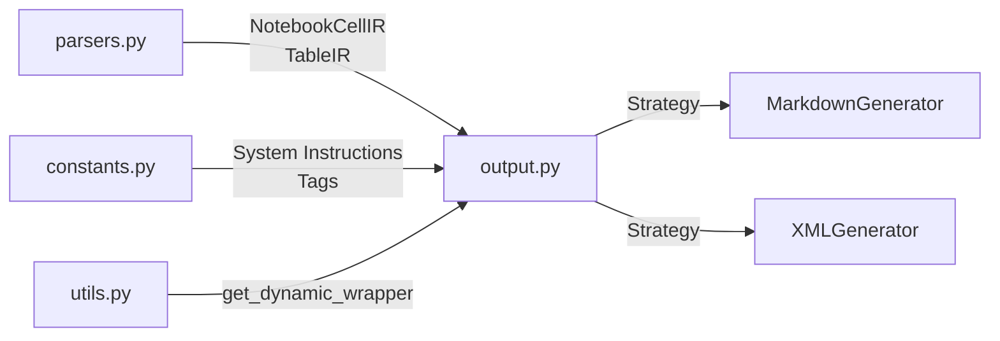

# Output Generation

The `data2prompt` project supports multiple output formats to ensure compatibility with various LLM context window requirements. The generation logic is implemented using the **Strategy Pattern**, allowing for easy extension to new formats.

## Architecture Overview

The output module ([`src/data2prompt/output.py`](../src/data2prompt/output.py#L1)) is responsible for transforming parsed file data into structured text representations optimized for LLM consumption. It receives Intermediate Representations (IR) from the parsing layer and produces either Markdown or XML output.



## Strategy Pattern Implementation

### Abstract Base Class

The [`OutputGenerator`](../src/data2prompt/output.py#L23) abstract class defines the interface for all output generation strategies:

```python
class OutputGenerator(ABC):
    @abstractmethod
    def generate(self,
                 project_name: str,
                 tree_text: str,
                 files_data: List[FileData],
                 stats: Dict[str, int],
                 config: Optional['Config'] = None) -> str:
        pass
```

`FileData` is a `TypedDict` defined in [`parsers.py`](parsers.md) describing a
processed file (`path`, `content`, `type`, `tokens`, `status`); it replaces the
former loosely-typed `Dict[str, Any]` and gives key-name safety across the
main → output boundary. `stats` is a plain `Dict[str, int]` of running counts.

Generators no longer receive a pre-computed token count. They emit
`{{TOTAL_TOKENS}}` and `{{TOKEN_METHOD}}` placeholders in their metadata block;
[`main.py`](../src/data2prompt/main.py#L1) counts the fully rendered output and
substitutes the real values. See [Token Estimation](#token-estimation) below.

### Factory Function

The [`get_generator()`](../src/data2prompt/output.py#L232) function provides simple factory access to concrete implementations:

```python
def get_generator(format_type: str) -> OutputGenerator:
    if format_type.lower() == 'markdown':
        return MarkdownGenerator()
    return XMLGenerator()
```

## Supported Formats

### 1. Markdown (`MarkdownGenerator`)

The [`MarkdownGenerator`](../src/data2prompt/output.py#L35) produces structured Markdown documents optimized for human readability and LLM context windows that prefer Markdown formatting.

#### Output Structure

| Section | Description |
|---------|-------------|
| Generation Flag | `<!-- DATA2PROMPT_GENERATED_CONTENT -->` marker for recursive scanning prevention |
| Header | `# codebase: {project_name}` |
| System Instructions | LLM instructions from [`SYSTEM_INSTRUCTIONS_MARKDOWN`](../src/data2prompt/constants.py#L53) |
| Metadata | Timestamp and token estimation via [`o200k_base`](../src/data2prompt/utils.py#L62) |
| Directory Structure | Code block with tree output |
| Files | Individual files with `## File: {path}` headers |

#### Notebook Rendering

Jupyter Notebooks are rendered using [`NotebookCellIR`](../src/data2prompt/parsers.py#L27) with cell-level headers:

````markdown
### Cell {number} ({type}) - {path}
```{lang}
{cell.source}
```
````

Cell outputs are displayed in text code blocks when present.

#### Table Rendering

CSV/Excel data is rendered using [`TableIR`](../src/data2prompt/parsers.py#L35) with Markdown table formatting via `pandas.DataFrame.to_markdown()`:

```markdown
### Sheet {sheet_number}: {name} - {path}
{table.df.to_markdown(index=False)}
---
```

Table truncation is handled by [`enforce_table_limit()`](../src/data2prompt/parsers.py#L97) when a `Config` object is provided.

#### Schema / Stats Metadata Block

Two **independent** flags drive table rendering in both generators (computed once per
`generate()` call from `config`):

```python
stats_summary = bool(config and config.stats_summary)   # feature #4
schema_only   = bool(config and config.schema_only)     # feature #3
render_block  = stats_summary or schema_only            # render the schema block?
render_data   = not schema_only                         # render the data rows?
```

- When `render_block` and `table.schema` is present, the generators call the shared
  [`render_schema_block()`](parsers.md) with `show_missing=stats_summary,
  show_describe=stats_summary`. In Markdown the block is emitted above the table; in XML
  it is wrapped in an escaped `<schema>…</schema>` element.
- The data table (`to_markdown`) is only emitted when `render_data` is true.

Resulting behavior (all metadata is computed on the **full** DataFrame):

| `--schema-only` | stats (default on) | Data-file output |
|:---:|:---:|:---|
| off | on | stats block (dtype + missing + describe) + sampled rows |
| off | `--no-stats-summary` | sampled rows only (legacy behavior) |
| on | on | stats block, no rows |
| on | `--no-stats-summary` | bare column + dtype schema, no rows |

### 2. XML (`XMLGenerator`)

The [`XMLGenerator`](../src/data2prompt/output.py#L138) produces structured XML documents for LLM context windows that benefit from explicit tagging.

#### Output Structure

| Tag | Description |
|-----|-------------|
| `<codebase name="{project_name}">` | Root element |
| `<metadata>` | Generation timestamp and token count |
| `<directory_structure>` | Tree output |
| `<files>` | Container for file entries |
| `<file path="{path}">` | Individual file with path attribute |
| `<cell path="" index="" type="">` | Notebook cell encapsulation |
| `<sheet name="" sheet_number="" path="">` | Excel sheet encapsulation |

#### Notebook XML Rendering

```xml
<cell path="{display_path}" index="{cell.number}" type="{cell.type}">
    <content>
{cell.source}
    </content>
    <outputs>
{cell.outputs}
    </outputs>
</cell>
```

#### Table XML Rendering

```xml
<sheet name="{table.name}" sheet_number="{table.sheet_number}" path="{table.file_path}">
{table.df.to_markdown(index=False)}
</sheet>
```

## Intermediate Representations (IR)

The output module consumes two types of Intermediate Representations produced by the parsing layer:

### NotebookCellIR

```python
@dataclass
class NotebookCellIR:
    number: int          # Cell index (1-based)
    type: str           # 'code' or 'markdown'
    source: str         # Cell content
    outputs: Optional[str] = None  # Captured outputs for code cells
```

### TableIR

```python
@dataclass
class TableIR:
    name: str                          # Table/sheet name
    df: pd.DataFrame                  # Tabular data
    header_note: Optional[str] = None # Warning/info message
    footer_note: Optional[str] = None # Truncation notice
    visual_warning: bool = False      # Display flag
    sheet_number: Optional[int] = None # Excel sheet index
    file_path: Optional[str] = None   # Source file path
    schema: Optional[TableSchema] = None # Full-df schema/stats metadata
```

## Dynamic Wrapping

To prevent nested code blocks from breaking Markdown rendering, the module uses [`get_dynamic_wrapper()`](../src/data2prompt/utils.py#L79) from [`src/data2prompt/utils.py`](../src/data2prompt/utils.py#L1).

### Algorithm

1. Scan content for maximum sequence of backticks (`` ` ``)
2. Return wrapper with one more backtick than maximum found
3. Minimum wrapper depth is 3 backticks (standard Markdown code block)

### Example

| Content Contains | Wrapper Used |
|-----------------|-------------|
| No backticks | <code>```</code> |
| Single backtick | <code>``</code> |
| Double backticks | <code>`</code> |
| Triple backticks | <code>``````</code> |

## Token Estimation

The reported token count reflects the **fully rendered output**, including all
structural scaffolding the generator adds (XML tags, `## File:` headers, dynamic
backtick fences, the metadata block, the system-instruction preamble, and XML
escaping). To achieve this without counting a string before it exists, generation
and counting are split via placeholders:

1. `generate()` emits the literal placeholders `{{TOTAL_TOKENS}}` and
   `{{TOKEN_METHOD}}` in its metadata block (plain, non-f-string lines so the
   double braces survive).
2. [`main.py`](../src/data2prompt/main.py#L1) calls `count_tokens()` on the returned
   string, then `str.replace()`s both placeholders with the real values before
   writing or copying.

The count runs **once** on the placeholder string; inserting the digits shifts the
true total by a token or two, which is acceptable since the metadata labels it an
estimate. No fixed-point iteration is performed.

### Methods

Token counting is performed by [`count_tokens()`](../src/data2prompt/utils.py#L47),
which returns both the count and the method used:

| Method | Source | Accuracy |
|--------|--------|----------|
| `o200k_base` | tiktoken library | ~100% (OpenAI official) |
| `regex_fallback` | Custom regex pattern | ~95-98% for code |
| `word_count` | Simple split | Baseline fallback |

The method string doubles as the label substituted into the metadata
(`{{TOKEN_METHOD}}`), which renders as:

```markdown
> Tokens: 12345 (est. via o200k_base)
```

```xml
<total_tokens method="o200k_base">12345</total_tokens>
```

## Configuration Integration

Output generators accept an optional [`Config`](../src/data2prompt/cli.py) parameter for table limit enforcement:

```python
def generate(self, ..., config: Optional['Config'] = None) -> str:
```

When `config` is provided (it is `Optional['Config']`, defaulting to `None`), table
content is truncated via [`enforce_table_limit()`](../src/data2prompt/parsers.py#L97)
using:
- `config.table_limit`: Maximum characters allowed
- `config.table_truncate`: Characters to retain when truncated

## Output Format Configuration

Output formats are configured via CLI arguments defined in [`src/data2prompt/cli.py`](../src/data2prompt/cli.py#L1):

| Constant | Value | Usage |
|----------|-------|-------|
| [`DEFAULT_FORMAT`](../src/data2prompt/constants.py#L40) | `'markdown'` | Default output format |
| [`SUPPORTED_FORMATS`](../src/data2prompt/constants.py#L43) | `{'xml': '.xml', 'markdown': '.md'}` | Format-to-extension mapping |
| [`DEFAULT_OUTPUT_FILE`](../src/data2prompt/constants.py#L39) | `'PROMPT'` | Default output filename base |

## Extension Points

To add a new output format:

1. Create a new class inheriting from `OutputGenerator`
2. Implement the `generate()` method
3. Update [`get_generator()`](../src/data2prompt/output.py#L232) to handle the new format
4. Add format constant to [`SUPPORTED_FORMATS`](../src/data2prompt/constants.py#L43) if file extension mapping is needed

## Constants Reference

| Constant | Value | Description |
|----------|-------|-------------|
| [`GENERATION_FLAG`](../src/data2prompt/constants.py#L49) | `"DATA2PROMPT_GENERATED_CONTENT"` | Recursive scanning prevention marker |
| [`SYSTEM_INSTRUCTIONS_MARKDOWN`](../src/data2prompt/constants.py#L53) | Multi-line string | LLM instructions for Markdown format |
| [`SYSTEM_INSTRUCTIONS_XML`](../src/data2prompt/constants.py#L61) | Multi-line string | LLM instructions for XML format |
| [`TAG_DIRECTORY_STRUCTURE`](../src/data2prompt/constants.py#L70) | `"directory_structure"` | XML tag name |
| [`TAG_FILES`](../src/data2prompt/constants.py#L71) | `"files"` | XML tag name |
| [`TAG_FILE`](../src/data2prompt/constants.py#L72) | `"file"` | XML tag name |
| [`TAG_CONTENT`](../src/data2prompt/constants.py#L73) | `"content"` | XML tag for notebook cells |
