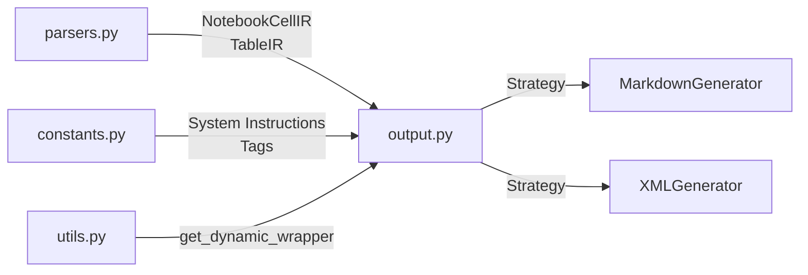

# Output Generation

The `data2prompt` project supports multiple output formats to ensure compatibility with various LLM context window requirements. The generation logic is implemented using the **Strategy Pattern**, allowing for easy extension to new formats.

## Architecture Overview

The output module ([`src/data2prompt/output.py`](src/data2prompt/output.py:1)) is responsible for transforming parsed file data into structured text representations optimized for LLM consumption. It receives Intermediate Representations (IR) from the parsing layer and produces either Markdown or XML output.



## Strategy Pattern Implementation

### Abstract Base Class

The [`OutputGenerator`](src/data2prompt/output.py:23) abstract class defines the interface for all output generation strategies:

```python
class OutputGenerator(ABC):
    @abstractmethod
    def generate(self, 
                 project_name: str, 
                 tree_text: str, 
                 files_data: List[Dict[str, Any]], 
                 stats: Dict[str, Any],
                 total_tokens: int,
                 token_method: str,
                 config: 'Config' = None) -> str:
        pass
```

### Factory Function

The [`get_generator()`](src/data2prompt/output.py:232) function provides simple factory access to concrete implementations:

```python
def get_generator(format_type: str) -> OutputGenerator:
    if format_type.lower() == 'markdown':
        return MarkdownGenerator()
    return XMLGenerator()
```

## Supported Formats

### 1. Markdown (`MarkdownGenerator`)

The [`MarkdownGenerator`](src/data2prompt/output.py:35) produces structured Markdown documents optimized for human readability and LLM context windows that prefer Markdown formatting.

#### Output Structure

| Section | Description |
|---------|-------------|
| Generation Flag | `<!-- DATA2PROMPT_GENERATED_CONTENT -->` marker for recursive scanning prevention |
| Header | `# codebase: {project_name}` |
| System Instructions | LLM instructions from [`SYSTEM_INSTRUCTIONS_MARKDOWN`](src/data2prompt/constants.py:53) |
| Metadata | Timestamp and token estimation via [`o200k_base`](src/data2prompt/utils.py:62) |
| Directory Structure | Code block with tree output |
| Files | Individual files with `## File: {path}` headers |

#### Notebook Rendering

Jupyter Notebooks are rendered using [`NotebookCellIR`](src/data2prompt/parsers.py:27) with cell-level headers:

```markdown
### Cell {number} ({type}) - {path}
```{lang}
{cell.source}
```
```

Cell outputs are displayed in text code blocks when present.

#### Table Rendering

CSV/Excel data is rendered using [`TableIR`](src/data2prompt/parsers.py:35) with Markdown table formatting via `pandas.DataFrame.to_markdown()`:

```markdown
### Sheet {sheet_number}: {name} - {path}
{table.df.to_markdown(index=False)}
---
```

Table truncation is handled by [`enforce_table_limit()`](src/data2prompt/parsers.py:97) when a `Config` object is provided.

### 2. XML (`XMLGenerator`)

The [`XMLGenerator`](src/data2prompt/output.py:138) produces structured XML documents for LLM context windows that benefit from explicit tagging.

#### Output Structure

| Tag | Description |
|-----|-------------|
| `<codebase name="{project_name}">` | Root element |
| `<metadata>` | Generation timestamp and token count |
| `<directory_structure>` | Tree output |
| `<files>` | Container for file entries |
| `<file path="{path}">` | Individual file with path attribute |
| `<cell path="" index="" type="">` | Notebook cell encapsulation |
| `<sheet name="" sheet_number="" path="">` | Excel sheet encapsulation |

#### Notebook XML Rendering

```xml
<cell path="{display_path}" index="{cell.number}" type="{cell.type}">
    <content>
{cell.source}
    </content>
    <outputs>
{cell.outputs}
    </outputs>
</cell>
```

#### Table XML Rendering

```xml
<sheet name="{table.name}" sheet_number="{table.sheet_number}" path="{table.file_path}">
{table.df.to_markdown(index=False)}
</sheet>
```

## Intermediate Representations (IR)

The output module consumes two types of Intermediate Representations produced by the parsing layer:

### NotebookCellIR

```python
@dataclass
class NotebookCellIR:
    number: int          # Cell index (1-based)
    type: str           # 'code' or 'markdown'
    source: str         # Cell content
    outputs: Optional[str] = None  # Captured outputs for code cells
```

### TableIR

```python
@dataclass
class TableIR:
    name: str                          # Table/sheet name
    df: pd.DataFrame                  # Tabular data
    header_note: Optional[str] = None # Warning/info message
    footer_note: Optional[str] = None # Truncation notice
    visual_warning: bool = False      # Display flag
    sheet_number: Optional[int] = None # Excel sheet index
    file_path: Optional[str] = None   # Source file path
```

## Dynamic Wrapping

To prevent nested code blocks from breaking Markdown rendering, the module uses [`get_dynamic_wrapper()`](src/data2prompt/utils.py:79) from [`src/data2prompt/utils.py`](src/data2prompt/utils.py:1).

### Algorithm

1. Scan content for maximum sequence of backticks (`` ` ``)
2. Return wrapper with one more backtick than maximum found
3. Minimum wrapper depth is 3 backticks (standard Markdown code block)

### Example

| Content Contains | Wrapper Used |
|-----------------|-------------|
| No backticks | <code>```</code> |
| Single backtick | <code>``</code> |
| Double backticks | <code>`</code> |
| Triple backticks | <code>``````</code> |

## Token Estimation

Token estimation is performed by the parsing layer using [`count_tokens()`](src/data2prompt/utils.py:42) and passed to output generators for inclusion in metadata.

### Methods

| Method | Source | Accuracy |
|--------|--------|----------|
| `o200k_base` | tiktoken library | ~100% (OpenAI official) |
| `regex_fallback` | Custom regex pattern | ~95-98% for code |
| `word_count` | Simple split | Baseline fallback |

The method label is included in output metadata:

```markdown
> Tokens: {total_tokens} (est. via o200k_base)
```

```xml
<total_tokens method="o200k_base">{total_tokens}</total_tokens>
```

## Configuration Integration

Output generators accept an optional [`Config`](src/data2prompt/cli.py) parameter for table limit enforcement:

```python
def generate(self, ..., config: 'Config' = None) -> str:
```

When `config` is provided, table content is truncated via [`enforce_table_limit()`](src/data2prompt/parsers.py:97) using:
- `config.table_limit`: Maximum characters allowed
- `config.table_truncate`: Characters to retain when truncated

## Output Format Configuration

Output formats are configured via CLI arguments defined in [`src/data2prompt/cli.py`](src/data2prompt/cli.py:1):

| Constant | Value | Usage |
|----------|-------|-------|
| [`DEFAULT_FORMAT`](src/data2prompt/constants.py:40) | `'markdown'` | Default output format |
| [`SUPPORTED_FORMATS`](src/data2prompt/constants.py:43) | `{'xml': '.xml', 'markdown': '.md'}` | Format-to-extension mapping |
| [`DEFAULT_OUTPUT_FILE`](src/data2prompt/constants.py:39) | `'PROMPT'` | Default output filename base |

## Extension Points

To add a new output format:

1. Create a new class inheriting from `OutputGenerator`
2. Implement the `generate()` method
3. Update [`get_generator()`](src/data2prompt/output.py:232) to handle the new format
4. Add format constant to [`SUPPORTED_FORMATS`](src/data2prompt/constants.py:43) if file extension mapping is needed

## Constants Reference

| Constant | Value | Description |
|----------|-------|-------------|
| [`GENERATION_FLAG`](src/data2prompt/constants.py:49) | `"DATA2PROMPT_GENERATED_CONTENT"` | Recursive scanning prevention marker |
| [`SYSTEM_INSTRUCTIONS_MARKDOWN`](src/data2prompt/constants.py:53) | Multi-line string | LLM instructions for Markdown format |
| [`SYSTEM_INSTRUCTIONS_XML`](src/data2prompt/constants.py:61) | Multi-line string | LLM instructions for XML format |
| [`TAG_DIRECTORY_STRUCTURE`](src/data2prompt/constants.py:70) | `"directory_structure"` | XML tag name |
| [`TAG_FILES`](src/data2prompt/constants.py:71) | `"files"` | XML tag name |
| [`TAG_FILE`](src/data2prompt/constants.py:72) | `"file"` | XML tag name |
| [`TAG_CONTENT`](src/data2prompt/constants.py:73) | `"content"` | XML tag for notebook cells |
