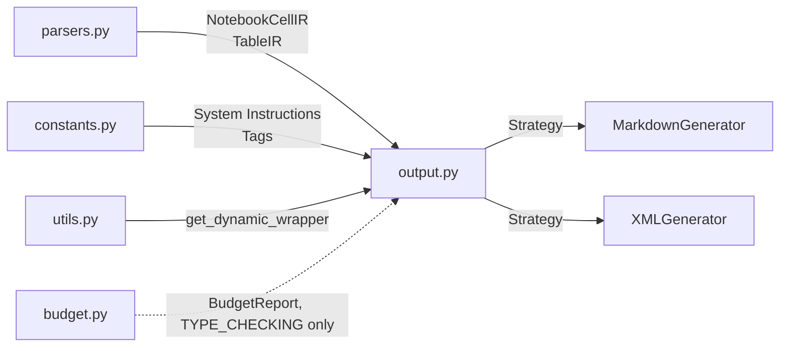

# Output Generation

The `data2prompt` project supports multiple output formats to ensure compatibility with various LLM context window requirements. The generation logic is implemented using the **Strategy Pattern**, allowing for easy extension to new formats.

> **Extending the output?** The design invariants (format parity, notice
> grammar, canonical path keys, controlled vocabularies) and step-by-step
> integration checklists live in [`output-contract.md`](output-contract.md).
> This file documents the structure as it exists; that one governs how it may
> change.

## Architecture Overview

The output module ([`src/data2prompt/output.py`](../src/data2prompt/output.py#L1)) is responsible for transforming parsed file data into structured text representations optimized for LLM consumption. It receives Intermediate Representations (IR) from the parsing layer and produces either Markdown or XML output.



## Strategy Pattern Implementation

### Abstract Base Class

The [`OutputGenerator`](../src/data2prompt/output.py#L23) abstract class defines the interface for all output generation strategies:

```python
class OutputGenerator(ABC):
    @abstractmethod
    def generate(self,
                 project_name: str,
                 tree_text: str,
                 files_data: List[FileData],
                 stats: Dict[str, int],
                 config: Optional['Config'] = None,
                 budget_report: Optional['BudgetReport'] = None) -> str:
        pass
```

`FileData` is a `TypedDict` defined in [`parsers.py`](parsers.md) describing a
processed file (`path`, `content`, `type`, `tokens`, `status`); it replaces the
former loosely-typed `Dict[str, Any]` and gives key-name safety across the
main → output boundary. `stats` is a plain `Dict[str, int]` of running counts.

`budget_report` is an optional [`BudgetReport`](budget.md) from
[`budget.py`](budget.md), passed only on a `--budget` run — `budget.py`
re-calls `generate()` once per ladder attempt with a freshly built report, so
the rendered Budget Report block always matches exactly what that attempt's
verified token count measured. `BudgetReport` is imported only under
`TYPE_CHECKING` (string-annotated as `'BudgetReport'`): `budget.py` imports
this module at runtime for `get_generator()`, so a runtime import in the
other direction would create a cycle. See
[Budget Report](#budget-report) below and
[budget.md § Import-cycle design](budget.md#import-cycle-design).

Generators no longer receive a pre-computed token count. They emit
`{{TOTAL_TOKENS}}` and `{{TOKEN_METHOD}}` placeholders in their metadata block;
[`main.py`](../src/data2prompt/main.py#L1) counts the fully rendered output and
substitutes the real values. See [Token Estimation](#token-estimation) below.

### Factory Function

The [`get_generator()`](../src/data2prompt/output.py) function dispatches through an
explicit strategy mapping and **raises `ValueError` for unknown formats** instead of
silently defaulting to XML — a wiring mistake fails loudly at the source:

```python
_GENERATORS: Dict[str, Type[OutputGenerator]] = {
    'markdown': MarkdownGenerator,
    'xml': XMLGenerator,
}

def get_generator(format_type: str) -> OutputGenerator:
    generator_cls = _GENERATORS.get(format_type.lower())
    if generator_cls is None:
        raise ValueError(f"Unsupported output format: {format_type!r} ...")
    return generator_cls()
```

(The CLI's `--format` choices normally prevent an unknown value from reaching this
point; the error guards programmatic callers.)

## Supported Formats

### 1. Markdown (`MarkdownGenerator`)

The [`MarkdownGenerator`](../src/data2prompt/output.py) produces structured Markdown documents optimized for human readability and LLM context windows that prefer Markdown formatting.

#### Output Structure

| Section | Description |
|---------|-------------|
| Generation Flag | `<!-- DATA2PROMPT_GENERATED_CONTENT -->` marker for recursive scanning prevention (always line 1) |
| Header | `# codebase: {project_name}` |
| System Instructions | LLM reading contract from [`SYSTEM_INSTRUCTIONS_MARKDOWN`](../src/data2prompt/constants.py) — document layout, structural conventions, tool-notice grammar, and anti-hallucination accuracy rules |
| Metadata | `> Generated on:`, `> Tokens:` (via [`o200k_base`](../src/data2prompt/utils.py)), and `> Contents:` — a content summary built from the `stats` dict (see [Stats Summary](#document-level-stats-summary)) |
| Budget Report | `# Budget Report` — present only when `--budget` was requested (see [Budget Report](#budget-report)) |
| File Index | `# File Index` — a `\| Path \| Type \| Status \|` table, one row per file (see [File Index](#file-index)) |
| Files | Individual files with `## File: {path}` headers, in File Index order |
| End Anchor | `# End of codebase: {project_name}` + one-sentence recap (see [End-of-Codebase Anchor](#end-of-codebase-anchor)) |

All paths in the output (index rows, `## File:` headers, cell/sheet labels) use
**forward slashes on every platform** — they are one exact string, the canonical
path key, so an LLM can cross-reference the index, headers, and tree by literal
match. Backslashes were dropped because they collide with escape sequences in
code contexts and tokenize worse.

#### Notebook Rendering

Jupyter Notebooks are rendered using [`NotebookCellIR`](../src/data2prompt/parsers.py#L27) with cell-level headers:

````markdown
### Cell {number} ({type}) - {path}
```{lang}
{cell.source}
```
````

Cell outputs are displayed in text code blocks when present.

#### Table Rendering

CSV/Excel/SQLite data is rendered using [`TableIR`](../src/data2prompt/parsers.py#L35) with Markdown table formatting via `pandas.DataFrame.to_markdown()`:

```markdown
### {section_label} {sheet_number}: {name} - {path}
```sql
{table.ddl}                       # SQLite only; gated by render_block
```
{schema block}                    # gated by render_block
{table.df.to_markdown(index=False)}
---
```

`section_label` is the sub-section word — `"Sheet"` for Excel, `"Table"` for
SQLite — and drives the XML element tag too (`<sheet>` / `<table>`). The `ddl`
block (SQLite `CREATE` statements) is emitted only when
`render_block` (`stats_summary or schema_only`) is true, the same gate as the
schema block. Table truncation is handled by
[`enforce_table_limit()`](../src/data2prompt/parsers.py#L97) when a `Config`
object is provided.

#### Schema / Stats Metadata Block

Two **independent** flags drive table rendering in both generators (computed once per
`generate()` call from `config`):

```python
stats_summary = bool(config and config.stats_summary)   # feature #4
schema_only   = bool(config and config.schema_only)     # feature #3
render_block  = stats_summary or schema_only            # render the schema block?
render_data   = not schema_only                         # render the data rows?
```

- When `render_block` and `table.schema` is present, the generators call the shared
  [`render_schema_block()`](parsers.md) with `show_missing=stats_summary,
  show_describe=stats_summary`. In Markdown the block is emitted above the table; in XML
  it is wrapped in a `<schema>…</schema>` element (content verbatim, like all content).
- The data table (`to_markdown`) is only emitted when `render_data` is true.

Resulting behavior (all metadata is computed on the **full** DataFrame):

| `--schema-only` | stats (default on) | Data-file output |
|:---:|:---:|:---|
| off | on | stats block (dtype + missing + describe) + sampled rows |
| off | `--no-stats-summary` | sampled rows only (legacy behavior) |
| on | on | stats block, no rows |
| on | `--no-stats-summary` | bare column + dtype schema, no rows |

#### Budget Report

Emitted by [`_budget_block_markdown()`](../src/data2prompt/output.py) /
[`_budget_block_xml()`](../src/data2prompt/output.py) — one shared source of
truth per format, mirroring each other for format parity (invariant 1 of
[output-contract.md](output-contract.md)) — **only when `budget_report is not
None`**, i.e. only on a `--budget` run. On a run without `--budget` neither
block is emitted and the document is byte-for-byte what a pre-`--budget` run
produced.

**Placement — Markdown**: between the metadata blockquote block and the
`# File Index` heading:

```markdown
# Budget Report

Requested budget: 50,000 tokens.

Data-cap parameters tightened to fit the budget (the Tokens line above is
the final count):

| Parameter | Requested | Adjusted | Scope |
|---|---|---|---|
| csv-sample-size | 15 | 5 | 6 tabular data file(s) re-sampled |

Files omitted entirely to meet the budget (status Omitted in the File
Index):

| Path | Est. tokens |
|---|---|
| data/big.csv | 12,400 |
```

If no adjustments were needed, the adjustments table is replaced by a single
line: `No parameter adjustments were needed - the document fit as
generated.` The omitted-files table is only emitted when `report.omitted` is
non-empty. Token counts in both tables are formatted with `{:,}`; all cell
text goes through `_md_cell()` (pipe-escaping), same as the File Index.

**Placement — XML**: between `</metadata>` and `<file_index>`:

```xml
<budget_report requested_tokens="50000">
    <adjustment parameter="csv-sample-size" requested="15" adjusted="5" scope="6 tabular data file(s) re-sampled"/>
    <omitted_file path="data/big.csv" estimated_tokens="12400"/>
</budget_report>
```

String attributes (`parameter`, `requested`, `adjusted`, `scope`, `path`) go
through `quoteattr()`, same as every other user-data attribute in this
format. Numeric attributes (`requested_tokens`, `estimated_tokens`) are plain
digits — no thousands separators inside XML attributes. When there are no
adjustments and no omissions, the element self-closes instead of carrying
empty children: `<budget_report requested_tokens="50000"/>`.

The block is built from a [`BudgetReport`](budget.md) — `requested_tokens`,
an ordered `adjustments: List[BudgetAdjustment]`, and an ordered
`omitted: List[Tuple[str, int]]` of `(canonical forward-slash path, estimated
tokens)` pairs. See [budget.md](budget.md#public-data-structures) for the
dataclass shapes and [budget.md § The De-escalation Ladder](budget.md#the-de-escalation-ladder)
for exactly which adjustment scope strings can appear.

The block **never** contains the literal placeholder strings
`{{TOTAL_TOKENS}}` or `{{TOKEN_METHOD}}` (output-contract invariant 7) — the
final, verified token count lives only in the metadata `> Tokens:` /
`<total_tokens>` line, never restated inside the Budget Report itself.

Files a `--budget` run omitted entirely are **not** listed by path inside the
Budget Report's omitted-files table alone — they also surface in the File
Index with status `Omitted`, through the *same* existing mechanism that lists
any tree-scanned-but-not-rendered file (see [File Index](#file-index) below):
`budget.py`'s `_materialize()` simply never adds an omitted record to
`files_data`, so `build_file_index()`'s "present in `tree_text`, absent from
`files_data`" leftover rule picks it up automatically — no File Index code
changed for this feature.

#### File Index

The File Index **replaces the former `# Directory Structure` section** in both
formats. The old tree was a flat sorted path list, so it carried no information
the index doesn't; merging the two avoids serializing every path twice and gives
the LLM a single orientation map: one entry per file with its `Type` and its
inclusion `Status`.

Construction ([`build_file_index()`](../src/data2prompt/output.py)):

1. Rendered files come first, **in document order** — index order always matches
   the order of the `## File:` / `<file>` sections below it.
2. Paths present in `tree_text` but absent from `files_data` (files skipped via
   `skip_file=True`, e.g. previously generated outputs detected by
   `GENERATION_FLAG`) are appended with type `-` and status `Omitted`. Every
   scanned file is therefore accounted for — previously these files appeared in
   the tree with no content section and no explanation.

Statuses come from [`resolve_inclusion_status()`](../src/data2prompt/output.py),
which maps the raw parser statuses onto the controlled vocabulary documented in
the system instructions via `INCLUSION_STATUS_MAP` ([`constants.py`](constants.md)):

| Raw parser status | Index status |
|---|---|
| `Read` | `Full` |
| `Sampled` / `Parsed` (SQL) / `Extracted` (Excel) | `Sampled` |
| `Cleaned` | `Cleaned` |
| `Truncated` | `Truncated` |
| `Schema Only` | `Schema Only` |
| `Redacted` | `Redacted` |
| `Skipped (Exclusion)` | `Excluded` |
| `Skipped (Binary)` | `Binary Skipped` |
| `Error` | `Error` |
| any other `Skipped (...)` | `Skipped` |
| anything unknown | passed through verbatim (never raises) |

In Markdown the index is a `| Path | Type | Status |` table (cell values are
pipe-escaped via `_md_cell()`); in XML it is a
`<file_index>` element of self-closing
`<entry path="..." type="..." status="..."/>` rows (all attributes through
`quoteattr`). The `IndexEntry` frozen dataclass carries one row.

#### Document-Level Stats Summary

The previously unused `stats: Dict[str, int]` parameter now feeds a one-line
content summary in the metadata block, built by
[`summarize_stats()`](../src/data2prompt/output.py) using the ordered
`STATS_SUMMARY_LABELS` mapping ([`constants.py`](constants.md)):

- Markdown: `> Contents: Total files: 12 | CSV: 3 | Notebooks: 2 | Truncated: 1`
- XML: `<stats total_files="12" csv="3" notebooks="2" truncated="1"/>` inside
  `<metadata>` (attribute names are the labels lowercased with underscores)

`Total files` is always present (falling back to the rendered-file count when
the stat is missing or zero — programmatic callers may pass `stats={}`); all
other zero counts are dropped to save tokens.

#### End-of-Codebase Anchor

Both formats close with an explicit terminal section built by
[`_end_recap()`](../src/data2prompt/output.py) — a recency anchor telling the
model the document is complete and restating the core accuracy rule:

- Markdown: `# End of codebase: {project_name}` followed by the recap sentence.
- XML: `<end_of_codebase>` + recap + `</end_of_codebase>`, immediately before
  `</codebase>`.

The recap: *"This concludes the data2prompt snapshot of {name}. The File Index
above lists all {N} files; content marked sampled, truncated, or omitted is not
fully included in this document."*

#### Scope of `--no-stats-summary`

`--no-stats-summary` gates only the **per-table schema/stats block** (feature
#4). The document-level scaffolding — the `> Contents:` line / `<stats/>`
element, the File Index, and the end anchor — is unconditional; it costs a few
hundred tokens and is what keeps the LLM oriented. See [cli.md](cli.md).

### 2. XML (`XMLGenerator`)

The [`XMLGenerator`](../src/data2prompt/output.py) produces XML-*style* documents for LLM context windows that benefit from explicit tagging.

#### Escaping model — attributes quoted, content verbatim

The output is **structural XML for LLM anchoring, not strict parseable XML**
(the same model Repomix uses):

- **Every attribute value that carries user data** (`path`, sheet `name`, cell
  `type`, project name) goes through `xml.sax.saxutils.quoteattr()`. A sheet
  named `Q1 "final" <rev>` or a path containing `&` can therefore never
  terminate an attribute early or break the tag structure.
- **Element content is embedded verbatim** — file text, notebook cell sources,
  table renderings, and the directory tree are *not* entity-escaped. Escaping
  code would rewrite `if a < b:` as `if a &lt; b:`, hurting LLM readability and
  inflating tokens. The XML system instructions tell the model explicitly that
  contents are verbatim and the tags are structural markers. (Previously cell
  and table content was escaped while plain-file content was not — the worst of
  both worlds; content handling is now uniform.)

#### Output Structure

| Tag | Description |
|-----|-------------|
| `<codebase name={quoteattr}>` | Root element |
| `<purpose>` | System instructions ([`SYSTEM_INSTRUCTIONS_XML`](constants.md)) |
| `<metadata>` | Generation timestamp, token count, and `<stats/>` content summary |
| `<budget_report requested_tokens="...">` | Present only when `--budget` was requested (see [Budget Report](#budget-report)) |
| `<file_index>` | One `<entry path type status/>` per file (see [File Index](#file-index)) |
| `<files>` | Container for file entries (no prose inside — the former stray "This section contains..." line was removed) |
| `<file path={quoteattr} type={quoteattr} status={quoteattr}>` | Individual file; `status` carries the **resolved** index vocabulary so it cross-references `<entry>` exactly |
| `<cell path={quoteattr} index="" type={quoteattr}>` | Notebook cell encapsulation |
| `<sheet name={quoteattr} sheet_number="" path={quoteattr}>` | Excel sheet encapsulation |
| `<table name={quoteattr} table_number="" path={quoteattr}>` | SQLite table/view encapsulation (tag + `{tag}_number` derived from `section_label`) |
| `<ddl>` | SQLite table's `CREATE`-statement DDL (verbatim; gated by `render_block`) |
| `<end_of_codebase>` | Terminal recap element, immediately before `</codebase>` |

#### Notebook XML Rendering

```xml
<cell path={quoteattr(display_path)} index="{cell.number}" type={quoteattr(cell.type)}>
    <content>
{cell.source}                                  <!-- verbatim, not escaped -->
    </content>
    <outputs>
{cell.outputs}                                 <!-- verbatim, not escaped -->
    </outputs>
</cell>
```

#### Table XML Rendering

The element tag and its number attribute are derived from `table.section_label`
(`<sheet sheet_number="">` for Excel, `<table table_number="">` for SQLite). The
optional `<ddl>` element (SQLite `CREATE` statements) is emitted only when
`render_block` is true, mirroring the Markdown fenced `sql` block.

```xml
<table name={quoteattr(table.name)} table_number="{table.sheet_number}" path={quoteattr(table.file_path)}>
<ddl>
{table.ddl}                                    <!-- SQLite only; verbatim, not escaped -->
</ddl>
<schema>...</schema>                           <!-- gated by render_block -->
{table.df.to_markdown(index=False)}            <!-- verbatim, not escaped -->
</table>
```

## Intermediate Representations (IR)

The output module consumes two types of Intermediate Representations produced by the parsing layer:

### NotebookCellIR

```python
@dataclass
class NotebookCellIR:
    number: int          # Cell index (1-based)
    type: str           # 'code' or 'markdown'
    source: str         # Cell content
    outputs: Optional[str] = None  # Captured outputs for code cells
```

### TableIR

```python
@dataclass
class TableIR:
    name: str                          # Table/sheet name
    df: pd.DataFrame                  # Tabular data
    header_note: Optional[str] = None # Warning/info message
    footer_note: Optional[str] = None # Truncation notice
    sheet_number: Optional[int] = None # Excel sheet / SQLite table sub-section index
    file_path: Optional[str] = None   # Source file path
    schema: Optional[TableSchema] = None # Full-df schema/stats metadata
    section_label: str = "Sheet"      # Sub-section word: "Sheet" (Excel) / "Table" (SQLite)
    ddl: Optional[str] = None         # SQLite CREATE-statement DDL
```

## Dynamic Wrapping

To prevent nested code blocks from breaking Markdown rendering, the module uses [`get_dynamic_wrapper()`](../src/data2prompt/utils.py#L79) from [`src/data2prompt/utils.py`](../src/data2prompt/utils.py#L1).

### Algorithm

1. Scan content for maximum sequence of backticks (`` ` ``)
2. Return wrapper with one more backtick than maximum found
3. Minimum wrapper depth is 3 backticks (standard Markdown code block)

### Example

| Content Contains | Wrapper Used |
|-----------------|-------------|
| No backticks | <code>```</code> |
| Single backtick | <code>``</code> |
| Double backticks | <code>`</code> |
| Triple backticks | <code>``````</code> |

## Token Estimation

The reported token count reflects the **fully rendered output**, including all
structural scaffolding the generator adds (XML tags, `## File:` headers, dynamic
backtick fences, the metadata block, the system-instruction preamble, and XML
escaping). To achieve this without counting a string before it exists, generation
and counting are split via placeholders:

1. `generate()` emits the literal placeholders `{{TOTAL_TOKENS}}` and
   `{{TOKEN_METHOD}}` in its metadata block (plain, non-f-string lines so the
   double braces survive).
2. [`main.py`](../src/data2prompt/main.py#L1) calls `count_tokens()` on the returned
   string, then `str.replace()`s both placeholders with the real values before
   writing or copying.

The count runs **once** on the placeholder string; inserting the digits shifts the
true total by a token or two, which is acceptable since the metadata labels it an
estimate. No fixed-point iteration is performed.

### Methods

Token counting is performed by [`count_tokens()`](../src/data2prompt/utils.py#L47),
which returns both the count and the method used:

| Method | Source | Accuracy |
|--------|--------|----------|
| `o200k_base` | tiktoken library | ~100% (OpenAI official) |
| `regex_fallback` | Custom regex pattern | ~95-98% for code |
| `word_count` | Simple split | Baseline fallback |

The method string doubles as the label substituted into the metadata
(`{{TOKEN_METHOD}}`), which renders as:

```markdown
> Tokens: 12345 (est. via o200k_base)
```

```xml
<total_tokens method="o200k_base">12345</total_tokens>
```

## Configuration Integration

Output generators accept an optional [`Config`](../src/data2prompt/cli.py) parameter for table limit enforcement:

```python
def generate(self, ..., config: Optional['Config'] = None) -> str:
```

When `config` is provided (it is `Optional['Config']`, defaulting to `None`), table
content is truncated via [`enforce_table_limit()`](../src/data2prompt/parsers.py#L97)
using:
- `config.table_limit`: Maximum characters allowed
- `config.table_truncate`: Characters to retain when truncated

`generate()` also accepts the optional `budget_report` parameter described
above — see [Budget Report](#budget-report).

## Output Format Configuration

Output formats are configured via CLI arguments defined in [`src/data2prompt/cli.py`](../src/data2prompt/cli.py#L1):

| Constant | Value | Usage |
|----------|-------|-------|
| [`DEFAULT_FORMAT`](../src/data2prompt/constants.py#L40) | `'markdown'` | Default output format |
| [`SUPPORTED_FORMATS`](../src/data2prompt/constants.py#L43) | `{'xml': '.xml', 'markdown': '.md'}` | Format-to-extension mapping |
| [`DEFAULT_OUTPUT_FILE`](../src/data2prompt/constants.py#L39) | `'PROMPT'` | Default output filename base |

## Extension Points

To add a new output format:

1. Create a new class inheriting from `OutputGenerator`
2. Implement the `generate()` method
3. Update [`get_generator()`](../src/data2prompt/output.py#L232) to handle the new format
4. Add format constant to [`SUPPORTED_FORMATS`](../src/data2prompt/constants.py#L43) if file extension mapping is needed

## Module-Level Helpers

All shared by both generators (single source of truth for the scaffolding):

| Helper | Purpose |
|--------|---------|
| `IndexEntry` (frozen dataclass) | One File Index row: `path`, `type`, `status` |
| `_display_path(rel_path) -> str` | Canonical forward-slash path key (`Path.as_posix()`) |
| `resolve_inclusion_status(status) -> str` | Raw parser status → index vocabulary; `Skipped (...)` prefix fallback, then verbatim passthrough — never raises |
| `build_file_index(tree_text, files_data) -> List[IndexEntry]` | Rendered files in document order + tree-only leftovers as `Omitted` |
| `summarize_stats(stats, file_total) -> List[Tuple[str, int]]` | Ordered (label, count) pairs; `Total files` always present, zero counts dropped |
| `_end_recap(project_name, indexed_count) -> str` | Shared closing recap sentence |
| `_md_cell(text) -> str` | Escapes `\|` so values are safe inside the Markdown index table |
| `_budget_block_markdown(report) -> List[str]` | Renders the Markdown Budget Report section (see [Budget Report](#budget-report)) |
| `_budget_block_xml(report) -> List[str]` | Renders the XML `<budget_report>` element (see [Budget Report](#budget-report)) |

## Constants Reference

| Constant | Value | Description |
|----------|-------|-------------|
| [`GENERATION_FLAG`](../src/data2prompt/constants.py) | `"DATA2PROMPT_GENERATED_CONTENT"` | Recursive scanning prevention marker |
| [`SYSTEM_INSTRUCTIONS_MARKDOWN`](../src/data2prompt/constants.py) | Multi-line string | LLM reading contract for Markdown format |
| [`SYSTEM_INSTRUCTIONS_XML`](../src/data2prompt/constants.py) | Multi-line string | LLM reading contract for XML format |
| [`TAG_FILES`](../src/data2prompt/constants.py) | `"files"` | XML tag name |
| [`TAG_FILE`](../src/data2prompt/constants.py) | `"file"` | XML tag name |
| [`TAG_CONTENT`](../src/data2prompt/constants.py) | `"content"` | XML tag for notebook cells |
| [`TAG_FILE_INDEX`](../src/data2prompt/constants.py) | `"file_index"` | XML tag for the File Index |
| [`TAG_INDEX_ENTRY`](../src/data2prompt/constants.py) | `"entry"` | XML tag for one index row |
| [`TAG_END_OF_CODEBASE`](../src/data2prompt/constants.py) | `"end_of_codebase"` | XML tag for the terminal anchor |
| [`TAG_BUDGET_REPORT`](../src/data2prompt/constants.py) | `"budget_report"` | XML tag for the optional Budget Report block |
| [`TAG_ADJUSTMENT`](../src/data2prompt/constants.py) | `"adjustment"` | XML tag for one Budget Report parameter-adjustment row |
| [`TAG_OMITTED_FILE`](../src/data2prompt/constants.py) | `"omitted_file"` | XML tag for one Budget Report omitted-file row |
| [`INCLUSION_STATUS_MAP`](../src/data2prompt/constants.py) | `Dict[str, str]` | Raw status → File Index vocabulary |
| [`STATS_SUMMARY_LABELS`](../src/data2prompt/constants.py) | `Dict[str, str]` | Ordered stat key → summary label |

`TAG_DIRECTORY_STRUCTURE` was removed along with the `# Directory Structure` /
`<directory_structure>` section — superseded by the File Index.
