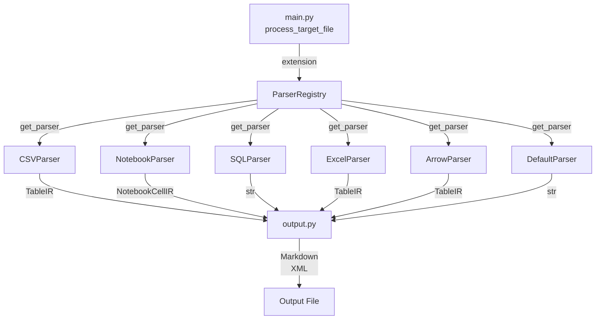

# Parsers Module

The `parsers.py` module (`src/data2prompt/parsers.py`) is the format-specific extraction engine of the data2prompt system. It implements the **Registry pattern** to dispatch parsing logic based on file extensions, producing **Intermediate Representations (IR)** that are consumed by the output generation layer.

## Architecture Overview



## ParserRegistry Pattern

The [`ParserRegistry`](../src/data2prompt/parsers.py#L561) class manages the mapping between file extensions and their corresponding parser implementations:

```python
class ParserRegistry:
    """Handles file-to-parser mapping."""
    def __init__(self) -> None:
        self._parsers: Dict[str, BaseParser] = {}
        self._default_parser = DefaultParser()

    def register(self, extensions: List[str], parser: BaseParser) -> None:
        for ext in extensions:
            self._parsers[ext.lower()] = parser

    def get_parser(self, extension: str) -> BaseParser:
        return self._parsers.get(extension.lower(), self._default_parser)
```

### Registration Table

| Parser | Extensions | Description |
|--------|------------|-------------|
| [`CSVParser`](../src/data2prompt/parsers.py#L419) | `.csv` | Samples rows to fit context limits |
| [`NotebookParser`](../src/data2prompt/parsers.py#L438) | `.ipynb` | Cleans and truncates notebook cells and outputs |
| [`SQLParser`](../src/data2prompt/parsers.py#L456) | `.sql` | Parses SQL files, sampling table data while preserving schema |
| [`ExcelParser`](../src/data2prompt/parsers.py#L478) | `.xlsx`, `.xls` | Extracts data from sheets, detecting visual elements |
| [`ArrowParser`](../src/data2prompt/parsers.py) | `.parquet`, `.feather`, `.arrow` | Samples rows; uses native pyarrow schema for exact dtypes; requires optional `pyarrow` |
| [`EnvParser`](../src/data2prompt/parsers.py) | `.env` & variants (by name) | Lists variable names with redacted values; never emits a value |
| [`DefaultParser`](../src/data2prompt/parsers.py#L507) | All others | Fallback for text files with binary detection and size truncation |

> **Name-based dispatch for env files.** `EnvParser` is *not* in the extension registry,
> because a bare `.env` file has an empty suffix. Instead,
> [`process_target_file()`](../src/data2prompt/main.py) checks `is_env_file(name)` first
> and routes matching files to the shared `env_parser` instance, before the extension
> registry is consulted.

### Dispatch Flow

1. [`main.py`](../src/data2prompt/main.py#L27) calls [`process_target_file()`](../src/data2prompt/main.py#L27) for each discovered file
2. The file extension is extracted and passed to [`registry.get_parser(ext)`](../src/data2prompt/parsers.py#L571)
3. The appropriate parser's [`parse()`](../src/data2prompt/parsers.py#L94) method is invoked
4. A [`ParserResult`](../src/data2prompt/parsers.py#L47) is returned containing the IR and metadata

## BaseParser Protocol

All parsers implement the [`BaseParser`](../src/data2prompt/parsers.py#L92) protocol, ensuring a consistent interface:

```python
class BaseParser(Protocol):
    """Interface for all file parsers."""
    def parse(self, file_path: Path, config: 'Config') -> ParserResult:
        ...
```

## Intermediate Representations (IR)

The module defines two dataclass-based IR types that provide structured, token-aware representations of complex data formats.

### NotebookCellIR

```python
@dataclass
class NotebookCellIR:
    """Intermediate representation for a Jupyter Notebook cell."""
    number: int
    type: str  # 'code' or 'markdown'
    source: str
    outputs: Optional[str] = None
```

Represents a single cell in a Jupyter Notebook, capturing:
- **Cell number** for sequential ordering
- **Cell type** (code/markdown)
- **Source content** with line truncation applied
- **Outputs** (for code cells) with truncation and filtering

### TableIR

```python
@dataclass
class TableIR:
    """Intermediate representation for tabular data (CSV, Excel)."""
    name: str
    df: pd.DataFrame
    header_note: Optional[str] = None
    footer_note: Optional[str] = None
    visual_warning: bool = False
    sheet_number: Optional[int] = None
    file_path: Optional[str] = None
    schema: Optional[TableSchema] = None
```

Represents tabular data (CSV, Excel), capturing:
- **Table name** (filename or sheet name)
- **DataFrame** for structured data representation
- **Header/footer notes** for sampling indicators
- **Visual warning flag** for detecting charts/images in Excel
- **Sheet metadata** for multi-sheet Excel files
- **Schema** — optional [`TableSchema`](#columnschema--tableschema) metadata computed on
  the **full** DataFrame (before sampling)

### ColumnSchema / TableSchema

```python
@dataclass
class ColumnSchema:
    """Per-column metadata computed on the full (unsampled) DataFrame."""
    name: str
    dtype: str
    missing: int
    missing_pct: float

@dataclass
class TableSchema:
    """Structural and statistical metadata for a table, computed on the full df."""
    row_count: int
    col_count: int
    columns: List[ColumnSchema]
    describe_df: Optional[pd.DataFrame] = None
```

`TableSchema` is the shared data structure read by **two independent features**:
- `--schema-only` (feature #3) — emit columns + dtypes only, dropping data rows.
- the stats-summary block (feature #4) — dtype, missing count/%, and `describe()` summary.

Both compute their metadata on the **full** DataFrame, *before* any row sampling, so
missing counts/percentages reflect the entire dataset even when only a sample is shown.
`describe_df` is only populated when a statistics summary is requested.

### ParserResult

```python
# The three shapes a parser can emit: raw text, notebook cells, or tables.
ParserContent = Union[str, List[NotebookCellIR], List[TableIR]]

@dataclass
class ParserResult:
    """Standardized output for all parsers."""
    content: ParserContent
    tokens: int
    type: str
    status: str
    stats_update: Dict[str, int] = field(default_factory=dict)
    skip_file: bool = False
```

Standardized output container containing:
- **content**: The IR or raw string content (typed by the `ParserContent` alias)
- **tokens**: Token count for the content
- **type**: File type string (e.g., "CSV", "Notebook")
- **status**: Processing status (e.g., "Sampled", "Cleaned", "Truncated")
- **stats_update**: Dictionary for aggregating statistics
- **skip_file**: Flag to exclude file from output entirely

### FileData / FileSummary

Two `TypedDict`s standardize the dict payloads that cross module boundaries,
replacing the former `Dict[str, Any]` annotations and giving key-name safety:

```python
class FileData(TypedDict):
    """A processed file handed from the orchestrator to an output generator."""
    path: str
    content: ParserContent
    type: str
    tokens: int
    status: str

class FileSummary(TypedDict):
    """A processed file's row in the final summary table rendered by the UI."""
    name: str
    type: str
    tokens: int
    status: str
```

- `FileData` is built in [`main.py`](../src/data2prompt/main.py) and consumed by the
  generators in [`output.py`](output.md) (`files_data: List[FileData]`).
- `FileSummary` feeds [`ui.print_final_report()`](ui.md)
  (`processed_files_info: List[FileSummary]`). The UI imports it under
  `TYPE_CHECKING` only, to avoid a `utils → ui → parsers → utils` import cycle.

### flatten_ir Function

The [`flatten_ir()`](../src/data2prompt/parsers.py) function converts IR objects to strings for token counting:

```python
def flatten_ir(
    content: ParserContent,
    *,
    schema_only: bool = False,
    stats_summary: bool = False,
) -> str:
    """
    Flattens the Intermediate Representation (IR) into a string for token counting.
    This provides a rough estimate of the final output size.
    """
```

- **String content**: Returned as-is
- **NotebookCellIR list**: Concatenates source and outputs
- **TableIR list**: Converts DataFrames to string representation with metadata

The keyword-only `schema_only` and `stats_summary` flags mirror the rendering decisions
in [`output.py`](output.md) so the token estimate tracks the real output: the schema
block is included when either flag is set, and data rows are dropped under `schema_only`.
Defaults are `False`, keeping legacy callers unaffected; the parser classes and `main.py`
pass the real `Config` flags.

### Schema Helpers

Two module-level helpers back the schema/stats features:

```python
def build_table_schema(df: pd.DataFrame, include_describe: bool) -> TableSchema: ...
def render_schema_block(schema, *, show_missing: bool, show_describe: bool) -> str: ...
```

- [`build_table_schema()`](../src/data2prompt/parsers.py) computes row/column counts,
  per-column dtype and missing stats from the **full** DataFrame, plus an optional
  transposed `describe()` summary (`include_describe`). `describe()` is wrapped in
  try/except and empty frames are handled gracefully.
- [`render_schema_block()`](../src/data2prompt/parsers.py) renders a `TableSchema` to a
  Markdown snippet (rows × cols header followed by a single unified table). When
  `show_describe=True` and a `describe_df` is available, the `describe()` statistics
  (`count`, `unique`, `top`, `freq`, `mean`, `std`, `min`, `25%`, `50%`, `75%`, `max`)
  are appended as additional columns in the same table alongside `column`, `dtype`,
  `missing`, and `missing %` — one row per column, NaN cells rendered as empty strings.
  When `show_describe=False`, only `column | dtype [| missing | missing %]` are shown.
  It is the **single source of truth** for schema rendering, used by both `flatten_ir()`
  (token estimate) and the output generators in [`output.py`](output.md).

## Parser Implementations

### CSVParser

```python
class CSVParser:
    def parse(self, file_path: Path, config: 'Config') -> ParserResult:
```

Uses [`process_csv()`](../src/data2prompt/parsers.py#L149) to:
1. Read CSV into a pandas DataFrame
2. Compute a [`TableSchema`](#columnschema--tableschema) on the **full** df when
   `config.stats_summary` or `config.schema_only` is set (before sampling)
3. If `config.schema_only`: return an empty-df `TableIR` carrying only the schema (no rows)
4. Otherwise sample `config.csv_sample_size` rows using `config.seed` for reproducibility
5. Add header/footer notes indicating sampling; attach the schema
6. Return a single-element `TableIR` list (status `"Schema Only"` when `schema_only`)

**Error Handling:**
- Empty CSV files → Empty DataFrame with note
- Parse errors → DataFrame with error message in footer_note

### NotebookParser

```python
class NotebookParser:
    def parse(self, file_path: Path, config: 'Config') -> ParserResult:
```

Uses [`process_notebook()`](../src/data2prompt/parsers.py#L178) to:
1. Parse JSON notebook structure
2. For each cell:
   - Read `cell_type` and `source` defensively via `.get()` with safe defaults
     (`'code'` and `[]` respectively), so a malformed cell degrades to empty
     content rather than aborting the whole notebook via the outer exception handler
   - Truncate long lines using [`truncate_long_lines()`](../src/data2prompt/parsers.py#L118)
   - Filter outputs: `stream` text, `execute_result`/`display_data` plain text,
     and `error` tracebacks (joined from the `traceback` list, prefixed with
     `-- [Error output] --`)
   - Apply max_lines limit per output block
3. Return a list of `NotebookCellIR` objects

**Error Handling:**
- JSON decode errors → Single error cell with malformed notebook message
- General exceptions → Single error cell with exception message
- Missing `cell_type` or `source` keys in an individual cell → safe defaults;
  the loop continues; only a truly unrecoverable file-level exception returns the
  global error cell

### SQLParser

```python
class SQLParser:
    def parse(self, file_path: Path, config: 'Config') -> ParserResult:
```

Uses [`process_sql()`](../src/data2prompt/parsers.py#L237) to:
1. Read SQL file line-by-line
2. Detect `CREATE TABLE` and `BEGIN TABLE` blocks
3. Buffer `INSERT INTO` statements and data rows
4. Sample `config.sql_sample_size` rows per table using seeded random selection
5. Apply secondary truncation via [`enforce_table_limit()`](../src/data2prompt/parsers.py#L97) if sampled block exceeds `config.table_limit`
6. Preserve schema keywords (`ALTER`, `CONSTRAINT`, `VIEW`, `DROP`, `INDEX`, `TABLE`)
7. Cap total non-data lines at `config.sql_max_lines`

**Key Algorithm:**
- First line (INSERT header) is always preserved
- Remaining rows are randomly sampled
- Secondary truncation ensures large sampled blocks don't exceed character limits

**Schema-only mode:** when `config.schema_only` is set, `process_sql()` drops all buffered
data rows (`INSERT`/data lines) and emits a single `-- [N data row(s) omitted: schema-only]
--` note per table while preserving `CREATE TABLE` blocks and schema keywords. Status
becomes `"Schema Only"`.

### ExcelParser

```python
class ExcelParser:
    def parse(self, file_path: Path, config: 'Config') -> ParserResult:
```

Uses [`process_excel()`](../src/data2prompt/parsers.py#L335) to:
1. Open workbook with `openpyxl` in read-only mode
2. Detect visual elements (images, charts) per sheet
3. Process up to `config.max_sheets` sheets
4. For each sheet:
   - Read into DataFrame with pandas
   - Compute a `TableSchema` on the **full** sheet when `stats_summary`/`schema_only` set
   - Under `schema_only`: append a schema-only `TableIR` (empty df) and skip rows
   - Otherwise sample `config.csv_sample_size` rows if exceeding limit
   - Add visual warning note if charts/images detected
   - Add truncation note if sampling applied
5. Return list of `TableIR` objects (one per sheet)

**Error Handling:**
- Empty sheets → Note indicating visual dashboard or empty
- Read errors → Empty DataFrame with error message

### ArrowParser

```python
class ArrowParser:
    """Parser for .parquet, .feather, and .arrow files. Requires pyarrow."""
    def parse(self, file_path: Path, config: 'Config') -> ParserResult:
```

Handles columnar binary formats via [`process_arrow_file()`](../src/data2prompt/parsers.py):

1. **Runtime dependency check**: attempts `import pyarrow` at call time. If pyarrow is not
   installed, the file still appears in the output with a short inline note
   (`status="Skipped (No pyarrow)"`) and no stack trace. The TUI shows a warning panel
   listing the install commands.
2. **Read**: uses the format-appropriate pyarrow reader:
   - `.parquet` → `pyarrow.parquet.read_table()`
   - `.feather` → `pyarrow.feather.read_table()`
   - `.arrow` → `pyarrow.ipc.open_file()`, falling back to `open_stream()` for
     IPC stream files
3. **Exact schema**: pyarrow's native type strings (e.g. `int64`, `utf8`,
   `timestamp[us, tz=UTC]`) are collected from `table.schema` and used to populate
   `ColumnSchema.dtype`, overriding the pandas-inferred types that `build_table_schema()`
   would otherwise assign.
4. **Schema & stats on full data**: `build_table_schema()` runs on the full DataFrame
   before sampling, so row counts and missing percentages reflect the entire file.
5. **Sampling**: mirrors `CSVParser` — if the row count exceeds `config.csv_sample_size`,
   a seeded random sample is taken.
6. **schema_only mode**: returns an empty-df `TableIR` carrying only the schema.

**Statistics updated**: `parquet_count`, `feather_count`, or `arrow_count` (one per file,
keyed by extension).

**Error handling**: any read error returns a `TableIR` with an error note in `footer_note`.

### DefaultParser

```python
class DefaultParser:
    """Fallback parser for text files."""
    def parse(self, file_path: Path, config: 'Config') -> ParserResult:
```

Handles all unhandled file types with defensive measures:
1. **Generation flag check**: Skip files containing `GENERATION_FLAG` marker
2. **Binary detection**: Use [`is_binary()`](../src/data2prompt/utils.py) to detect binary content
3. **File size check**: If file exceeds `config.max_file_size` KB, read only first 10KB
4. **Line truncation**: Apply [`truncate_long_lines()`](../src/data2prompt/parsers.py#L118) for remaining content

### EnvParser

```python
class EnvParser:
    """Parser for environment files: lists variable names with redacted values."""
    def parse(self, file_path: Path, config: 'Config') -> ParserResult:
```

Handles `.env` files (detected by name, not extension — see the dispatch note above):

1. If `config.env_keys` is `False` → returns a skip note (`status="Skipped (Env)"`).
2. Otherwise delegates to [`process_env()`](../src/data2prompt/parsers.py), which:
   - reads the file with `errors="ignore"`
   - drops blank lines and `#` comments, strips an optional `export ` prefix
   - splits each `KEY=value` on the first `=`, and for identifier-like keys emits
     `KEY=<redacted>` using [`ENV_VALUE_PLACEHOLDER`](constants.md)
   - **never includes any value** from the file

Returns a `ParserResult` of `type="Env"`, `status="Redacted"`, and
`stats_update={"env_count": 1}`.

**Security rationale:** previously `.env` was listed in `CORE_SKIP_EXTS`, but a bare
`.env` has an empty suffix so it was never skipped and fell through to `DefaultParser`,
which dumped its full contents. Name-based routing to `EnvParser` closes that leak while
still surfacing the variable names for project understanding.

### `is_env_file()`

```python
def is_env_file(name: str) -> bool:
    return name == ".env" or name.startswith(".env.") or name.endswith(".env")
```

Matches `.env`, dotted variants (`.env.local`, `.env.production`) and suffixed variants
(`prod.env`); intentionally excludes `.envrc`. Used by
[`process_target_file()`](../src/data2prompt/main.py) and exposed alongside the shared
`env_parser` singleton.

## Defensive Programming Measures

### Binary Detection

The [`DefaultParser`](../src/data2prompt/parsers.py#L507) implements binary detection via [`is_binary()`](../src/data2prompt/utils.py) to prevent attempting to read binary files as text. Binary files receive a standardized skip message.

### Line Truncation

The [`truncate_long_lines()`](../src/data2prompt/parsers.py#L118) function prevents excessively long lines from consuming disproportionate context:

```python
def truncate_long_lines(text: str, threshold: int, truncate_to: int) -> str:
    """
    Truncates lines in a text string that exceed a certain character threshold.
    """
```

- Lines exceeding `threshold` characters are truncated to `truncate_to` characters
- A warning comment is appended to truncated lines
- Trailing newlines are preserved

### Table Size Enforcement

The [`enforce_table_limit()`](../src/data2prompt/parsers.py#L97) function provides secondary protection against oversized table representations:

```python
def enforce_table_limit(text: str, limit: int, truncate_to: int) -> str:
    """
    Checks if a table's string representation exceeds a character limit.
    If it does, truncates it and appends a warning.
    """
```

### Error Recovery

All parsing functions implement try-except blocks with graceful degradation:
- **CSV**: Empty DataFrame with error note
- **Notebook**: File-level failures → single error cell with exception message;
  individual cells with missing keys degrade to empty/typed content via `.get()`
  defaults rather than aborting the whole notebook
- **SQL**: Error string with exception message
- **Excel**: Empty sheet entry with error note

## Constants Used

The parsers module imports configuration constants from [`constants.py`](../src/data2prompt/constants.py):

| Constant | Default | Purpose |
|----------|---------|---------|
| `DEFAULT_CSV_SAMPLE_SIZE` | 15 | Rows to sample from CSV/Excel |
| `DEFAULT_SQL_SAMPLE_SIZE` | 15 | Data rows to keep per SQL table |
| `DEFAULT_SQL_MAX_LINES` | 50 | Max non-data lines in SQL |
| `DEFAULT_MAX_LINES` | 40 | Max output lines per notebook cell |
| `DEFAULT_MAX_SHEETS` | 10 | Max Excel sheets to process |
| `DEFAULT_SEED` | 42 | Random seed for reproducibility |
| `DEFAULT_LINE_LENGTH_THRESHOLD` | 4000 | Characters before line truncation |
| `DEFAULT_TRUNCATED_LINE_LENGTH` | 1000 | Characters to keep when truncating |
| `DEFAULT_TABLE_CHAR_LIMIT` | 50000 | Max characters per table representation |
| `DEFAULT_TABLE_TRUNCATED_SIZE` | 20000 | Characters to keep when table is truncated |
| `GENERATION_FLAG` | `"DATA2PROMPT_GENERATED_CONTENT"` | Skip marker for generated files |

## Integration Points

### With main.py

The [`process_target_file()`](../src/data2prompt/main.py#L27) function in main.py
1. Routes env files first: if `is_env_file(file_path.name)`, calls `env_parser.parse(...)`
2. Checks if extension is in `config.skip_exts`
3. Calls `registry.get_parser(ext)` to obtain the appropriate parser
4. Invokes `parser.parse(file_path, config)`
5. Returns `ParserResult` to the orchestration layer

### With output.py

The output generators in [`output.py`](../src/data2prompt/output.py) receive `ParserResult` objects:
- **MarkdownGenerator**: Formats `NotebookCellIR` and `TableIR` into markdown code blocks
- **XMLGenerator**: Formats IR into XML tags with attributes

The [`flatten_ir()`](../src/data2prompt/parsers.py#L56) function converts IR to strings for **per-file** token estimation during parsing (the `tokens` field on each `ParserResult`). The headline output total is counted separately by `main.py` on the fully rendered string, not via `flatten_ir()`.

### With utils.py

Parsers use utility functions from [`utils.py`](../src/data2prompt/utils.py),
imported once at module level (`from .utils import count_tokens, is_binary`). The
import is safe because the dependency chain `parsers → utils → ui → constants` has
no path back to `parsers`.

- [`count_tokens()`](../src/data2prompt/utils.py): Token counting using tiktoken
- [`is_binary()`](../src/data2prompt/utils.py): Binary file detection

## Statistics Tracking

Each parser returns a `stats_update` dictionary that is aggregated by the main orchestration layer:

| Parser | Statistics Updated |
|--------|-------------------|
| CSVParser | `{"csv_count": 1}` |
| NotebookParser | `{"notebook_count": 1}` |
| SQLParser | `{"sql_count": 1}` |
| ExcelParser | `{"excel_count": 1, "excel_sheets_count": sheet_count}` |
| ArrowParser (`.parquet`) | `{"parquet_count": 1}` |
| ArrowParser (`.feather`) | `{"feather_count": 1}` |
| ArrowParser (`.arrow`) | `{"arrow_count": 1}` |
| ArrowParser (pyarrow missing) | `{}` — no count incremented |
| EnvParser | `{"env_count": 1}` |
| DefaultParser | `{"binary_count": 1}` or `{"truncated_count": 1}` |

### Parser Status Values

Beyond the established statuses (`Read`, `Sampled`, `Cleaned`, `Parsed`, `Extracted`,
`Truncated`, `Skipped (Binary)`, `Skipped (Exclusion)`), the new behaviors introduce:

| Status | Meaning |
|--------|---------|
| `Schema Only` | A data file rendered as schema only (`--schema-only`) |
| `Redacted` | A `.env` file rendered as variable names with redacted values |
| `Skipped (Env)` | A `.env` file skipped entirely (`--no-env-keys`) |
| `Skipped (No pyarrow)` | A Parquet / Feather / Arrow file skipped because pyarrow is not installed |

These statistics feed into the UI progress reporting system.
