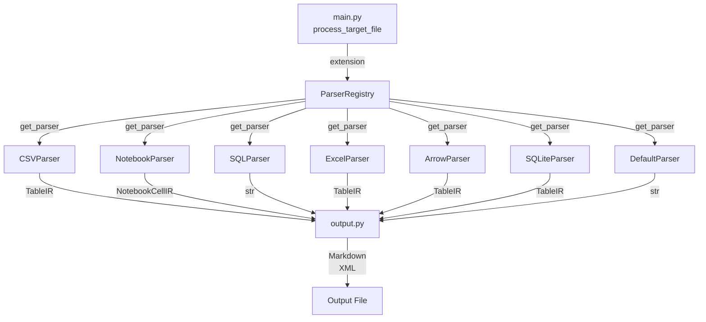

# Parsers Module

The `parsers.py` module (`src/data2prompt/parsers.py`) is the format-specific extraction engine of the data2prompt system. It implements the **Registry pattern** to dispatch parsing logic based on file extensions, producing **Intermediate Representations (IR)** that are consumed by the output generation layer.

## Architecture Overview



## ParserRegistry Pattern

The [`ParserRegistry`](../src/data2prompt/parsers.py#L561) class manages the mapping between file extensions and their corresponding parser implementations:

```python
class ParserRegistry:
    """Handles file-to-parser mapping."""
    def __init__(self) -> None:
        self._parsers: Dict[str, BaseParser] = {}
        self._default_parser = DefaultParser()

    def register(self, extensions: List[str], parser: BaseParser) -> None:
        for ext in extensions:
            self._parsers[ext.lower()] = parser

    def get_parser(self, extension: str) -> BaseParser:
        return self._parsers.get(extension.lower(), self._default_parser)
```

### Registration Table

| Parser | Extensions | Description |
|--------|------------|-------------|
| [`CSVParser`](../src/data2prompt/parsers.py#L419) | `.csv` | Samples rows to fit context limits |
| [`NotebookParser`](../src/data2prompt/parsers.py#L438) | `.ipynb` | Cleans and truncates notebook cells and outputs |
| [`SQLParser`](../src/data2prompt/parsers.py#L456) | `.sql` | Parses SQL files, sampling table data while preserving schema |
| [`ExcelParser`](../src/data2prompt/parsers.py#L478) | `.xlsx`, `.xls`, `.xlsm` | Extracts data from sheets, detecting visual elements |
| [`ArrowParser`](../src/data2prompt/parsers.py) | `.parquet`, `.feather`, `.arrow` | Samples rows; uses native pyarrow schema for exact dtypes; requires optional `pyarrow` |
| [`SQLiteParser`](../src/data2prompt/parsers.py) | `.db`, `.sqlite`, `.sqlite3` | One `TableIR` per table/view: CREATE-statement DDL, schema/stats, and a row sample; stdlib `sqlite3`, no dependency |
| [`EnvParser`](../src/data2prompt/parsers.py) | `.env` & variants (by name) | Lists variable names with redacted values; never emits a value |
| [`DefaultParser`](../src/data2prompt/parsers.py#L507) | All others | Fallback for text files with binary detection and size truncation |

> **Name-based dispatch for env files.** `EnvParser` is *not* in the extension registry,
> because a bare `.env` file has an empty suffix. Instead,
> [`process_target_file()`](../src/data2prompt/main.py) checks `is_env_file(name)` first
> and routes matching files to the shared `env_parser` instance, before the extension
> registry is consulted.

### Dispatch Flow

1. [`main.py`](../src/data2prompt/main.py#L27) calls [`process_target_file()`](../src/data2prompt/main.py#L27) for each discovered file
2. The file extension is extracted and passed to [`registry.get_parser(ext)`](../src/data2prompt/parsers.py#L571)
3. The appropriate parser's [`parse()`](../src/data2prompt/parsers.py#L94) method is invoked
4. A [`ParserResult`](../src/data2prompt/parsers.py#L47) is returned containing the IR and metadata

## BaseParser Protocol

All parsers implement the [`BaseParser`](../src/data2prompt/parsers.py#L92) protocol, ensuring a consistent interface:

```python
class BaseParser(Protocol):
    """Interface for all file parsers."""
    def parse(self, file_path: Path, config: 'Config') -> ParserResult:
        ...
```

## Intermediate Representations (IR)

The module defines two dataclass-based IR types that provide structured, token-aware representations of complex data formats.

### NotebookCellIR

```python
@dataclass
class NotebookCellIR:
    """Intermediate representation for a Jupyter Notebook cell."""
    number: int
    type: str  # 'code' or 'markdown'
    source: str
    outputs: Optional[str] = None
```

Represents a single cell in a Jupyter Notebook, capturing:
- **Cell number** for sequential ordering
- **Cell type** (code/markdown)
- **Source content** with line truncation applied
- **Outputs** (for code cells) with truncation and filtering

### TableIR

```python
@dataclass
class TableIR:
    """Intermediate representation for tabular data (CSV, Excel, SQLite)."""
    name: str
    df: pd.DataFrame
    header_note: Optional[str] = None
    footer_note: Optional[str] = None
    sheet_number: Optional[int] = None
    file_path: Optional[str] = None
    schema: Optional[TableSchema] = None
    section_label: str = "Sheet"
    ddl: Optional[str] = None
```

Represents tabular data (CSV, Excel, SQLite), capturing:
- **Table name** (filename, sheet name, or DB table/view name)
- **DataFrame** for structured data representation
- **Header/footer notes** for sampling indicators (visual-element detection in
  Excel is reported through `header_note`; a former `visual_warning` field was
  removed — nothing ever read it)
- **Sheet metadata** for multi-sheet Excel files and multi-table databases:
  `sheet_number` is the 1-based sub-section ordinal, and `section_label` is the
  word used in the sub-section heading ("Sheet" for Excel, "Table" for SQLite)
  and the XML element tag (`<sheet>` / `<table>`). Excel keeps the default, so
  its output is unchanged.
- **Schema** — optional [`TableSchema`](#columnschema--tableschema) metadata computed on
  the **full** DataFrame (before sampling)
- **DDL** — optional raw `CREATE` statement(s) (SQLite only). Rendered in a
  fenced `sql` block (Markdown) / `<ddl>` element (XML), gated by the same
  flags as the schema block (`stats_summary or schema_only`).

### ColumnSchema / TableSchema

```python
@dataclass
class ColumnSchema:
    """Per-column metadata computed on the full (unsampled) DataFrame."""
    name: str
    dtype: str
    missing: int
    missing_pct: float

@dataclass
class TableSchema:
    """Structural and statistical metadata for a table, computed on the full df."""
    row_count: int
    col_count: int
    columns: List[ColumnSchema]
    describe_df: Optional[pd.DataFrame] = None
```

`TableSchema` is the shared data structure read by **two independent features**:
- `--schema-only` (feature #3) — emit columns + dtypes only, dropping data rows.
- the stats-summary block (feature #4) — dtype, missing count/%, and `describe()` summary.

Both compute their metadata on the **full** DataFrame, *before* any row sampling, so
missing counts/percentages reflect the entire dataset even when only a sample is shown.
`describe_df` is only populated when a statistics summary is requested.

### ParserResult

```python
# The three shapes a parser can emit: raw text, notebook cells, or tables.
ParserContent = Union[str, List[NotebookCellIR], List[TableIR]]

@dataclass
class ParserResult:
    """Standardized output for all parsers."""
    content: ParserContent
    tokens: int
    type: str
    status: str
    stats_update: Dict[str, int] = field(default_factory=dict)
    skip_file: bool = False
```

Standardized output container containing:
- **content**: The IR or raw string content (typed by the `ParserContent` alias)
- **tokens**: Token count for the content
- **type**: File type string (e.g., "CSV", "Notebook")
- **status**: Processing status (e.g., "Sampled", "Cleaned", "Truncated")
- **stats_update**: Dictionary for aggregating statistics
- **skip_file**: Flag to exclude file from output entirely

### FileData / FileSummary

Two `TypedDict`s standardize the dict payloads that cross module boundaries,
replacing the former `Dict[str, Any]` annotations and giving key-name safety:

```python
class FileData(TypedDict):
    """A processed file handed from the orchestrator to an output generator."""
    path: str
    content: ParserContent
    type: str
    tokens: int
    status: str

class FileSummary(TypedDict):
    """A processed file's row in the final summary table rendered by the UI."""
    name: str
    type: str
    tokens: int
    status: str
```

- `FileData` is built in [`main.py`](../src/data2prompt/main.py) and consumed by the
  generators in [`output.py`](output.md) (`files_data: List[FileData]`).
- `FileSummary` feeds [`ui.print_final_report()`](ui.md)
  (`processed_files_info: List[FileSummary]`). The UI imports it under
  `TYPE_CHECKING` only, to avoid a `utils → ui → parsers → utils` import cycle.

### flatten_ir Function

The [`flatten_ir()`](../src/data2prompt/parsers.py) function converts IR objects to strings for token counting:

```python
def flatten_ir(
    content: ParserContent,
    *,
    schema_only: bool = False,
    stats_summary: bool = False,
) -> str:
    """
    Flattens the Intermediate Representation (IR) into a string for token counting.
    This provides a rough estimate of the final output size.
    """
```

- **String content**: Returned as-is
- **NotebookCellIR list**: Concatenates source and outputs
- **TableIR list**: Converts DataFrames to string representation with metadata

The keyword-only `schema_only` and `stats_summary` flags mirror the rendering decisions
in [`output.py`](output.md) so the token estimate tracks the real output: the schema
block is included when either flag is set, and data rows are dropped under `schema_only`.
Defaults are `False`, keeping legacy callers unaffected; the parser classes and `main.py`
pass the real `Config` flags.

### Schema Helpers

Two module-level helpers back the schema/stats features:

```python
def build_table_schema(df: pd.DataFrame, include_describe: bool) -> TableSchema: ...
def render_schema_block(schema, *, show_missing: bool, show_describe: bool) -> str: ...
```

- [`build_table_schema()`](../src/data2prompt/parsers.py) computes row/column counts,
  per-column dtype and missing stats from the **full** DataFrame, plus an optional
  transposed `describe()` summary (`include_describe`). `describe()` is wrapped in
  try/except and empty frames are handled gracefully. Columns are read
  **positionally** (`df.iloc[:, i]`), not by label (`df[name]`): a pandas
  DataFrame can carry duplicate column labels (reachable via `ArrowParser`,
  since Arrow schemas permit duplicate field names, unlike CSV/Excel readers
  which auto-deduplicate on read), and `df[name]` on a duplicate label
  returns a DataFrame instead of a Series — `int(<Series>.isna().sum())`
  would then raise `TypeError` and the whole file would degrade to a generic
  read-error note instead of rendering.
- [`render_schema_block()`](../src/data2prompt/parsers.py) renders a `TableSchema` to a
  Markdown snippet (rows × cols header followed by a single unified table). When
  `show_describe=True` and a `describe_df` is available, the `describe()` statistics
  (`count`, `unique`, `top`, `freq`, `mean`, `std`, `min`, `25%`, `50%`, `75%`, `max`)
  are appended as additional columns in the same table alongside `column`, `dtype`,
  `missing`, and `missing %` — one row per column, NaN cells rendered as empty strings,
  paired with `describe_df`'s rows **positionally** (`desc.iloc[i]`) for the same
  duplicate-column reason as `build_table_schema()` above: `describe()` preserves
  column order even when two columns share a name, but a name-based `.loc[name]`
  lookup would ambiguously return every matching row instead of the one row that
  actually lines up with this column.
  When `show_describe=False`, only `column | dtype [| missing | missing %]` are shown.
  It is the **single source of truth** for schema rendering, used by both `flatten_ir()`
  (token estimate) and the output generators in [`output.py`](output.md).

## Parser Implementations

### CSVParser

```python
class CSVParser:
    def parse(self, file_path: Path, config: 'Config') -> ParserResult:
```

Uses [`process_csv()`](../src/data2prompt/parsers.py#L149) to:
1. Read CSV into a pandas DataFrame
2. Compute a [`TableSchema`](#columnschema--tableschema) on the **full** df when
   `config.stats_summary` or `config.schema_only` is set (before sampling)
3. If `config.schema_only`: return an empty-df `TableIR` carrying only the schema (no rows)
4. Otherwise sample `config.csv_sample_size` rows using `config.seed` for
   reproducibility, then `sort_index()` so the sampled rows appear in **original
   file order** (time series stay chronological, ids stay ascending)
5. Add header/footer notes indicating sampling; attach the schema. The notes
   ground the sample in the full-dataset size —
   `-- [Sample: random 15 of 1,234,567 rows] --` — captured via `len(df)`
   **before** sampling, so an LLM can never mistake the sample for the data
6. Return a single-element `TableIR` list (status `"Schema Only"` when `schema_only`)

**Error Handling:**
- Empty CSV files → Empty DataFrame with note
- Parse errors → DataFrame with error message in footer_note

### NotebookParser

```python
class NotebookParser:
    def parse(self, file_path: Path, config: 'Config') -> ParserResult:
```

Uses [`process_notebook()`](../src/data2prompt/parsers.py#L178) to:
1. Parse JSON notebook structure
2. For each cell:
   - Read `cell_type` and `source` defensively via `.get()` with safe defaults
     (`'code'` and `[]` respectively), so a malformed cell degrades to empty
     content rather than aborting the whole notebook via the outer exception handler
   - Truncate long lines using [`truncate_long_lines()`](../src/data2prompt/parsers.py#L118)
   - Filter outputs: `stream` text, `execute_result`/`display_data` plain text,
     and `error` tracebacks (joined from the `traceback` list, prefixed with
     `-- [Error output] --`)
   - Apply max_lines limit per output block
3. Return a list of `NotebookCellIR` objects. A notebook with a valid but
   empty `"cells": []` list returns a single placeholder cell
   (`-- [Note: notebook contains no cells] --`) instead of an empty list —
   an empty `ParserContent` list would fall through `output.py`'s
   `NotebookCellIR`/`TableIR` branch checks (which require a non-empty list)
   to the plain-string fallback and render the bare Python repr `[]` with no
   explanation, violating the "nothing partial may look complete" invariant
   (see [output-contract.md](output-contract.md)).

**Error Handling:**
- JSON decode errors → Single error cell with malformed notebook message
- General exceptions → Single error cell with exception message
- Missing `cell_type` or `source` keys in an individual cell → safe defaults;
  the loop continues; only a truly unrecoverable file-level exception returns the
  global error cell
- A genuinely empty `"cells": []` list → single placeholder cell noting the
  notebook has no cells (not an error, but not an empty list either)

### SQLParser

```python
class SQLParser:
    def parse(self, file_path: Path, config: 'Config') -> ParserResult:
```

Uses [`process_sql()`](../src/data2prompt/parsers.py#L237) to:
1. Read SQL file line-by-line
2. Detect `CREATE TABLE` and `BEGIN TABLE` blocks
3. Buffer `INSERT INTO` statements and data rows
4. Sample `config.sql_sample_size` rows per table using seeded random selection
5. Apply secondary truncation via [`enforce_table_limit()`](../src/data2prompt/parsers.py#L97) if sampled block exceeds `config.table_limit`
6. Preserve schema keywords (`ALTER`, `CONSTRAINT`, `VIEW`, `DROP`, `INDEX`, `TABLE`)
7. Cap total non-data lines at `config.sql_max_lines`; when non-blank lines are
   dropped by the cap, a trailing
   `-- [N non-data line(s) omitted: exceeded the X-line limit (--sql-max-lines)] --`
   marker is appended so omitted content never vanishes silently

**Key Algorithm:**
- First line (INSERT header) is always preserved
- Remaining rows are randomly sampled; the truncation note reports
  `random N of M buffered rows` — "buffered" because the buffer includes the
  INSERT header line, so the count deliberately does not overclaim an exact
  data-row total
- Secondary truncation ensures large sampled blocks don't exceed character limits

**Schema-only mode:** when `config.schema_only` is set, `process_sql()` drops all buffered
data rows (`INSERT`/data lines) and emits a single `-- [N data row(s) omitted: schema-only]
--` note per table while preserving `CREATE TABLE` blocks and schema keywords. Status
becomes `"Schema Only"`.

### ExcelParser

```python
class ExcelParser:
    def parse(self, file_path: Path, config: 'Config') -> ParserResult:
```

Uses [`process_excel()`](../src/data2prompt/parsers.py) to:
1. Detect visual elements up front via [`_xlsx_has_visuals()`](#visual-element-detection)
   (`.xlsx`/`.xlsm` only — both are the same OOXML zip container; legacy
   `.xls` is a different, non-zip binary format and is never checked)
2. Open the workbook **once** with `pd.ExcelFile` inside a context manager — all
   sheets are parsed from the single handle (the old per-sheet `pd.read_excel`
   re-opened and re-parsed the file for every sheet), and the handle is released
   even on error paths (no lingering file locks on Windows)
3. Process up to `config.max_sheets` sheets; when the workbook has more, a
   `-- [Workbook truncated: ...] --` note is appended to the last processed sheet.
   When `max_sheets` is `0`, no sheet is ever processed, so there is no existing
   `TableIR` to attach that note to — a standalone placeholder `TableIR` carrying
   the note is emitted instead of returning an empty list (see the note on
   `max_sheets`/`max_tables` == 0 under [SQLiteParser](#sqliteparser) below,
   which shares the exact same fix for the same reason)
4. For each sheet:
   - Parse into a DataFrame via `excel_file.parse(sheet_name)`
   - Compute a `TableSchema` on the **full** sheet when `stats_summary`/`schema_only` set
   - Under `schema_only`: append a schema-only `TableIR` (empty df) and skip rows
   - Otherwise sample `config.csv_sample_size` rows if exceeding limit, then
     `sort_index()` so the sample keeps original sheet order
   - Add sampling notes carrying the full sheet's row count (captured before
     sampling), e.g. `-- [Sample: random 15 of 8,200 rows] --`
5. Return list of `TableIR` objects (one per sheet)

`ExcelParser.parse()` computes each sheet's `file_path` (`display_path`) as the
**cwd-relative path with forward slashes** (`Path.as_posix()`), matching the
canonical path keys used by the output File Index and file headers.

#### Visual-element detection

```python
def _xlsx_has_visuals(file_path) -> bool: ...
```

An `.xlsx`/`.xlsm` file is a zip archive; embedded images live under
`xl/media/` and charts under `xl/charts/`. `_xlsx_has_visuals()` inspects the
archive listing — no workbook load required. When visuals are present, a single
`-- [Note: Workbook contains visual elements (images/charts); they are not
extracted] --` header note is emitted on the **first sheet** (drawings are stored
at workbook level in the archive, so attribution is workbook-level).

> Why not openpyxl? The previous implementation checked `sheet._images` /
> `sheet.charts` on worksheets loaded with `read_only=True` — but read-only
> worksheets never parse drawing parts (and the attribute on regular worksheets
> is `_charts`, not `charts`), so that detection could never fire. The zip probe
> is both correct and cheaper.

#### Legacy `.xls` files

`pd.ExcelFile` selects the engine lazily; legacy `.xls` needs the optional
`xlrd` package. When it is not installed, pandas raises `ImportError` and the
parser returns a single `TableIR` with an actionable note
(`-- [Skipped: reading legacy .xls files requires the optional 'xlrd' package
(pip install xlrd)] --`) instead of a stack-trace error. (Previously `.xls` was
routed through `openpyxl`, which cannot read the BIFF format at all — every
`.xls` file produced a generic read error.)

`.xlsm` (macro-enabled Excel) needs no such optional dependency: it is the
same OOXML zip container as `.xlsx`, read through the same `openpyxl` engine
pandas already selects for `.xlsx` — registering it was a one-line addition
to the `ParserRegistry`, `budget.py`'s `EXTS_TABULAR`, and `main.py`'s
`get_ui_action()`, with zero new parsing code.

**Error Handling:**
- Empty sheets → Note indicating visual dashboard or empty
- Sheet read errors → Empty DataFrame with sanitized error message
- Workbook open errors → single `TableIR` with sanitized error note
- `--max-sheets 0` → a standalone placeholder `TableIR` carrying the
  `-- [Workbook truncated: Only first 0 sheets processed] --` note, not an
  empty list (see step 3 above)

### ArrowParser

```python
class ArrowParser:
    """Parser for .parquet, .feather, and .arrow files. Requires pyarrow."""
    def parse(self, file_path: Path, config: 'Config') -> ParserResult:
```

Handles columnar binary formats via [`process_arrow_file()`](../src/data2prompt/parsers.py):

1. **Runtime dependency check**: attempts `import pyarrow` at call time. If pyarrow is not
   installed, the file still appears in the output with a short inline note
   (`status="Skipped (No pyarrow)"`) and no stack trace. The TUI shows a warning panel
   listing the install commands.
2. **Read**: uses the format-appropriate pyarrow reader:
   - `.parquet` → `pyarrow.parquet.read_table()`
   - `.feather` → `pyarrow.feather.read_table()`
   - `.arrow` → `pyarrow.ipc.open_file()`, falling back to `open_stream()` for
     IPC stream files
3. **Exact schema**: pyarrow's native type strings (e.g. `int64`, `utf8`,
   `timestamp[us, tz=UTC]`) are collected from `table.schema`, **by column
   position**, and used to populate `ColumnSchema.dtype`, overriding the
   pandas-inferred types that `build_table_schema()` would otherwise assign.
   Positional, not name-keyed: unlike a pandas DataFrame, an Arrow schema
   permits duplicate field names (e.g. a table produced by a join that never
   disambiguated overlapping columns) — a `{name: dtype}` dict would silently
   collapse two same-named columns onto one dtype string, and
   `df.to_pandas()` carries the duplicate straight through (pandas' own
   CSV/Excel readers auto-deduplicate on read, so this is Arrow-specific).
4. **Schema & stats on full data**: `build_table_schema()` runs on the full DataFrame
   before sampling, so row counts and missing percentages reflect the entire file.
5. **Sampling**: mirrors `CSVParser` — if the row count exceeds `config.csv_sample_size`,
   a seeded random sample is taken, then re-sorted to original file order. The
   sampling notes carry the full row count (`-- [Sample: random 15 of 50,000
   rows] --`), captured before sampling.
6. **schema_only mode**: returns an empty-df `TableIR` carrying only the schema.

**Statistics updated**: `parquet_count`, `feather_count`, or `arrow_count` (one per file,
keyed by extension).

**Error handling**: any read error returns a `TableIR` with an error note in `footer_note`
(see [Error sanitisation](#error-sanitisation) for how paths and verbose pyarrow chains
are cleaned before display).

### SQLiteParser

```python
class SQLiteParser:
    """Parser for .db/.sqlite/.sqlite3 SQLite databases (stdlib sqlite3)."""
    def parse(self, file_path: Path, config: 'Config') -> ParserResult:
```

Reads a SQLite database with the **stdlib `sqlite3`** module (zero new
dependencies) and returns **one `TableIR` per user table/view** — structurally
the same multi-sub-section shape as `ExcelParser`, so output rendering, schema
blocks, table-size capping, canonical paths, File Index status, and the
`--budget` ladder all apply for free. Backed by
[`process_sqlite()`](../src/data2prompt/parsers.py).

1. **Magic-byte sniff.** `_is_sqlite_file()` checks the 16-byte
   `SQLite format 3\0` header first; a `.db` that is some other binary format is
   returned as `status="Skipped (Binary)"` with a `-- [Skipped: ... is not a
   SQLite database ...] --` note rather than crashing on open.
2. **Read-only, query-only connection.** Opens
   `sqlite3.connect("file:{path}?mode=ro", uri=True)` and sets
   `PRAGMA query_only = ON`; only `SELECT`/`PRAGMA` are ever executed, and the
   connection is closed in a `finally`. The `PRAGMA` call and the
   `sqlite_master` discovery query are themselves wrapped in a
   `try/except sqlite3.Error` that degrades to the same
   `-- [Error reading DB: ...] --` `TableIR` as a connection-open failure: a
   file can pass the 16-byte magic-header sniff yet still be corrupted (a
   truncated download, a partial write) — and since `sqlite3.Error` is not an
   `OSError` subclass, an uncaught one here would skip both this function's
   own error handling *and* `main.py`'s top-level `except OSError`, crashing
   the whole run over one bad file.
3. **Discovery & ordering.** Reads `sqlite_master` for tables and views
   (skipping internal `sqlite_%`), ordered tables-first then views, each
   alphabetical, and capped at `config.max_tables`. When more exist, a
   `-- [Database truncated: Only first N tables processed] --` note is appended
   to the last table (the Excel `max_sheets` pattern). When `max_tables` is
   `0`, no table is ever processed, so there is no existing `TableIR` to
   attach that note to — a standalone placeholder `TableIR` carrying the note
   is emitted instead of returning an empty list, which `output.py`'s
   `TableIR` rendering branch (it requires a non-empty list) would otherwise
   silently fall through on, rendering the bare Python repr `[]` with no
   explanation of what happened to the data.
4. **Per-table rendering** (`_process_sqlite_table()`), with three read paths
   that keep partial output honest:
   - **DDL** — the table's `CREATE` statement plus its index `CREATE`s, from
     `sqlite_master.sql`. Always captured; rendered when
     `stats_summary or schema_only`.
   - **Row count** — `SELECT COUNT(*)`, captured **before** sampling, cited in
     the notice. Skipped (reported as `unknown (large)`) for database files
     larger than `DEFAULT_DB_COUNT_MAX_BYTES` so a pathological DB never makes
     `COUNT(*)` itself slow.
   - **Small table** (count ≤ `DEFAULT_DB_FULL_SCAN_MAX_ROWS`) — read in full,
     so `missing`/`describe` stats are exact and the sample is a seeded random
     sample re-sorted to natural order (exactly like `CSVParser`). Declared
     SQLite column types (from `PRAGMA table_info`) override the
     pandas-inferred dtypes, the same override hook `ArrowParser` uses.
   - **Large table** (count above the threshold, or unknown) — read with
     `LIMIT k` only. `schema` is `None`; structure comes from the DDL, so
     sample-derived stats never masquerade as full-dataset truth. Flagged with
     `-- [Sample: first k of N rows] --` and
     `-- [Large table: showing first k rows; full-scan stats omitted] --`.
   - **`--schema-only`** drops data rows: small tables still full-read for an
     exact schema block + DDL; large tables show DDL and a row-count note only.
5. **Identifier safety.** Table/view/index names cannot be parameterized, so
   `_quote_identifier()` double-quotes and escapes every identifier before it is
   interpolated into a query — hostile names (spaces, keywords, embedded quotes)
   are handled safely.
6. Per-table failures are caught individually (Excel per-sheet pattern) and
   produce an error-note `TableIR`, so one bad table never fails the whole file.

`SQLiteParser.parse()` computes each table's `file_path` (`display_path`) as the
cwd-relative forward-slashed path (`Path.as_posix()`), and returns
`type=f"SQLite ({n} tables)"`, `status="Schema Only"` under `--schema-only` else
`"Sampled"`, and `stats_update={"sqlite_count": 1, "db_tables_count": n}`.

> **DuckDB** (`.duckdb`) is a planned follow-up behind an optional
> `data2prompt[duckdb]` extra (an `ArrowParser`-style import guard); it is not
> registered yet.

**Error handling:**
- Non-SQLite `.db` → `Skipped (Binary)` with an actionable note.
- Connection open failure → single `TableIR` with `-- [Error reading DB: ...] --`.
- Corrupted database that passes the magic-byte sniff but fails on the
  discovery query (`PRAGMA`/`sqlite_master`) → the same
  `-- [Error reading DB: ...] --` `TableIR`, not an uncaught `sqlite3.Error`.
- Database with no user tables → `-- [Note: database contains no user tables] --`.
- Per-table read error → error-note `TableIR` for that table only.
- `--max-tables 0` → a standalone placeholder `TableIR` carrying the
  `-- [Database truncated: Only first 0 tables processed] --` note, not an
  empty list (see step 3 above).

### DefaultParser

```python
class DefaultParser:
    """Fallback parser for text files."""
    def parse(self, file_path: Path, config: 'Config') -> ParserResult:
```

Handles all unhandled file types with defensive measures (in evaluation order):
1. **Binary detection**: Use [`is_binary()`](../src/data2prompt/utils.py) to detect
   binary content (checked first, and exactly once per file)
2. **Generation flag check**: Skip files containing the `GENERATION_FLAG` marker
   in their first 100 characters
3. **File size check**: If file exceeds `config.max_file_size` KB, read only first 10KB.
   The `file_path.stat()` call itself shares the same `try/except Exception` as the
   read that follows it: a file that vanished or became unreadable between the
   project scan and this parse call (a locked file, a permission change, a
   network-drive hiccup) degrades to this one file's `status="Error"` instead of
   propagating an `OSError` out of `process_target_file()` and aborting the
   entire run — the opposite of every other parser's graceful-degradation contract.
4. **Line truncation**: Apply [`truncate_long_lines()`](../src/data2prompt/parsers.py#L118) for remaining content

### EnvParser

```python
class EnvParser:
    """Parser for environment files: lists variable names with redacted values."""
    def parse(self, file_path: Path, config: 'Config') -> ParserResult:
```

Handles `.env` files (detected by name, not extension — see the dispatch note above):

1. If `config.env_keys` is `False` → returns a skip note (`status="Skipped (Env)"`).
2. Otherwise delegates to [`process_env()`](../src/data2prompt/parsers.py), which:
   - reads the file with `errors="ignore"`
   - drops blank lines and `#` comments, strips an optional `export ` prefix
   - splits each `KEY=value` on the first `=`, and for identifier-like keys emits
     `KEY=<redacted>` using [`ENV_VALUE_PLACEHOLDER`](constants.md)
   - **never includes any value** from the file

Returns a `ParserResult` of `type="Env"`, `status="Redacted"`, and
`stats_update={"env_count": 1}`.

**Security rationale:** previously `.env` was listed in `CORE_SKIP_EXTS`, but a bare
`.env` has an empty suffix so it was never skipped and fell through to `DefaultParser`,
which dumped its full contents. Name-based routing to `EnvParser` closes that leak while
still surfacing the variable names for project understanding.

### `is_env_file()`

```python
def is_env_file(name: str) -> bool:
    return name == ".env" or name.startswith(".env.") or name.endswith(".env")
```

Matches `.env`, dotted variants (`.env.local`, `.env.production`) and suffixed variants
(`prod.env`); intentionally excludes `.envrc`. Used by
[`process_target_file()`](../src/data2prompt/main.py) and exposed alongside the shared
`env_parser` singleton.

## Defensive Programming Measures

### Binary Detection

The [`DefaultParser`](../src/data2prompt/parsers.py#L507) implements binary detection via [`is_binary()`](../src/data2prompt/utils.py) to prevent attempting to read binary files as text. Binary files receive a standardized skip message.

### Line Truncation

The [`truncate_long_lines()`](../src/data2prompt/parsers.py#L118) function prevents excessively long lines from consuming disproportionate context:

```python
def truncate_long_lines(text: str, threshold: int, truncate_to: int) -> str:
    """
    Truncates lines in a text string that exceed a certain character threshold.
    """
```

- Lines exceeding `threshold` characters are truncated to `truncate_to` characters
- A warning comment is appended to truncated lines
- Trailing newlines are preserved

### Table Size Enforcement

The [`enforce_table_limit()`](../src/data2prompt/parsers.py#L97) function provides secondary protection against oversized table representations:

```python
def enforce_table_limit(text: str, limit: int, truncate_to: int) -> str:
    """
    Checks if a table's string representation exceeds a character limit.
    If it does, truncates it and appends a warning.
    """
```

### Error Recovery

All parsing functions implement try-except blocks with graceful degradation:
- **CSV**: Empty DataFrame with error note
- **Notebook**: File-level failures → single error cell with exception message;
  individual cells with missing keys degrade to empty/typed content via `.get()`
  defaults rather than aborting the whole notebook; a genuinely empty
  `"cells": []` list → single placeholder cell, never an empty `ParserContent` list
- **SQL**: Error string with exception message
- **Excel**: Empty sheet entry with error note; `--max-sheets 0` → standalone
  placeholder `TableIR`, never an empty `ParserContent` list
- **SQLite**: Corrupted-after-header-check DB → the same
  `-- [Error reading DB: ...] --` `TableIR` as an open failure, not an
  uncaught `sqlite3.Error` (not an `OSError` subclass, so it would otherwise
  bypass `main.py`'s top-level handler too); `--max-tables 0` → standalone
  placeholder `TableIR`, never an empty `ParserContent` list
- **DefaultParser**: a file that becomes unreadable between scan and parse
  (permission change, lock, vanished file) → `status="Error"` for that file
  only, not a propagated `OSError`

#### Error sanitisation

All error messages pass through `_sanitize_error(e, file_path)` before display.
This helper replaces any occurrence of the absolute file path in the exception string
with a path relative to `Path.cwd()` (the directory where data2prompt was invoked),
falling back to just the filename if the paths are on different drives.

For Arrow/Parquet/Feather files specifically, the error is further trimmed to only the
root cause — the final colon-separated clause of pyarrow's chained error string — since
pyarrow repeats the full path and error context multiple times in a single message.

## Tool-Notice Grammar

Every notice the tool inserts into the output — sampling, truncation, omission,
redaction, and error notes — uses one uniform grammar:

```
-- [Category: detail] --
```

This single convention is documented in the system-instruction preambles
([`constants.py`](constants.md)) so an LLM can reliably distinguish
tool-inserted notices from original file content. The former `*Note: ...*`
star-notes and emoji-prefixed errors have been eliminated. When adding a new
notice, follow the "Adding a new `-- [...] --` tool notice" checklist in
[`output-contract.md`](output-contract.md) and add a row to this table.
Current notices:

| Notice (representative form) | Emitted by |
|---|---|
| `-- [Sample: random 15 of 1,234,567 rows] --` | CSV / Excel / Arrow / SQLite sampling (header); SQLite large tables use `first 15` instead of `random 15` |
| `-- [CSV truncated: Showing random 15 of 1,234,567 rows to save context] --` | `process_csv` (footer; `Sheet`/`Table`/`PARQUET`/`FEATHER`/`ARROW` variants likewise) |
| `-- [Schema only: data rows omitted] --` | CSV / Excel / Arrow / SQLite under `--schema-only` |
| `-- [Schema only: 1,234 rows, data omitted] --` | `process_sqlite` large table under `--schema-only` (row count kept, no data) |
| `-- [Large table: showing first 15 rows; full-scan stats omitted] --` | `process_sqlite` tables above `DEFAULT_DB_FULL_SCAN_MAX_ROWS` (footer) |
| `-- [Database truncated: Only first 25 tables processed] --` | `process_sqlite` `max_tables` cap |
| `-- [Skipped: file.db is not a SQLite database (header check failed)] --` | `SQLiteParser` magic-byte sniff |
| `-- [Note: database contains no user tables] --` | `process_sqlite` empty database |
| `-- [N data row(s) omitted: schema-only] --` | `process_sql` under `--schema-only` |
| `-- [Table data truncated: Showing random 15 of 200 buffered rows to save context] --` | `process_sql` sampling |
| `-- [N non-data line(s) omitted: exceeded the X-line limit (--sql-max-lines)] --` | `process_sql` line cap |
| `-- [Output truncated: Showing first 40 lines] --` | notebook outputs |
| `-- [Line truncated: showing first 1000 characters] --` | `truncate_long_lines` |
| `-- [Table truncated: Total size exceeded N characters. ...] --` | `enforce_table_limit` |
| `-- [File truncated: Showing first 10KB ...] --` | `DefaultParser` size cap |
| `-- [Binary content detected (.bin): content not included] --` | `DefaultParser` |
| `-- [Content skipped: (.png) files are excluded by exclusion rules] --` | `process_target_file` (main.py) |
| `-- [Env file skipped (--no-env-keys): content not included] --` | `EnvParser` |
| `-- [Skipped: file.parquet requires pyarrow, which is not installed] --` | `ArrowParser` |
| `-- [Error: Malformed Jupyter Notebook (Invalid JSON)] --` | `process_notebook` |
| `-- [Note: notebook contains no cells] --` | `process_notebook` on a valid, genuinely empty `"cells": []` notebook |
| `-- [Error reading CSV/SQL/Excel/DB/...: message] --` | error paths (sanitized); `DB` covers both a connection-open failure and a database that passes the magic-byte sniff but fails on the discovery query |

## Constants Used

The parsers module imports configuration constants from [`constants.py`](../src/data2prompt/constants.py):

| Constant | Default | Purpose |
|----------|---------|---------|
| `DEFAULT_CSV_SAMPLE_SIZE` | 15 | Rows to sample from CSV/Excel |
| `DEFAULT_SQL_SAMPLE_SIZE` | 15 | Data rows to keep per SQL table |
| `DEFAULT_SQL_MAX_LINES` | 50 | Max non-data lines in SQL |
| `DEFAULT_MAX_LINES` | 40 | Max output lines per notebook cell |
| `DEFAULT_MAX_SHEETS` | 10 | Max Excel sheets to process |
| `DEFAULT_MAX_TABLES` | 25 | Max tables/views to process per SQLite database |
| `DEFAULT_DB_FULL_SCAN_MAX_ROWS` | 100000 | Tables above this row count are LIMIT-sampled (no full-table scan) |
| `DEFAULT_DB_COUNT_MAX_BYTES` | 1073741824 | Skip `COUNT(*)` for DB files larger than ~1 GiB (rows reported `unknown`) |
| `DEFAULT_SEED` | 42 | Random seed for reproducibility |
| `DEFAULT_LINE_LENGTH_THRESHOLD` | 4000 | Characters before line truncation |
| `DEFAULT_TRUNCATED_LINE_LENGTH` | 1000 | Characters to keep when truncating |
| `DEFAULT_TABLE_CHAR_LIMIT` | 50000 | Max characters per table representation |
| `DEFAULT_TABLE_TRUNCATED_SIZE` | 20000 | Characters to keep when table is truncated |
| `GENERATION_FLAG` | `"DATA2PROMPT_GENERATED_CONTENT"` | Skip marker for generated files |

## Integration Points

### With main.py

The [`process_target_file()`](../src/data2prompt/main.py#L27) function in main.py
1. Routes env files first: if `is_env_file(file_path.name)`, calls `env_parser.parse(...)`
2. Checks if extension is in `config.skip_exts`
3. Calls `registry.get_parser(ext)` to obtain the appropriate parser
4. Invokes `parser.parse(file_path, config)`
5. Returns `ParserResult` to the orchestration layer

### With output.py

The output generators in [`output.py`](../src/data2prompt/output.py) receive `ParserResult` objects:
- **MarkdownGenerator**: Formats `NotebookCellIR` and `TableIR` into markdown code blocks
- **XMLGenerator**: Formats IR into XML tags with attributes

The [`flatten_ir()`](../src/data2prompt/parsers.py#L56) function converts IR to strings for **per-file** token estimation during parsing (the `tokens` field on each `ParserResult`). The headline output total is counted separately by `main.py` on the fully rendered string, not via `flatten_ir()`.

### With utils.py

Parsers use utility functions from [`utils.py`](../src/data2prompt/utils.py),
imported once at module level
(`from data2prompt.utils import count_tokens, is_binary` — the whole package now
uses absolute imports, per the project's coding standards). The import is safe
because the dependency chain `parsers → utils → ui → constants` has no path back
to `parsers`.

- [`count_tokens()`](../src/data2prompt/utils.py): Token counting using tiktoken
- [`is_binary()`](../src/data2prompt/utils.py): Binary file detection

## Statistics Tracking

Each parser returns a `stats_update` dictionary that is aggregated by the main orchestration layer:

| Parser | Statistics Updated |
|--------|-------------------|
| CSVParser | `{"csv_count": 1}` |
| NotebookParser | `{"notebook_count": 1}` |
| SQLParser | `{"sql_count": 1}` |
| ExcelParser | `{"excel_count": 1, "excel_sheets_count": sheet_count}` |
| ArrowParser (`.parquet`) | `{"parquet_count": 1}` |
| ArrowParser (`.feather`) | `{"feather_count": 1}` |
| ArrowParser (`.arrow`) | `{"arrow_count": 1}` |
| ArrowParser (pyarrow missing) | `{}` — no count incremented |
| SQLiteParser | `{"sqlite_count": 1, "db_tables_count": table_count}` |
| SQLiteParser (non-SQLite `.db`) | `{"binary_count": 1}` |
| EnvParser | `{"env_count": 1}` |
| DefaultParser | `{"binary_count": 1}` or `{"truncated_count": 1}` |

### Parser Status Values

Beyond the established statuses (`Read`, `Sampled`, `Cleaned`, `Parsed`, `Extracted`,
`Truncated`, `Skipped (Binary)`, `Skipped (Exclusion)`), the new behaviors introduce:

| Status | Meaning |
|--------|---------|
| `Schema Only` | A data file rendered as schema only (`--schema-only`) |
| `Redacted` | A `.env` file rendered as variable names with redacted values |
| `Skipped (Env)` | A `.env` file skipped entirely (`--no-env-keys`) |
| `Skipped (No pyarrow)` | A Parquet / Feather / Arrow file skipped because pyarrow is not installed |

These statistics feed into the UI progress reporting system.

The raw statuses above are an internal vocabulary. For the generated document,
[`output.py`](output.md) maps them onto the controlled **File Index** vocabulary
(`Full`, `Sampled`, `Cleaned`, ...) via `INCLUSION_STATUS_MAP` in
[`constants.py`](constants.md) — see [output.md](output.md#file-index) for the
mapping and its fallback rules.
