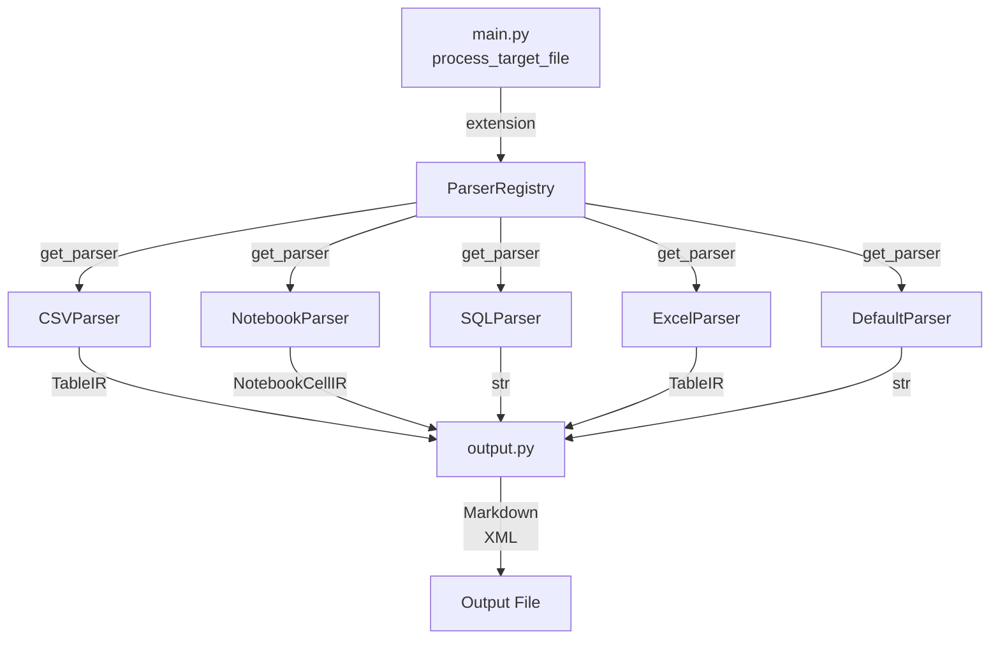

# Parsers Module

The `parsers.py` module (`src/data2prompt/parsers.py`) is the format-specific extraction engine of the data2prompt system. It implements the **Registry pattern** to dispatch parsing logic based on file extensions, producing **Intermediate Representations (IR)** that are consumed by the output generation layer.

## Architecture Overview



## ParserRegistry Pattern

The [`ParserRegistry`](../src/data2prompt/parsers.py#L561) class manages the mapping between file extensions and their corresponding parser implementations:

```python
class ParserRegistry:
    """Handles file-to-parser mapping."""
    def __init__(self):
        self._parsers: Dict[str, BaseParser] = {}
        self._default_parser = DefaultParser()

    def register(self, extensions: List[str], parser: BaseParser):
        for ext in extensions:
            self._parsers[ext.lower()] = parser

    def get_parser(self, extension: str) -> BaseParser:
        return self._parsers.get(extension.lower(), self._default_parser)
```

### Registration Table

| Parser | Extensions | Description |
|--------|------------|-------------|
| [`CSVParser`](../src/data2prompt/parsers.py#L419) | `.csv` | Samples rows to fit context limits |
| [`NotebookParser`](../src/data2prompt/parsers.py#L438) | `.ipynb` | Cleans and truncates notebook cells and outputs |
| [`SQLParser`](../src/data2prompt/parsers.py#L456) | `.sql` | Parses SQL files, sampling table data while preserving schema |
| [`ExcelParser`](../src/data2prompt/parsers.py#L478) | `.xlsx`, `.xls` | Extracts data from sheets, detecting visual elements |
| [`DefaultParser`](../src/data2prompt/parsers.py#L507) | All others | Fallback for text files with binary detection and size truncation |

### Dispatch Flow

1. [`main.py`](../src/data2prompt/main.py#L27) calls [`process_target_file()`](../src/data2prompt/main.py#L27) for each discovered file
2. The file extension is extracted and passed to [`registry.get_parser(ext)`](../src/data2prompt/parsers.py#L571)
3. The appropriate parser's [`parse()`](../src/data2prompt/parsers.py#L94) method is invoked
4. A [`ParserResult`](../src/data2prompt/parsers.py#L47) is returned containing the IR and metadata

## BaseParser Protocol

All parsers implement the [`BaseParser`](../src/data2prompt/parsers.py#L92) protocol, ensuring a consistent interface:

```python
class BaseParser(Protocol):
    """Interface for all file parsers."""
    def parse(self, file_path: Path, config: 'Config') -> ParserResult:
        ...
```

## Intermediate Representations (IR)

The module defines two dataclass-based IR types that provide structured, token-aware representations of complex data formats.

### NotebookCellIR

```python
@dataclass
class NotebookCellIR:
    """Intermediate representation for a Jupyter Notebook cell."""
    number: int
    type: str  # 'code' or 'markdown'
    source: str
    outputs: Optional[str] = None
```

Represents a single cell in a Jupyter Notebook, capturing:
- **Cell number** for sequential ordering
- **Cell type** (code/markdown)
- **Source content** with line truncation applied
- **Outputs** (for code cells) with truncation and filtering

### TableIR

```python
@dataclass
class TableIR:
    """Intermediate representation for tabular data (CSV, Excel)."""
    name: str
    df: pd.DataFrame
    header_note: Optional[str] = None
    footer_note: Optional[str] = None
    visual_warning: bool = False
    sheet_number: Optional[int] = None
    file_path: Optional[str] = None
```

Represents tabular data (CSV, Excel), capturing:
- **Table name** (filename or sheet name)
- **DataFrame** for structured data representation
- **Header/footer notes** for sampling indicators
- **Visual warning flag** for detecting charts/images in Excel
- **Sheet metadata** for multi-sheet Excel files

### ParserResult

```python
@dataclass
class ParserResult:
    """Standardized output for all parsers."""
    content: Union[str, List[NotebookCellIR], List[TableIR]]
    tokens: int
    type: str
    status: str
    stats_update: Dict[str, int] = field(default_factory=dict)
    skip_file: bool = False
```

Standardized output container containing:
- **content**: The IR or raw string content
- **tokens**: Token count for the content
- **type**: File type string (e.g., "CSV", "Notebook")
- **status**: Processing status (e.g., "Sampled", "Cleaned", "Truncated")
- **stats_update**: Dictionary for aggregating statistics
- **skip_file**: Flag to exclude file from output entirely

### flatten_ir Function

The [`flatten_ir()`](../src/data2prompt/parsers.py#L56) function converts IR objects to strings for token counting:

```python
def flatten_ir(content: Union[str, List[NotebookCellIR], List[TableIR]]) -> str:
    """
    Flattens the Intermediate Representation (IR) into a string for token counting.
    This provides a rough estimate of the final output size.
    """
```

- **String content**: Returned as-is
- **NotebookCellIR list**: Concatenates source and outputs
- **TableIR list**: Converts DataFrames to string representation with metadata

## Parser Implementations

### CSVParser

```python
class CSVParser:
    def parse(self, file_path: Path, config: 'Config') -> ParserResult:
```

Uses [`process_csv()`](../src/data2prompt/parsers.py#L149) to:
1. Read CSV into a pandas DataFrame
2. Sample `config.csv_sample_size` rows using `config.seed` for reproducibility
3. Add header/footer notes indicating sampling
4. Return a single-element `TableIR` list

**Error Handling:**
- Empty CSV files → Empty DataFrame with note
- Parse errors → DataFrame with error message in footer_note

### NotebookParser

```python
class NotebookParser:
    def parse(self, file_path: Path, config: 'Config') -> ParserResult:
```

Uses [`process_notebook()`](../src/data2prompt/parsers.py#L178) to:
1. Parse JSON notebook structure
2. For each cell:
   - Truncate long lines using [`truncate_long_lines()`](../src/data2prompt/parsers.py#L118)
   - Filter outputs (stream text, execute_result data)
   - Apply max_lines limit per output block
3. Return a list of `NotebookCellIR` objects

**Error Handling:**
- JSON decode errors → Single error cell with malformed notebook message
- General exceptions → Single error cell with exception message

### SQLParser

```python
class SQLParser:
    def parse(self, file_path: Path, config: 'Config') -> ParserResult:
```

Uses [`process_sql()`](../src/data2prompt/parsers.py#L237) to:
1. Read SQL file line-by-line
2. Detect `CREATE TABLE` and `BEGIN TABLE` blocks
3. Buffer `INSERT INTO` statements and data rows
4. Sample `config.sql_sample_size` rows per table using seeded random selection
5. Apply secondary truncation via [`enforce_table_limit()`](../src/data2prompt/parsers.py#L97) if sampled block exceeds `config.table_limit`
6. Preserve schema keywords (`ALTER`, `CONSTRAINT`, `VIEW`, `DROP`, `INDEX`, `TABLE`)
7. Cap total non-data lines at `config.sql_max_lines`

**Key Algorithm:**
- First line (INSERT header) is always preserved
- Remaining rows are randomly sampled
- Secondary truncation ensures large sampled blocks don't exceed character limits

### ExcelParser

```python
class ExcelParser:
    def parse(self, file_path: Path, config: 'Config') -> ParserResult:
```

Uses [`process_excel()`](../src/data2prompt/parsers.py#L335) to:
1. Open workbook with `openpyxl` in read-only mode
2. Detect visual elements (images, charts) per sheet
3. Process up to `config.max_sheets` sheets
4. For each sheet:
   - Read into DataFrame with pandas
   - Sample `config.csv_sample_size` rows if exceeding limit
   - Add visual warning note if charts/images detected
   - Add truncation note if sampling applied
5. Return list of `TableIR` objects (one per sheet)

**Error Handling:**
- Empty sheets → Note indicating visual dashboard or empty
- Read errors → Empty DataFrame with error message

### DefaultParser

```python
class DefaultParser:
    """Fallback parser for text files."""
    def parse(self, file_path: Path, config: 'Config') -> ParserResult:
```

Handles all unhandled file types with defensive measures:
1. **Generation flag check**: Skip files containing `GENERATION_FLAG` marker
2. **Binary detection**: Use [`is_binary()`](../src/data2prompt/utils.py) to detect binary content
3. **File size check**: If file exceeds `config.max_file_size` KB, read only first 10KB
4. **Line truncation**: Apply [`truncate_long_lines()`](../src/data2prompt/parsers.py#L118) for remaining content

## Defensive Programming Measures

### Binary Detection

The [`DefaultParser`](../src/data2prompt/parsers.py#L507) implements binary detection via [`is_binary()`](../src/data2prompt/utils.py) to prevent attempting to read binary files as text. Binary files receive a standardized skip message.

### Line Truncation

The [`truncate_long_lines()`](../src/data2prompt/parsers.py#L118) function prevents excessively long lines from consuming disproportionate context:

```python
def truncate_long_lines(text: str, threshold: int, truncate_to: int) -> str:
    """
    Truncates lines in a text string that exceed a certain character threshold.
    """
```

- Lines exceeding `threshold` characters are truncated to `truncate_to` characters
- A warning comment is appended to truncated lines
- Trailing newlines are preserved

### Table Size Enforcement

The [`enforce_table_limit()`](../src/data2prompt/parsers.py#L97) function provides secondary protection against oversized table representations:

```python
def enforce_table_limit(text: str, limit: int, truncate_to: int) -> str:
    """
    Checks if a table's string representation exceeds a character limit.
    If it does, truncates it and appends a warning.
    """
```

### Error Recovery

All parsing functions implement try-except blocks with graceful degradation:
- **CSV**: Empty DataFrame with error note
- **Notebook**: Error cell with exception message
- **SQL**: Error string with exception message
- **Excel**: Empty sheet entry with error note

## Constants Used

The parsers module imports configuration constants from [`constants.py`](../src/data2prompt/constants.py):

| Constant | Default | Purpose |
|----------|---------|---------|
| `DEFAULT_CSV_SAMPLE_SIZE` | 15 | Rows to sample from CSV/Excel |
| `DEFAULT_SQL_SAMPLE_SIZE` | 15 | Data rows to keep per SQL table |
| `DEFAULT_SQL_MAX_LINES` | 50 | Max non-data lines in SQL |
| `DEFAULT_MAX_LINES` | 40 | Max output lines per notebook cell |
| `DEFAULT_MAX_SHEETS` | 10 | Max Excel sheets to process |
| `DEFAULT_SEED` | 42 | Random seed for reproducibility |
| `DEFAULT_LINE_LENGTH_THRESHOLD` | 4000 | Characters before line truncation |
| `DEFAULT_TRUNCATED_LINE_LENGTH` | 1000 | Characters to keep when truncating |
| `DEFAULT_TABLE_CHAR_LIMIT` | 50000 | Max characters per table representation |
| `DEFAULT_TABLE_TRUNCATED_SIZE` | 20000 | Characters to keep when table is truncated |
| `GENERATION_FLAG` | `"DATA2PROMPT_GENERATED_CONTENT"` | Skip marker for generated files |

## Integration Points

### With main.py

The [`process_target_file()`](../src/data2prompt/main.py#L27) function in main.py#L
1. Checks if extension is in `config.skip_exts`
2. Calls `registry.get_parser(ext)` to obtain the appropriate parser
3. Invokes `parser.parse(file_path, config)`
4. Returns `ParserResult` to the orchestration layer

### With output.py

The output generators in [`output.py`](../src/data2prompt/output.py) receive `ParserResult` objects:
- **MarkdownGenerator**: Formats `NotebookCellIR` and `TableIR` into markdown code blocks
- **XMLGenerator**: Formats IR into XML tags with attributes

The [`flatten_ir()`](../src/data2prompt/parsers.py#L56) function is used to convert IR to strings for token estimation before output generation.

### With utils.py

Parsers use utility functions from [`utils.py`](../src/data2prompt/utils.py):
- [`count_tokens()`](../src/data2prompt/utils.py): Token counting using tiktoken
- [`is_binary()`](../src/data2prompt/utils.py): Binary file detection

## Statistics Tracking

Each parser returns a `stats_update` dictionary that is aggregated by the main orchestration layer:

| Parser | Statistics Updated |
|--------|-------------------|
| CSVParser | `{"csv_count": 1}` |
| NotebookParser | `{"notebook_count": 1}` |
| SQLParser | `{"sql_count": 1}` |
| ExcelParser | `{"excel_count": 1, "excel_sheets_count": sheet_count}` |
| DefaultParser | `{"binary_count": 1}` or `{"truncated_count": 1}` |

These statistics feed into the UI progress reporting system.
