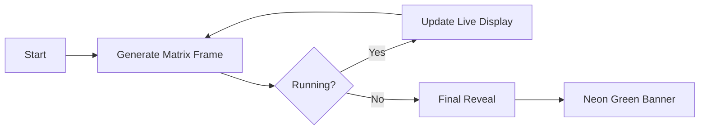
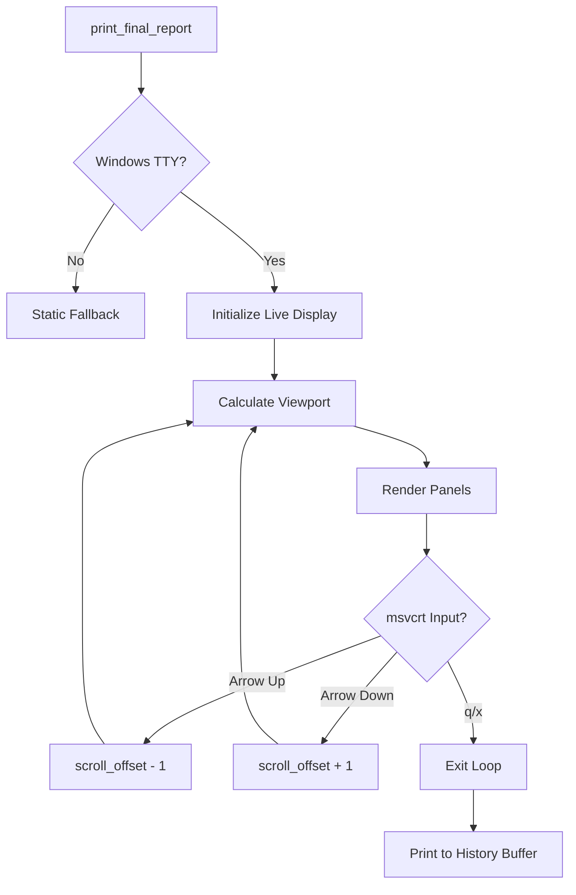

# User Interface (UI)

The `data2prompt` project utilizes a sophisticated Terminal User Interface (TUI) built with the [`rich`](https://github.com/Textualize/rich) library to provide real-time feedback and a professional, tech-focused experience. All UI logic is encapsulated in the [`UIHandler`](src/data2prompt/ui.py:34) class.

## UIHandler Class

The [`UIHandler`](src/data2prompt/ui.py:34) class in [`src/data2prompt/ui.py`](src/data2prompt/ui.py) serves as the central point for all terminal output. It encapsulates Rich-based display components, formatting, and progress tracking.

### Core Responsibilities

| Responsibility | Description |
|:---|:---|
| **Event Handling** | Processes lifecycle events: `on_start`, `on_progress`, `on_error`, `on_warning` |
| **Progress Tracking** | Manages real-time progress bars during file scanning and processing |
| **Visual Components** | Renders panels, tables, spinners, and ASCII art headers |
| **Interactive TUI** | Provides scrollable, keyboard-navigable summary on Windows |
| **Error Display** | Shows formatted error and warning messages with hacker aesthetic |

### Event Handlers

The [`UIHandler`](src/data2prompt/ui.py:34) provides four event handler methods that integrate with the main processing flow:

```python
def on_start(self, description: str, total: int) -> None:
    """Event handler for process start."""
    self.print_header()
```

```python
def on_progress(self, description: str, advance: int = 0) -> None:
    """Event handler for progress updates."""
    if self._progress and self._task_id is not None:
        self._progress.update(self._task_id, description=description)
        if advance > 0:
            self._progress.advance(self._task_id, advance)
```

```python
def on_error(self, message: str) -> None:
    """Event handler for errors."""
    self.print_error(message)
```

```python
def on_warning(self, message: str) -> None:
    """Event handler for warnings."""
    self.print_warning(message)
```

## UI Components

### Matrix Startup Animation

The [`print_header()`](src/data2prompt/ui.py:73) method displays an ASCII art banner with a Matrix-style decryption animation:



**Animation Parameters** (from [`constants.py`](src/data2prompt/constants.py:76)):
- `MATRIX_DARK_GREEN = (0, 150, 0)` - Initial frame color
- `MATRIX_NEON_GREEN = (0, 255, 0)` - Final reveal color
- `STARTUP_ANIMATION_DURATION = 0.9` - Animation duration in seconds
- `ANIMATION_FRAME_DELAY = 0.03` - Frame delay in seconds

The [`_generate_matrix_frame()`](src/data2prompt/ui.py:63) method generates random binary/hex characters for each frame:
```python
def _generate_matrix_frame(self, width: int, height: int) -> Text:
    """Generates a single frame of random binary/hex characters."""
    chars = "0123456789ABCDEF"
    lines = []
    for _ in range(height):
        line = "".join(random.choice(chars) if random.random() > 0.5 else str(random.randint(0, 1)) for _ in range(width))
        lines.append(line)
    return Text("\n".join(lines), style=Style(color=Color.from_rgb(*MATRIX_DARK_GREEN), dim=True))
```

### Progress Bar

The [`progress_bar()`](src/data2prompt/ui.py:98) context manager provides a stable, two-line hacker-style progress bar:

```python
@contextmanager
def progress_bar(self, description: str, total: int) -> Generator[Any, None, None]:
    """Context manager for showing a stable, two-line hacker-style progress bar."""
    progress = Progress(
        TextColumn("[bold green][[/bold green]"),
        BarColumn(bar_width=None, style="dim green", complete_style="bold green", finished_style="bold green"),
        TextColumn("[bold green]][/bold green]"),
        TaskProgressColumn(style="bold yellow"),
        console=self.console,
    )
```

**Components:**
- `TextColumn` - Opening/closing brackets with green styling
- `BarColumn` - Visual progress bar with dim/complete/finished styles
- `TaskProgressColumn` - Percentage display in yellow
- `Spinner` - "dots12" tech-focused spinner animation

### Status Spinner

The [`status()`](src/data2prompt/ui.py:91) context manager shows a temporary status spinner:

```python
@contextmanager
def status(self, message: str) -> Generator[Any, None, None]:
    """Context manager for showing a status spinner with a tech-focused animation."""
    with self.console.status(Text(message, style="bold green"), spinner="dots12", spinner_style="bold green"):
        yield
```

## Final Report

The [`print_final_report()`](src/data2prompt/ui.py:129) method displays the comprehensive scan summary with two main sections:

### Success Panel

A styled panel showing compilation statistics:
- Output file path and size
- Total token count and method used
- File type counts (CSV, Notebook, SQL, Excel)
- Truncation and skip counts

### Summary Table

A Rich table displaying processed files with columns:
- `FILE_NAME` - Basename of the file
- `TYPE` - File type/extension category
- `TOKENS` - Token count (right-aligned, yellow)
- `STATUS` - Processing status with color coding:
  - **Green**: Read, Sampled, Cleaned, Parsed, Extracted
  - **Yellow**: Truncated, Skipped (Binary), Skipped (Exclusion)
  - **Red**: Error states

## Interactive TUI (Windows)

The final report includes an interactive scrollable table on Windows TTY terminals:

### Architecture



### Key Features

1. **Alternate Buffer**: Uses `Live(screen=True)` for absolute stability during terminal resize
2. **Dynamic Viewport**: Calculates available height based on terminal size minus header and summary heights
3. **Scroll Bar**: Custom scroll bar with proportional thumb positioning using `SCROLL_THUMB` ("█") and `SCROLL_TRACK` ("│")
4. **Keyboard Navigation**:
   - Arrow Up/Down: Scroll through file list
   - 'q' or 'x': Exit interactive mode
   - Ctrl+C: Raise KeyboardInterrupt

### Scroll Bar Logic

The [`get_scan_list_panel()`](src/data2prompt/ui.py:235) function calculates scroll bar dimensions:

```python
if total_items > v_height:
    thumb_size = max(1, int(track_height * (v_height / total_items)))
    max_offset = total_items - v_height
    thumb_pos = int((track_height - thumb_size) * (offset / max_offset))
else:
    thumb_size = track_height
    thumb_pos = 0
```

### History Preservation

A `finally` block ensures the final state is printed to the standard buffer upon exit, preserving it in terminal history:

```python
finally:
    self.console.print(success_panel)
    self.console.print(Panel(table, border_style="bold green", title="[bold green]SCAN LIST[/bold green]", padding=(0, 1)))
```

## Error and Warning Display

### Warning Panel

The [`print_warning_panel()`](src/data2prompt/ui.py:340) displays a styled warning panel:

```python
def print_warning_panel(self, message: str) -> None:
    """Displays a warning message in a hacker-style panel."""
    self.console.print(Panel(
        message,
        border_style="bold yellow",
        title="[bold yellow]SYSTEM_WARNING[/bold yellow]"
    ))
```

### Inline Warning/Error

The [`print_warning()`](src/data2prompt/ui.py:348) and [`print_error()`](src/data2prompt/ui.py:352) methods provide inline messages:

```python
def print_warning(self, message: str) -> None:
    """Displays a simple warning message with a hacker aesthetic."""
    self.console.print(f"[bold yellow]![/bold yellow] [yellow]WARN: {message}[/yellow]")

def print_error(self, message: str) -> None:
    """Displays an error message with a hacker aesthetic."""
    self.console.print(f"[bold red]![/bold red] [red]ERR_CRITICAL: {message}[/red]")
```

## Integration with Main Processing

The [`UIHandler`](src/data2prompt/ui.py:34) integrates with [`main.py`](src/data2prompt/main.py:43) through event handlers:

```python
# From main.py
with ui.progress_bar("[cyan]Starting process...[/cyan]", total=total_steps) as handler:
    handler.on_progress("[cyan]Checking online connectivity...[/cyan]")
    is_online = check_connectivity()
    handler.on_progress(f"[cyan]Checking online connectivity... {status_msg}[/cyan]", advance=1)
    # ... file processing loop
```

## Static Fallback

For non-Windows environments or non-TTY terminals, the TUI provides a static fallback:

```python
if not sys.stdin.isatty() or sys.platform != "win32":
    self.console.print(success_panel)
    self.console.print(Panel(table, border_style="bold green", title="[bold green]SCAN LIST[/bold green]", padding=(0, 1)))
    return
```

## Global Instance

A global [`ui`](src/data2prompt/ui.py:357) instance is exported for use throughout the application:

```python
# Global UI instance
ui = UIHandler()
```

## Constants Used

| Constant | Value | Purpose |
|:---|:---|:---|
| `MATRIX_DARK_GREEN` | `(0, 150, 0)` | Matrix animation frame color |
| `MATRIX_NEON_GREEN` | `(0, 255, 0)` | Final banner color |
| `STARTUP_ANIMATION_DURATION` | `0.9` | Animation duration (seconds) |
| `ANIMATION_FRAME_DELAY` | `0.03` | Frame delay (seconds) |
| `SCROLL_THUMB` | `"█"` | Scroll bar thumb character |
| `SCROLL_TRACK` | `"│"` | Scroll bar track character |
| `ASCII_ART` | list | Application banner lines |
