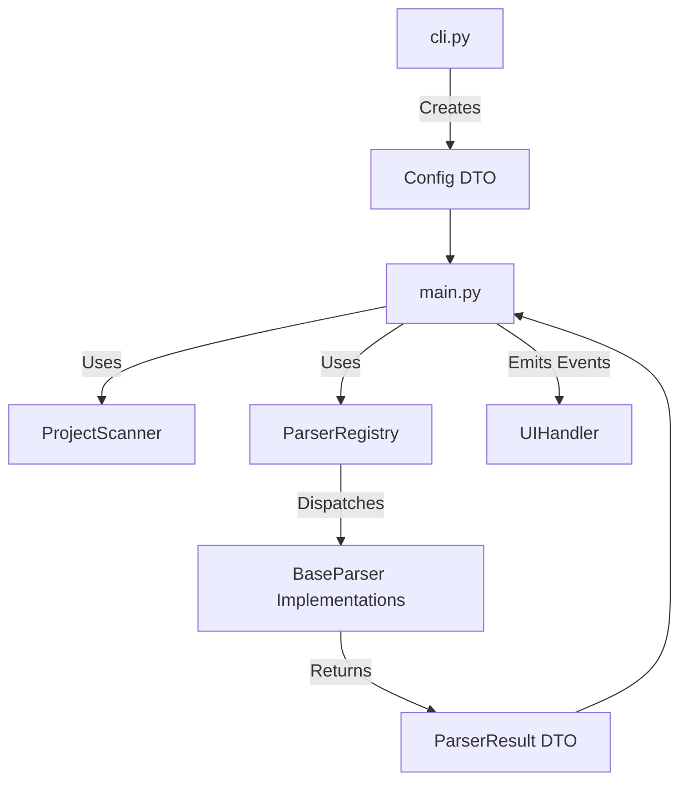

# Data2Prompt Refactoring Roadmap

This roadmap outlines the transition of the `data2prompt` codebase toward a more modular, scalable, and decoupled architecture, adhering to the **Modular Functional Orchestration (MFO)** pattern.

## Phase 1: Configuration & Discovery Decoupling

### Architectural Changes
- **Config DTO**: Introduce a `Config` dataclass in [`src/data2prompt/cli.py`](../src/data2prompt/cli.py) (or a new `config.py`) to replace the raw `argparse.Namespace`. This DTO will provide type-safe access to all application settings.
- **ProjectScanner**: Create a `ProjectScanner` class in [`src/data2prompt/utils.py`](../src/data2prompt/utils.py) (or a new `scanner.py`).
    - Encapsulate `os.walk` logic.
    - Centralize ignore logic (folders, files, extensions).
    - Handle `.data2promptignore` loading and merging.

### Expected Benefits
- **Improved Testability**: `ProjectScanner` can be tested in isolation with mock file systems.
- **Type Safety**: The `Config` DTO eliminates "stringly-typed" access to arguments, reducing runtime errors.
- **Separation of Concerns**: `main.py` no longer needs to know *how* files are discovered or ignored.

### Alignment with MFO
- **Centralized Configuration**: Strengthens the role of `constants.py` by funneling them through a formal DTO.
- **Functional Specialization**: Moves discovery logic out of the orchestration layer into a specialized utility.

---

## Phase 2: Parser Abstraction (Registry Pattern)

### Architectural Changes
- **BaseParser Interface**: Define a `BaseParser` protocol or abstract base class in [`src/data2prompt/parsers.py`](../src/data2prompt/parsers.py).
    - Method: `parse(file_path: Path, config: Config) -> ParserResult`.
- **ParserResult DTO**: Standardize the output of all parsers (content, tokens, metadata, stats).
- **ParserRegistry**: Implement a registry that maps file extensions to `BaseParser` implementations.
    - Remove the large `if-elif` block in `process_target_file`.

### Expected Benefits
- **Easier Extensibility**: Adding a new file format only requires implementing `BaseParser` and registering it.
- **Decoupling**: `main.py` interacts with a generic interface rather than specific parser functions.
- **Uniformity**: Standardized output prevents "leaky abstractions" where `main.py` has to handle different return types.

### Alignment with MFO
- **Functional Specialization**: Each parser is a self-contained unit adhering to a strict interface.
- **Orchestration Layer**: `main.py` becomes a pure coordinator, dispatching to the registry.

---

## Phase 3: Orchestration Refinement

### Architectural Changes
- **Refactor `main`**: Update the main loop in [`src/data2prompt/main.py`](../src/data2prompt/main.py) to use `ProjectScanner` and `ParserRegistry`.
- **Standardize Metadata**: Ensure all parsers return a uniform metadata structure, which `main.py` uses to build the final Markdown.
- **Pipeline Pattern**: Consider treating the processing of a file as a pipeline: `Discovery -> Parsing -> Wrapping -> Stats Collection`.

### Expected Benefits
- **Readability**: `main` will be significantly shorter and easier to follow.
- **Robustness**: Centralized error handling within the registry or pipeline.

### Alignment with MFO
- **Orchestration Layer**: `main.py` focuses exclusively on the high-level workflow.

---

## Phase 4: UI & Feedback Decoupling

### Architectural Changes
- **Event/Callback Mechanism**: Introduce a simple event system (e.g., `on_file_processed`, `on_progress_update`) so that logic modules don't call `ui` directly.
- **Passive UIHandler**: Transition `UIHandler` in [`src/data2prompt/ui.py`](../src/data2prompt/ui.py) to listen for these events.
- **Dependency Injection**: Pass the UI handler (or an event bus) to the orchestrator, rather than using a global instance everywhere.

### Expected Benefits
- **System Decoupling**: Logic modules become completely independent of the UI library (Rich).
- **Headless Mode**: Easier to implement a non-interactive or logging-only mode in the future.

### Alignment with MFO
- **UI Encapsulation**: Further isolates the UI from the core logic, ensuring that changes to the TUI don't break the processing engine.

---

## Mermaid Architecture Diagram (Target State)

